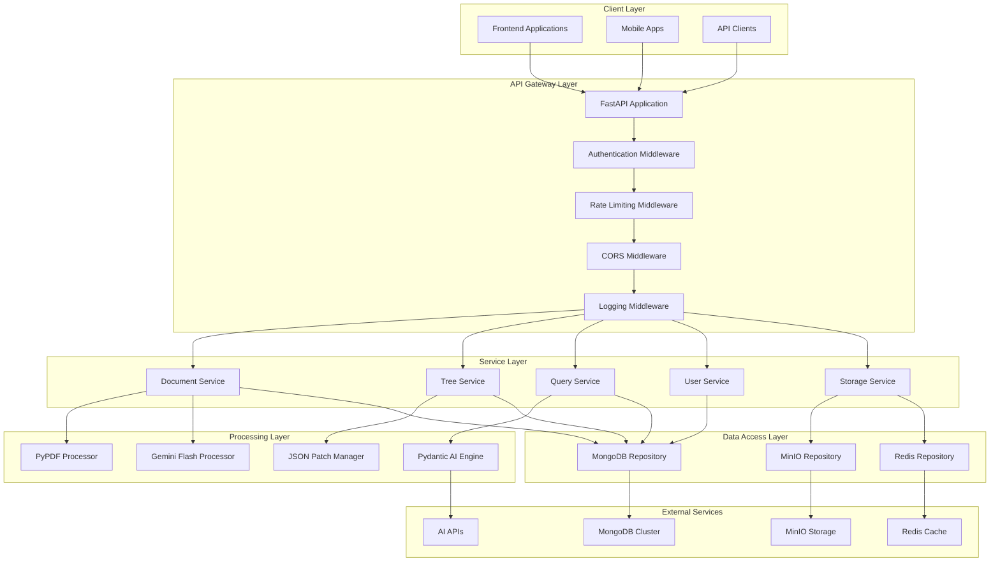

# Backend Architecture Implementation Guide

## Overview

This document provides comprehensive implementation guidance for the complete backend architecture of the Vectorless RAG system. Based on **Sections 5, 5.1, and 5.3** of the PRD, this backend serves as the central orchestration layer that coordinates document processing, tree management, query processing, and data storage across all system components.

### Purpose and Role

The backend architecture serves as:

* **Central Orchestration Hub**: Coordinates all system components and services

* **API Gateway**: Provides unified REST API interface for frontend applications

* **Processing Pipeline Manager**: Orchestrates document processing workflows

* **Data Access Layer**: Manages interactions with MongoDB, MinIO, and Redis

* **Security Enforcement**: Implements authentication, authorization, and data protection

* **Performance Optimization**: Handles caching, rate limiting, and resource management

## Technical Specifications

### Core Architecture Requirements

Based on **Section 5.1** technology stack from PRD:

* **Framework**: FastAPI 0.104+ with async/await support

* **Language**: Python 3.11+ with type hints

* **Database**: MongoDB 7.0+ with Motor async driver

* **Object Storage**: MinIO with async client

* **Caching**: Redis 7.2+ with async support

* **Authentication**: JWT tokens with OAuth2 flows

* **Validation**: Pydantic v2 for data validation

* **Testing**: pytest with async support

### System Architecture



## Implementation Details

### 1. Project Structure

```
app/
├── __init__.py
├── main.py                 # FastAPI application entry point
├── config/
│   ├── __init__.py
│   ├── settings.py         # Application configuration
│   └── database.py         # Database connection setup
├── api/
│   ├── __init__.py
│   ├── dependencies.py     # Dependency injection
│   ├── middleware.py       # Custom middleware
│   └── v1/
│       ├── __init__.py
│       ├── auth.py         # Authentication endpoints
│       ├── documents.py    # Document management endpoints
│       ├── trees.py        # Tree management endpoints
│       ├── queries.py      # Query processing endpoints
│       └── users.py        # User management endpoints
├── core/
│   ├── __init__.py
│   ├── security.py         # Security utilities
│   ├── exceptions.py       # Custom exceptions
│   └── logging.py          # Logging configuration
├── services/
│   ├── __init__.py
│   ├── document_service.py # Document processing service
│   ├── tree_service.py     # Tree management service
│   ├── query_service.py    # Query processing service
│   ├── user_service.py     # User management service
│   └── storage_service.py  # Storage management service
├── processors/
│   ├── __init__.py
│   ├── pypdf_processor.py  # PDF processing
│   ├── gemini_processor.py # Image analysis
│   ├── patch_manager.py    # Tree manipulation
│   └── ai_engine.py        # Query processing
├── repositories/
│   ├── __init__.py
│   ├── mongodb_repo.py     # MongoDB data access
│   ├── minio_repo.py       # MinIO storage access
│   └── redis_repo.py       # Redis cache access
├── models/
│   ├── __init__.py
│   ├── document.py         # Document models
│   ├── tree.py             # Tree structure models
│   ├── query.py            # Query models
│   └── user.py             # User models
├── schemas/
│   ├── __init__.py
│   ├── document.py         # Document API schemas
│   ├── tree.py             # Tree API schemas
│   ├── query.py            # Query API schemas
│   └── user.py             # User API schemas
└── utils/
    ├── __init__.py
    ├── helpers.py          # Utility functions
    ├── validators.py       # Custom validators
    └── constants.py        # Application constants
```

### 2. Main Application Setup

**app/main.py**

```python
from fastapi import FastAPI, Request, status
from fastapi.middleware.cors import CORSMiddleware
from fastapi.middleware.trustedhost import TrustedHostMiddleware
from fastapi.responses import JSONResponse
import uvicorn
import logging
from contextlib import asynccontextmanager

from app.config.settings import get_settings
from app.config.database import init_database, close_database
from app.api.v1 import auth, documents, trees, queries, users
from app.api.middleware import (
    LoggingMiddleware,
    RateLimitMiddleware,
    SecurityHeadersMiddleware
)
from app.core.exceptions import (
    ValidationException,
    AuthenticationException,
    AuthorizationException,
    ProcessingException
)
from app.core.logging import setup_logging

settings = get_settings()
setup_logging()
logger = logging.getLogger(__name__)

@asynccontextmanager
async def lifespan(app: FastAPI):
    """Application lifespan management"""
    # Startup
    logger.info("Starting Vectorless RAG Backend...")
    await init_database()
    logger.info("Database connections initialized")
    
    yield
    
    # Shutdown
    logger.info("Shutting down Vectorless RAG Backend...")
    await close_database()
    logger.info("Database connections closed")

# Create FastAPI application
app = FastAPI(
    title="Vectorless RAG API",
    description="Advanced document processing and query system without vector embeddings",
    version="1.0.0",
    docs_url="/docs" if settings.ENVIRONMENT == "development" else None,
    redoc_url="/redoc" if settings.ENVIRONMENT == "development" else None,
    lifespan=lifespan
)

# Security middleware
app.add_middleware(
    TrustedHostMiddleware,
    allowed_hosts=settings.ALLOWED_HOSTS
)

app.add_middleware(
    CORSMiddleware,
    allow_origins=settings.CORS_ORIGINS,
    allow_credentials=True,
    allow_methods=["GET", "POST", "PUT", "DELETE", "PATCH"],
    allow_headers=["*"],
)

# Custom middleware
app.add_middleware(SecurityHeadersMiddleware)
app.add_middleware(RateLimitMiddleware)
app.add_middleware(LoggingMiddleware)

# Exception handlers
@app.exception_handler(ValidationException)
async def validation_exception_handler(request: Request, exc: ValidationException):
    return JSONResponse(
        status_code=status.HTTP_422_UNPROCESSABLE_ENTITY,
        content={"detail": exc.detail, "type": "validation_error"}
    )

@app.exception_handler(AuthenticationException)
async def authentication_exception_handler(request: Request, exc: AuthenticationException):
    return JSONResponse(
        status_code=status.HTTP_401_UNAUTHORIZED,
        content={"detail": exc.detail, "type": "authentication_error"}
    )

@app.exception_handler(AuthorizationException)
async def authorization_exception_handler(request: Request, exc: AuthorizationException):
    return JSONResponse(
        status_code=status.HTTP_403_FORBIDDEN,
        content={"detail": exc.detail, "type": "authorization_error"}
    )

@app.exception_handler(ProcessingException)
async def processing_exception_handler(request: Request, exc: ProcessingException):
    return JSONResponse(
        status_code=status.HTTP_500_INTERNAL_SERVER_ERROR,
        content={"detail": exc.detail, "type": "processing_error"}
    )

# Health check endpoint
@app.get("/health")
async def health_check():
    """System health check endpoint"""
    return {
        "status": "healthy",
        "version": "1.0.0",
        "environment": settings.ENVIRONMENT
    }

# API routes
app.include_router(auth.router, prefix="/api/v1/auth", tags=["Authentication"])
app.include_router(documents.router, prefix="/api/v1/documents", tags=["Documents"])
app.include_router(trees.router, prefix="/api/v1/trees", tags=["Trees"])
app.include_router(queries.router, prefix="/api/v1/queries", tags=["Queries"])
app.include_router(users.router, prefix="/api/v1/users", tags=["Users"])

if __name__ == "__main__":
    uvicorn.run(
        "app.main:app",
        host="0.0.0.0",
        port=8000,
        reload=settings.ENVIRONMENT == "development",
        log_level="info"
    )
```

### 3. Configuration Management

**app/config/settings.py**

```python
from pydantic_settings import BaseSettings
from pydantic import Field, validator
from typing import List, Optional
import os

class Settings(BaseSettings):
    """Application settings with environment variable support"""
    
    # Environment
    ENVIRONMENT: str = Field(default="development", env="ENVIRONMENT")
    DEBUG: bool = Field(default=False, env="DEBUG")
    SECRET_KEY: str = Field(..., env="SECRET_KEY")
    
    # API Configuration
    API_V1_STR: str = "/api/v1"
    PROJECT_NAME: str = "Vectorless RAG"
    ALLOWED_HOSTS: List[str] = Field(default=["*"], env="ALLOWED_HOSTS")
    CORS_ORIGINS: List[str] = Field(default=["*"], env="CORS_ORIGINS")
    
    # Database Configuration
    MONGODB_URL: str = Field(..., env="MONGODB_URL")
    MONGODB_DB_NAME: str = Field(default="vectorless_rag", env="MONGODB_DB_NAME")
    MONGODB_MIN_POOL_SIZE: int = Field(default=10, env="MONGODB_MIN_POOL_SIZE")
    MONGODB_MAX_POOL_SIZE: int = Field(default=100, env="MONGODB_MAX_POOL_SIZE")
    
    # MinIO Configuration
    MINIO_ENDPOINT: str = Field(..., env="MINIO_ENDPOINT")
    MINIO_ACCESS_KEY: str = Field(..., env="MINIO_ACCESS_KEY")
    MINIO_SECRET_KEY: str = Field(..., env="MINIO_SECRET_KEY")
    MINIO_SECURE: bool = Field(default=False, env="MINIO_SECURE")
    MINIO_BUCKET_DOCUMENTS: str = Field(default="documents", env="MINIO_BUCKET_DOCUMENTS")
    MINIO_BUCKET_IMAGES: str = Field(default="images", env="MINIO_BUCKET_IMAGES")
    MINIO_BUCKET_PROCESSED: str = Field(default="processed", env="MINIO_BUCKET_PROCESSED")
    
    # Redis Configuration
    REDIS_URL: str = Field(..., env="REDIS_URL")
    REDIS_PASSWORD: Optional[str] = Field(default=None, env="REDIS_PASSWORD")
    REDIS_DB: int = Field(default=0, env="REDIS_DB")
    REDIS_MAX_CONNECTIONS: int = Field(default=20, env="REDIS_MAX_CONNECTIONS")
    
    # AI Service Configuration
    OPENAI_API_KEY: Optional[str] = Field(default=None, env="OPENAI_API_KEY")
    ANTHROPIC_API_KEY: Optional[str] = Field(default=None, env="ANTHROPIC_API_KEY")
    GOOGLE_API_KEY: Optional[str] = Field(default=None, env="GOOGLE_API_KEY")
    GEMINI_API_KEY: str = Field(..., env="GEMINI_API_KEY")
    
    # Security Configuration
    ACCESS_TOKEN_EXPIRE_MINUTES: int = Field(default=30, env="ACCESS_TOKEN_EXPIRE_MINUTES")
    REFRESH_TOKEN_EXPIRE_DAYS: int = Field(default=7, env="REFRESH_TOKEN_EXPIRE_DAYS")
    ALGORITHM: str = Field(default="HS256", env="ALGORITHM")
    
    # Rate Limiting
    RATE_LIMIT_REQUESTS: int = Field(default=100, env="RATE_LIMIT_REQUESTS")
    RATE_LIMIT_WINDOW: int = Field(default=60, env="RATE_LIMIT_WINDOW")
    
    # Processing Configuration
    MAX_FILE_SIZE: int = Field(default=50 * 1024 * 1024, env="MAX_FILE_SIZE")  # 50MB
    ALLOWED_FILE_TYPES: List[str] = Field(default=["pdf"], env="ALLOWED_FILE_TYPES")
    PROCESSING_TIMEOUT: int = Field(default=300, env="PROCESSING_TIMEOUT")  # 5 minutes
    
    # Logging Configuration
    LOG_LEVEL: str = Field(default="INFO", env="LOG_LEVEL")
    LOG_FORMAT: str = Field(default="json", env="LOG_FORMAT")
    LOG_FILE: Optional[str] = Field(default=None, env="LOG_FILE")
    
    @validator("ENVIRONMENT")
    def validate_environment(cls, v):
        if v not in ["development", "staging", "production"]:
            raise ValueError("Environment must be development, staging, or production")
        return v
    
    @validator("CORS_ORIGINS", pre=True)
    def parse_cors_origins(cls, v):
        if isinstance(v, str):
            return [origin.strip() for origin in v.split(",")]
        return v
    
    @validator("ALLOWED_HOSTS", pre=True)
    def parse_allowed_hosts(cls, v):
        if isinstance(v, str):
            return [host.strip() for host in v.split(",")]
        return v
    
    class Config:
        env_file = ".env"
        case_sensitive = True

# Global settings instance
_settings = None

def get_settings() -> Settings:
    """Get application settings singleton"""
    global _settings
    if _settings is None:
        _settings = Settings()
    return _settings
```

### 4. Database Connection Management

**app/config/database.py**

```python
from motor.motor_asyncio import AsyncIOMotorClient, AsyncIOMotorDatabase
from redis.asyncio import Redis
from minio import Minio
import logging
from typing import Optional

from app.config.settings import get_settings

logger = logging.getLogger(__name__)
settings = get_settings()

# Global connection instances
mongodb_client: Optional[AsyncIOMotorClient] = None
mongodb_database: Optional[AsyncIOMotorDatabase] = None
redis_client: Optional[Redis] = None
minio_client: Optional[Minio] = None

async def init_database():
    """Initialize all database connections"""
    global mongodb_client, mongodb_database, redis_client, minio_client
    
    try:
        # MongoDB connection
        mongodb_client = AsyncIOMotorClient(
            settings.MONGODB_URL,
            minPoolSize=settings.MONGODB_MIN_POOL_SIZE,
            maxPoolSize=settings.MONGODB_MAX_POOL_SIZE,
            serverSelectionTimeoutMS=5000,
            connectTimeoutMS=10000,
            socketTimeoutMS=10000
        )
        
        # Test MongoDB connection
        await mongodb_client.admin.command('ping')
        mongodb_database = mongodb_client[settings.MONGODB_DB_NAME]
        logger.info("MongoDB connection established")
        
        # Redis connection
        redis_client = Redis.from_url(
            settings.REDIS_URL,
            password=settings.REDIS_PASSWORD,
            db=settings.REDIS_DB,
            max_connections=settings.REDIS_MAX_CONNECTIONS,
            decode_responses=True
        )
        
        # Test Redis connection
        await redis_client.ping()
        logger.info("Redis connection established")
        
        # MinIO connection
        minio_client = Minio(
            settings.MINIO_ENDPOINT,
            access_key=settings.MINIO_ACCESS_KEY,
            secret_key=settings.MINIO_SECRET_KEY,
            secure=settings.MINIO_SECURE
        )
        
        # Test MinIO connection
        if not minio_client.bucket_exists(settings.MINIO_BUCKET_DOCUMENTS):
            minio_client.make_bucket(settings.MINIO_BUCKET_DOCUMENTS)
        logger.info("MinIO connection established")
        
    except Exception as e:
        logger.error(f"Database initialization failed: {e}")
        raise

async def close_database():
    """Close all database connections"""
    global mongodb_client, redis_client
    
    try:
        if mongodb_client:
            mongodb_client.close()
            logger.info("MongoDB connection closed")
        
        if redis_client:
            await redis_client.close()
            logger.info("Redis connection closed")
            
    except Exception as e:
        logger.error(f"Error closing database connections: {e}")

def get_mongodb() -> AsyncIOMotorDatabase:
    """Get MongoDB database instance"""
    if mongodb_database is None:
        raise RuntimeError("MongoDB not initialized")
    return mongodb_database

def get_redis() -> Redis:
    """Get Redis client instance"""
    if redis_client is None:
        raise RuntimeError("Redis not initialized")
    return redis_client

def get_minio() -> Minio:
    """Get MinIO client instance"""
    if minio_client is None:
        raise RuntimeError("MinIO not initialized")
    return minio_client
```

### 5. Service Layer Implementation

**app/services/document\_service.py**

```python
from typing import List, Optional, Dict, Any
from datetime import datetime
import asyncio
import logging
from bson import ObjectId

from app.models.document import Document, DocumentStatus
from app.schemas.document import DocumentCreate, DocumentUpdate, DocumentResponse
from app.repositories.mongodb_repo import MongoDBRepository
from app.repositories.minio_repo import MinIORepository
from app.processors.pypdf_processor import PyPDFProcessor
from app.processors.gemini_processor import GeminiProcessor
from app.core.exceptions import ProcessingException, ValidationException

logger = logging.getLogger(__name__)

class DocumentService:
    """Document processing and management service"""
    
    def __init__(
        self,
        mongodb_repo: MongoDBRepository,
        minio_repo: MinIORepository,
        pypdf_processor: PyPDFProcessor,
        gemini_processor: GeminiProcessor
    ):
        self.mongodb_repo = mongodb_repo
        self.minio_repo = minio_repo
        self.pypdf_processor = pypdf_processor
        self.gemini_processor = gemini_processor
    
    async def create_document(
        self,
        document_data: DocumentCreate,
        file_content: bytes,
        user_id: str
    ) -> DocumentResponse:
        """Create and process a new document"""
        try:
            # Validate file
            if len(file_content) > 50 * 1024 * 1024:  # 50MB limit
                raise ValidationException("File size exceeds 50MB limit")
            
            # Create document record
            document = Document(
                title=document_data.title,
                filename=document_data.filename,
                user_id=user_id,
                status=DocumentStatus.UPLOADING,
                metadata=document_data.metadata or {}
            )
            
            # Save to database
            document_id = await self.mongodb_repo.create_document(document)
            document.id = document_id
            
            # Upload file to MinIO
            file_path = f"documents/{user_id}/{document_id}/{document_data.filename}"
            await self.minio_repo.upload_file(
                bucket="documents",
                object_name=file_path,
                data=file_content,
                content_type="application/pdf"
            )
            
            # Update document with file path
            await self.mongodb_repo.update_document(
                document_id,
                {"file_path": file_path, "status": DocumentStatus.PROCESSING}
            )
            
            # Start async processing
            asyncio.create_task(self._process_document(document_id, file_path))
            
            return DocumentResponse.from_document(document)
            
        except Exception as e:
            logger.error(f"Error creating document: {e}")
            if 'document_id' in locals():
                await self.mongodb_repo.update_document(
                    document_id,
                    {"status": DocumentStatus.FAILED, "error_message": str(e)}
                )
            raise ProcessingException(f"Failed to create document: {e}")
    
    async def _process_document(self, document_id: str, file_path: str):
        """Process document asynchronously"""
        try:
            # Update status
            await self.mongodb_repo.update_document(
                document_id,
                {"status": DocumentStatus.PROCESSING}
            )
            
            # Download file from MinIO
            file_content = await self.minio_repo.download_file("documents", file_path)
            
            # Process with PyPDF
            pdf_result = await self.pypdf_processor.process_pdf(file_content)
            
            # Process images with Gemini
            image_results = []
            for page_num, images in pdf_result.images.items():
                for image_data in images:
                    result = await self.gemini_processor.analyze_image(image_data)
                    image_results.append({
                        "page": page_num,
                        "analysis": result
                    })
            
            # Save processed content
            processed_data = {
                "text_content": pdf_result.text_content,
                "page_content": pdf_result.page_content,
                "metadata": pdf_result.metadata,
                "image_analysis": image_results,
                "processing_completed_at": datetime.utcnow()
            }
            
            # Update document
            await self.mongodb_repo.update_document(
                document_id,
                {
                    "status": DocumentStatus.COMPLETED,
                    "processed_content": processed_data
                }
            )
            
            logger.info(f"Document {document_id} processed successfully")
            
        except Exception as e:
            logger.error(f"Error processing document {document_id}: {e}")
            await self.mongodb_repo.update_document(
                document_id,
                {
                    "status": DocumentStatus.FAILED,
                    "error_message": str(e)
                }
            )
    
    async def get_document(self, document_id: str, user_id: str) -> Optional[DocumentResponse]:
        """Get document by ID"""
        document = await self.mongodb_repo.get_document(document_id)
        if not document or document.user_id != user_id:
            return None
        return DocumentResponse.from_document(document)
    
    async def list_documents(
        self,
        user_id: str,
        skip: int = 0,
        limit: int = 20,
        status: Optional[DocumentStatus] = None
    ) -> List[DocumentResponse]:
        """List user documents"""
        documents = await self.mongodb_repo.list_documents(
            user_id=user_id,
            skip=skip,
            limit=limit,
            status=status
        )
        return [DocumentResponse.from_document(doc) for doc in documents]
    
    async def delete_document(self, document_id: str, user_id: str) -> bool:
        """Delete document and associated files"""
        try:
            document = await self.mongodb_repo.get_document(document_id)
            if not document or document.user_id != user_id:
                return False
            
            # Delete file from MinIO
            if document.file_path:
                await self.minio_repo.delete_file("documents", document.file_path)
            
            # Delete from database
            await self.mongodb_repo.delete_document(document_id)
            
            return True
            
        except Exception as e:
            logger.error(f"Error deleting document {document_id}: {e}")
            return False
```

### 6. API Dependencies

**app/api/dependencies.py**

```python
sequenceDiagram
    participant C as Client
    participant A as FastAPI
    participant DS as Document Service
    participant PP as PyPDF Processor
    participant GP as Gemini Processor
    participant TS as Tree Service
    participant JP as JSON Patch
    participant QS as Query Service
    participant AI as Pydantic AI
    participant DB as MongoDB
    participant S3 as MinIO
    participant R as Redis
    
    C->>A: Upload Document
    A->>DS: Process Document
    DS->>S3: Store File
    DS->>PP: Extract Text/Images
    DS->>GP: Analyze Images
    DS->>DB: Save Results
    
    C->>A: Create Tree
    A->>TS: Build Tree Structure
    TS->>JP: Apply Patches
    TS->>DB: Store Tree
    
    C->>A: Query Document
    A->>QS: Process Query
    QS->>R: Check Cache
    QS->>AI: Analyze Query
    QS->>DB: Retrieve Data
    QS->>A: Return Results
```

## Integration Points

### 1. Service Integration Matrix

| Service              | Integrates With               | Purpose                            |
| -------------------- | ----------------------------- | ---------------------------------- |
| **Document Service** | PyPDF, Gemini, MongoDB, MinIO | Document processing pipeline       |
| **Tree Service**     | JSON Patch, MongoDB           | Tree structure management          |
| **Query Service**    | Pydantic AI, MongoDB, Redis   | Intelligent query processing       |
| **User Service**     | MongoDB, JWT                  | User management and authentication |
| **Storage Service**  | MinIO, Redis                  | File and cache management          |

### 2. Data Flow Integration

```mermaid
from fastapi import Depends, HTTPException, status
from fastapi.security import HTTPBearer, HTTPAuthorizationCredentials
from jose import JWTError, jwt
from typing import Optional
import logging

from app.config.settings import get_settings
from app.config.database import get_mongodb, get_redis, get_minio
from app.repositories.mongodb_repo import MongoDBRepository
from app.repositories.minio_repo import MinIORepository
from app.repositories.redis_repo import RedisRepository
from app.services.document_service import DocumentService
from app.services.tree_service import TreeService
from app.services.query_service import QueryService
from app.services.user_service import UserService
from app.processors.pypdf_processor import PyPDFProcessor
from app.processors.gemini_processor import GeminiProcessor
from app.processors.patch_manager import JSONPatchManager
from app.processors.ai_engine import PydanticAIEngine
from app.models.user import User
from app.core.exceptions import AuthenticationException

logger = logging.getLogger(__name__)
settings = get_settings()
security = HTTPBearer()

# Repository dependencies
def get_mongodb_repo() -> MongoDBRepository:
    """Get MongoDB repository instance"""
    return MongoDBRepository(get_mongodb())

def get_minio_repo() -> MinIORepository:
    """Get MinIO repository instance"""
    return MinIORepository(get_minio())

def get_redis_repo() -> RedisRepository:
    """Get Redis repository instance"""
    return RedisRepository(get_redis())

# Processor dependencies
def get_pypdf_processor() -> PyPDFProcessor:
    """Get PyPDF processor instance"""
    return PyPDFProcessor()

def get_gemini_processor() -> GeminiProcessor:
    """Get Gemini processor instance"""
    return GeminiProcessor(api_key=settings.GEMINI_API_KEY)

def get_patch_manager() -> JSONPatchManager:
    """Get JSON Patch manager instance"""
    return JSONPatchManager()

def get_ai_engine() -> PydanticAIEngine:
    """Get Pydantic AI engine instance"""
    return PydanticAIEngine(
        openai_api_key=settings.OPENAI_API_KEY,
        anthropic_api_key=settings.ANTHROPIC_API_KEY
    )

# Service dependencies
def get_document_service(
    mongodb_repo: MongoDBRepository = Depends(get_mongodb_repo),
    minio_repo: MinIORepository = Depends(get_minio_repo),
    pypdf_processor: PyPDFProcessor = Depends(get_pypdf_processor),
    gemini_processor: GeminiProcessor = Depends(get_gemini_processor)
) -> DocumentService:
    """Get document service instance"""
    return DocumentService(mongodb_repo, minio_repo, pypdf_processor, gemini_processor)

def get_tree_service(
    mongodb_repo: MongoDBRepository = Depends(get_mongodb_repo),
    patch_manager: JSONPatchManager = Depends(get_patch_manager)
) -> TreeService:
    """Get tree service instance"""
    return TreeService(mongodb_repo, patch_manager)

def get_query_service(
    mongodb_repo: MongoDBRepository = Depends(get_mongodb_repo),
    redis_repo: RedisRepository = Depends(get_redis_repo),
    ai_engine: PydanticAIEngine = Depends(get_ai_engine)
) -> QueryService:
    """Get query service instance"""
    return QueryService(mongodb_repo, redis_repo, ai_engine)

def get_user_service(
    mongodb_repo: MongoDBRepository = Depends(get_mongodb_repo)
) -> UserService:
    """Get user service instance"""
    return UserService(mongodb_repo)

# Authentication dependencies
async def get_current_user(
    credentials: HTTPAuthorizationCredentials = Depends(security),
    user_service: UserService = Depends(get_user_service)
) -> User:
    """Get current authenticated user"""
    try:
        token = credentials.credentials
        payload = jwt.decode(token, settings.SECRET_KEY, algorithms=[settings.ALGORITHM])
        user_id: str = payload.get("sub")
        
        if user_id is None:
            raise AuthenticationException("Invalid token")
        
        user = await user_service.get_user(user_id)
        if user is None:
            raise AuthenticationException("User not found")
        
        return user
        
    except JWTError:
        raise AuthenticationException("Invalid token")

async def get_current_active_user(
    current_user: User = Depends(get_current_user)
) -> User:
    """Get current active user"""
    if not current_user.is_active:
        raise AuthenticationException("Inactive user")
    return current_user

# Optional authentication
async def get_current_user_optional(
    credentials: Optional[HTTPAuthorizationCredentials] = Depends(HTTPBearer(auto_error=False)),
    user_service: UserService = Depends(get_user_service)
) -> Optional[User]:
    """Get current user if authenticated, None otherwise"""
    if not credentials:
        return None
    
    try:
        token = credentials.credentials
        payload = jwt.decode(token, settings.SECRET_KEY, algorithms=[settings.ALGORITHM])
        user_id: str = payload.get("sub")
        
        if user_id is None:
            return None
        
        user = await user_service.get_user(user_id)
        return user if user and user.is_active else None
        
    except JWTError:
        return None
```

## Development Tasks

### Phase 1: Core Backend (Week 1-2)

* [ ] Setup FastAPI application structure

* [ ] Implement configuration management

* [ ] Create database connection management

* [ ] Setup dependency injection system

* [ ] Implement basic middleware and exception handling

### Phase 2: Service Layer (Week 3-4)

* [ ] Implement document service with processing pipeline

* [ ] Create tree service with JSON Patch integration

* [ ] Build query service with AI integration

* [ ] Develop user service with authentication

* [ ] Setup storage service for file management

### Phase 3: API Layer (Week 5-6)

* [ ] Create REST API endpoints for all services

* [ ] Implement authentication and authorization

* [ ] Add rate limiting and security middleware

* [ ] Setup comprehensive error handling

* [ ] Create API documentation

### Phase 4: Integration & Testing (Week 7-8)

* [ ] Integrate all processors and services

* [ ] Implement comprehensive testing suite

* [ ] Performance optimization and caching

* [ ] Security hardening and validation

* [ ] Documentation and deployment preparation

## Testing Strategy

### Unit Testing

```python
# Example unit test for document service
import pytest
from unittest.mock import AsyncioMock, Mock
from app.services.document_service import DocumentService
from app.schemas.document import DocumentCreate

@pytest.mark.asyncio
async def test_create_document():
    # Mock dependencies
    mongodb_repo = AsyncioMock()
    minio_repo = AsyncioMock()
    pypdf_processor = AsyncioMock()
    gemini_processor = AsyncioMock()
    
    # Setup mocks
    mongodb_repo.create_document.return_value = "doc_id_123"
    minio_repo.upload_file.return_value = None
    
    # Create service
    service = DocumentService(mongodb_repo, minio_repo, pypdf_processor, gemini_processor)
    
    # Test document creation
    document_data = DocumentCreate(title="Test Doc", filename="test.pdf")
    result = await service.create_document(document_data, b"pdf_content", "user_123")
    
    # Assertions
    assert result.title == "Test Doc"
    mongodb_repo.create_document.assert_called_once()
    minio_repo.upload_file.assert_called_once()
```

### Integration Testing

```python
# Example integration test
import pytest
from httpx import AsyncClient
from app.main import app

@pytest.mark.asyncio
async def test_document_upload_flow():
    async with AsyncClient(app=app, base_url="http://test") as client:
        # Login
        login_response = await client.post("/api/v1/auth/login", json={
            "email": "test@example.com",
            "password": "testpass"
        })
        token = login_response.json()["access_token"]
        
        # Upload document
        files = {"file": ("test.pdf", b"pdf_content", "application/pdf")}
        headers = {"Authorization": f"Bearer {token}"}
        
        response = await client.post(
            "/api/v1/documents/",
            files=files,
            headers=headers
        )
        
        assert response.status_code == 201
        assert "id" in response.json()
```

## Performance Considerations

### Optimization Strategies

* **Async Processing**: Non-blocking operations for better concurrency

* **Connection Pooling**: Efficient database connection management

* **Caching**: Redis for frequently accessed data

* **Background Tasks**: Async processing for heavy operations

* **Resource Management**: Proper memory and CPU utilization

### Monitoring Metrics

* **Response Time**: API endpoint performance

* **Throughput**: Requests per second handling

* **Error Rate**: Failed request percentage

* **Resource Usage**: CPU, memory, and database utilization

* **Queue Length**: Background task processing

## Security Requirements

### Authentication & Authorization

* **JWT Tokens**: Secure token-based authentication

* **Role-Based Access**: User permission management

* **Token Refresh**: Secure token renewal mechanism

* **Session Management**: Secure session handling

### Data Protection

* **Input Validation**: Comprehensive request validation

* **SQL Injection Prevention**: Parameterized queries

* **File Upload Security**: Safe file handling

* **Rate Limiting**: API abuse prevention

* **CORS Configuration**: Cross-origin request security

## Deployment Configuration

### Environment Setup

```bash
# Development
export ENVIRONMENT=development
export DEBUG=true
export SECRET_KEY=dev-secret-key

# Production
export ENVIRONMENT=production
export DEBUG=false
export SECRET_KEY=production-secret-key
```

### Docker Configuration

```dockerfile
FROM python:3.11-slim

WORKDIR /app

COPY requirements.txt .
RUN pip install --no-cache-dir -r requirements.txt

COPY . .

EXPOSE 8000

CMD ["uvicorn", "app.main:app", "--host", "0.0.0.0", "--port", "8000"]
```

## Monitoring & Logging

### Logging Configuration

```python
import logging
import sys
from pythonjsonlogger import jsonlogger

def setup_logging():
    """Setup structured logging"""
    logger = logging.getLogger()
    logger.setLevel(logging.INFO)
    
    handler = logging.StreamHandler(sys.stdout)
    formatter = jsonlogger.JsonFormatter(
        '%(asctime)s %(name)s %(levelname)s %(message)s'
    )
    handler.setFormatter(formatter)
    logger.addHandler(handler)
```

### Health Monitoring

```python
@app.get("/health/detailed")
async def detailed_health_check():
    """Detailed health check with service status"""
    health_status = {
        "status": "healthy",
        "timestamp": datetime.utcnow().isoformat(),
        "services": {}
    }
    
    # Check MongoDB
    try:
        await get_mongodb().admin.command('ping')
        health_status["services"]["mongodb"] = "healthy"
    except Exception:
        health_status["services"]["mongodb"] = "unhealthy"
        health_status["status"] = "degraded"
    
    # Check Redis
    try:
        await get_redis().ping()
        health_status["services"]["redis"] = "healthy"
    except Exception:
        health_status["services"]["redis"] = "unhealthy"
        health_status["status"] = "degraded"
    
    return health_status
```

***

*This backend architecture implementation guide provides the complete foundation for the Vectorless RAG system. Follow the structured approach and integration patterns for optimal performance and maintainability.*
