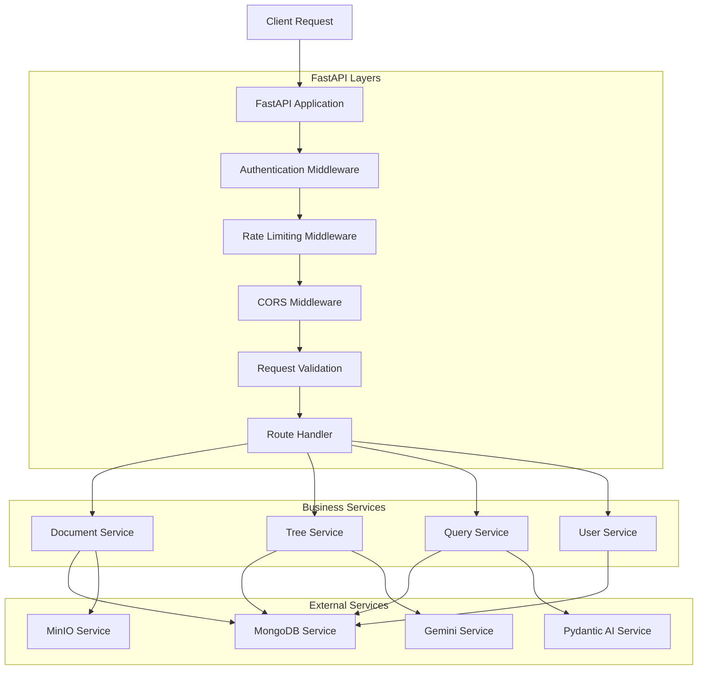

# FastAPI Implementation Guide

## Overview

This document provides comprehensive implementation guidance for FastAPI integration in the Vectorless RAG system. Based on **Section 5.1** and **Section 7** of the PRD, FastAPI serves as the high-performance web framework providing RESTful APIs for document processing, tree management, and query handling.

### Purpose and Role

FastAPI integration serves as:
- **API Gateway**: Expose RESTful endpoints for all system operations
- **Request Handler**: Process HTTP requests and route to appropriate services
- **Authentication Layer**: Handle user authentication and authorization
- **Data Validation**: Validate input/output data using Pydantic models
- **Documentation**: Auto-generate OpenAPI documentation

## Technical Specifications

### Core Requirements

Based on **Section 5.1** and **Section 7** deployment architecture:
- **Version**: FastAPI 0.104+ for latest features and performance
- **ASGI Server**: Uvicorn for production deployment
- **Authentication**: JWT-based authentication with refresh tokens
- **Validation**: Pydantic v2 for data validation and serialization
- **Documentation**: Automatic OpenAPI/Swagger documentation
- **Middleware**: CORS, rate limiting, logging, and security middleware

### API Architecture



## Implementation Details

### 1. FastAPI Application Setup

**app/main.py**
```python
import logging
from contextlib import asynccontextmanager
from typing import Dict, Any

from fastapi import FastAPI, Request, HTTPException
from fastapi.middleware.cors import CORSMiddleware
from fastapi.middleware.trustedhost import TrustedHostMiddleware
from fastapi.responses import JSONResponse
from fastapi.openapi.docs import get_swagger_ui_html
from fastapi.openapi.utils import get_openapi
import uvicorn

from app.core.config import settings
from app.core.middleware import (
    RateLimitMiddleware,
    LoggingMiddleware,
    SecurityMiddleware,
    ErrorHandlingMiddleware
)
from app.core.exceptions import VectorlessRAGException
from app.services.mongodb_service import mongodb_service
from app.services.minio_service import minio_service
from app.api.v1 import api_router

# Configure logging
logging.basicConfig(
    level=logging.INFO,
    format="%(asctime)s - %(name)s - %(levelname)s - %(message)s"
)
logger = logging.getLogger(__name__)

@asynccontextmanager
async def lifespan(app: FastAPI):
    """Application lifespan manager for startup and shutdown events."""
    # Startup
    logger.info("Starting Vectorless RAG API...")
    
    try:
        # Initialize services
        await mongodb_service.connect()
        await minio_service.initialize()
        
        logger.info("All services initialized successfully")
        
        yield
        
    except Exception as e:
        logger.error(f"Failed to initialize services: {str(e)}")
        raise
    finally:
        # Shutdown
        logger.info("Shutting down Vectorless RAG API...")
        await mongodb_service.disconnect()

# Create FastAPI application
app = FastAPI(
    title="Vectorless RAG API",
    description="High-performance document processing and querying system without vector embeddings",
    version="1.0.0",
    docs_url="/docs" if settings.ENVIRONMENT != "production" else None,
    redoc_url="/redoc" if settings.ENVIRONMENT != "production" else None,
    openapi_url="/openapi.json" if settings.ENVIRONMENT != "production" else None,
    lifespan=lifespan
)

# Add middleware (order matters!)
app.add_middleware(ErrorHandlingMiddleware)
app.add_middleware(SecurityMiddleware)
app.add_middleware(LoggingMiddleware)
app.add_middleware(RateLimitMiddleware)

# CORS middleware
app.add_middleware(
    CORSMiddleware,
    allow_origins=settings.ALLOWED_ORIGINS,
    allow_credentials=True,
    allow_methods=["GET", "POST", "PUT", "DELETE", "PATCH"],
    allow_headers=["*"],
)

# Trusted host middleware for production
if settings.ENVIRONMENT == "production":
    app.add_middleware(
        TrustedHostMiddleware,
        allowed_hosts=settings.ALLOWED_HOSTS
    )

# Include API routes
app.include_router(api_router, prefix="/api/v1")

# Health check endpoint
@app.get("/health", tags=["Health"])
async def health_check():
    """System health check endpoint."""
    try:
        # Check MongoDB
        mongodb_health = await mongodb_service.health_check()
        
        # Check MinIO
        minio_health = await minio_service.health_check()
        
        # Overall health status
        overall_status = "healthy" if (
            mongodb_health["status"] == "healthy" and 
            minio_health["status"] == "healthy"
        ) else "unhealthy"
        
        return {
            "status": overall_status,
            "services": {
                "mongodb": mongodb_health,
                "minio": minio_health
            },
            "version": "1.0.0"
        }
        
    except Exception as e:
        logger.error(f"Health check failed: {str(e)}")
        return JSONResponse(
            status_code=503,
            content={
                "status": "unhealthy",
                "error": str(e)
            }
        )

# Custom OpenAPI schema
def custom_openapi():
    if app.openapi_schema:
        return app.openapi_schema
    
    openapi_schema = get_openapi(
        title="Vectorless RAG API",
        version="1.0.0",
        description="High-performance document processing and querying system",
        routes=app.routes,
    )
    
    # Add security schemes
    openapi_schema["components"]["securitySchemes"] = {
        "BearerAuth": {
            "type": "http",
            "scheme": "bearer",
            "bearerFormat": "JWT"
        }
    }
    
    app.openapi_schema = openapi_schema
    return app.openapi_schema

app.openapi = custom_openapi

# Global exception handler
@app.exception_handler(VectorlessRAGException)
async def vectorless_rag_exception_handler(request: Request, exc: VectorlessRAGException):
    return JSONResponse(
        status_code=exc.status_code,
        content={
            "error": exc.error_code,
            "message": exc.message,
            "details": exc.details
        }
    )

@app.exception_handler(HTTPException)
async def http_exception_handler(request: Request, exc: HTTPException):
    return JSONResponse(
        status_code=exc.status_code,
        content={
            "error": "HTTP_ERROR",
            "message": exc.detail
        }
    )

@app.exception_handler(Exception)
async def general_exception_handler(request: Request, exc: Exception):
    logger.error(f"Unhandled exception: {str(exc)}", exc_info=True)
    return JSONResponse(
        status_code=500,
        content={
            "error": "INTERNAL_SERVER_ERROR",
            "message": "An unexpected error occurred"
        }
    )

if __name__ == "__main__":
    uvicorn.run(
        "app.main:app",
        host="0.0.0.0",
        port=8000,
        reload=settings.ENVIRONMENT == "development",
        log_level="info"
    )
```

### 2. API Router Configuration

**app/api/v1/__init__.py**
```python
from fastapi import APIRouter

from app.api.v1 import documents, trees, queries, users, auth

api_router = APIRouter()

# Include all route modules
api_router.include_router(auth.router, prefix="/auth", tags=["Authentication"])
api_router.include_router(users.router, prefix="/users", tags=["Users"])
api_router.include_router(documents.router, prefix="/documents", tags=["Documents"])
api_router.include_router(trees.router, prefix="/trees", tags=["Trees"])
api_router.include_router(queries.router, prefix="/queries", tags=["Queries"])
```

### 3. Document Management Endpoints

**app/api/v1/documents.py**
```python
import logging
from typing import List, Optional
from fastapi import APIRouter, Depends, HTTPException, UploadFile, File, Form, BackgroundTasks
from fastapi.responses import StreamingResponse

from app.core.dependencies import get_current_user, get_mongodb, get_minio
from app.models.user import User
from app.models.document import Document, DocumentCreate, DocumentResponse, DocumentStatus
from app.services.document_processor import document_processor
from app.services.mongodb_service import MongoDBService
from app.services.minio_service import MinIOService

logger = logging.getLogger(__name__)
router = APIRouter()

@router.post("/upload", response_model=DocumentResponse)
async def upload_document(
    background_tasks: BackgroundTasks,
    file: UploadFile = File(...),
    user_id: Optional[str] = Form(None),
    current_user: User = Depends(get_current_user),
    mongodb: MongoDBService = Depends(get_mongodb),
    minio: MinIOService = Depends(get_minio)
):
    """
    Upload a PDF document for processing.
    Based on Section 5.3 processing architecture from PRD.
    """
    try:
        # Validate file type
        if not file.content_type == "application/pdf":
            raise HTTPException(
                status_code=400,
                detail="Only PDF files are supported"
            )
        
        # Validate file size (50MB limit)
        if file.size > 50 * 1024 * 1024:
            raise HTTPException(
                status_code=400,
                detail="File size exceeds 50MB limit"
            )
        
        # Read file content
        file_content = await file.read()
        
        # Create document record
        document_data = {
            "document_id": f"doc_{current_user.id}_{int(time.time())}",
            "user_id": user_id or current_user.id,
            "filename": file.filename,
            "file_size": len(file_content),
            "content_type": file.content_type,
            "status": DocumentStatus.UPLOADED
        }
        
        # Store in database
        await mongodb.create_document(document_data)
        
        # Store file in MinIO
        await minio.upload_pdf(
            document_data["document_id"],
            io.BytesIO(file_content),
            file.filename,
            current_user.id
        )
        
        # Start background processing
        background_tasks.add_task(
            process_document_background,
            document_data["document_id"],
            file_content
        )
        
        logger.info(f"Document uploaded: {document_data['document_id']}")
        
        return DocumentResponse(**document_data)
        
    except Exception as e:
        logger.error(f"Error uploading document: {str(e)}")
        raise HTTPException(status_code=500, detail=str(e))

async def process_document_background(document_id: str, file_content: bytes):
    """Background task for document processing."""
    try:
        await document_processor.process_document(document_id, file_content)
    except Exception as e:
        logger.error(f"Background processing failed for {document_id}: {str(e)}")
        # Update document status to failed
        await mongodb_service.update_document_status(
            document_id, 
            DocumentStatus.FAILED,
            {"error_message": str(e)}
        )

@router.get("/", response_model=List[DocumentResponse])
async def list_documents(
    limit: int = 50,
    offset: int = 0,
    status: Optional[DocumentStatus] = None,
    current_user: User = Depends(get_current_user),
    mongodb: MongoDBService = Depends(get_mongodb)
):
    """List user's documents with optional filtering."""
    try:
        documents = await mongodb.list_user_documents(
            current_user.id, limit, offset
        )
        
        # Filter by status if provided
        if status:
            documents = [doc for doc in documents if doc["status"] == status.value]
        
        return [DocumentResponse(**doc) for doc in documents]
        
    except Exception as e:
        logger.error(f"Error listing documents: {str(e)}")
        raise HTTPException(status_code=500, detail=str(e))

@router.get("/{document_id}", response_model=DocumentResponse)
async def get_document(
    document_id: str,
    current_user: User = Depends(get_current_user),
    mongodb: MongoDBService = Depends(get_mongodb)
):
    """Get document details by ID."""
    try:
        document = await mongodb.get_document(document_id)
        
        if not document:
            raise HTTPException(status_code=404, detail="Document not found")
        
        # Check ownership
        if document["user_id"] != current_user.id and not current_user.is_admin:
            raise HTTPException(status_code=403, detail="Access denied")
        
        return DocumentResponse(**document)
        
    except HTTPException:
        raise
    except Exception as e:
        logger.error(f"Error getting document: {str(e)}")
        raise HTTPException(status_code=500, detail=str(e))

@router.get("/{document_id}/download")
async def download_document(
    document_id: str,
    current_user: User = Depends(get_current_user),
    mongodb: MongoDBService = Depends(get_mongodb),
    minio: MinIOService = Depends(get_minio)
):
    """Download original PDF document."""
    try:
        # Get document info
        document = await mongodb.get_document(document_id)
        
        if not document:
            raise HTTPException(status_code=404, detail="Document not found")
        
        # Check ownership
        if document["user_id"] != current_user.id and not current_user.is_admin:
            raise HTTPException(status_code=403, detail="Access denied")
        
        # Get download URL
        object_name = f"{document['user_id']}/{document_id}/{document['filename']}"
        download_url = await minio.get_download_url("pdfs", object_name)
        
        return {"download_url": download_url}
        
    except HTTPException:
        raise
    except Exception as e:
        logger.error(f"Error downloading document: {str(e)}")
        raise HTTPException(status_code=500, detail=str(e))

@router.delete("/{document_id}")
async def delete_document(
    document_id: str,
    current_user: User = Depends(get_current_user),
    mongodb: MongoDBService = Depends(get_mongodb),
    minio: MinIOService = Depends(get_minio)
):
    """Delete document and all associated files."""
    try:
        # Get document info
        document = await mongodb.get_document(document_id)
        
        if not document:
            raise HTTPException(status_code=404, detail="Document not found")
        
        # Check ownership
        if document["user_id"] != current_user.id and not current_user.is_admin:
            raise HTTPException(status_code=403, detail="Access denied")
        
        # Delete from MinIO
        cleanup_result = await minio.cleanup_document_files(document_id)
        
        # Delete from MongoDB
        # Note: This would need to be implemented in mongodb_service
        # await mongodb.delete_document(document_id)
        
        logger.info(f"Deleted document: {document_id}")
        
        return {
            "message": "Document deleted successfully",
            "cleanup_result": cleanup_result
        }
        
    except HTTPException:
        raise
    except Exception as e:
        logger.error(f"Error deleting document: {str(e)}")
        raise HTTPException(status_code=500, detail=str(e))

@router.get("/{document_id}/status")
async def get_processing_status(
    document_id: str,
    current_user: User = Depends(get_current_user),
    mongodb: MongoDBService = Depends(get_mongodb)
):
    """Get document processing status."""
    try:
        document = await mongodb.get_document(document_id)
        
        if not document:
            raise HTTPException(status_code=404, detail="Document not found")
        
        # Check ownership
        if document["user_id"] != current_user.id and not current_user.is_admin:
            raise HTTPException(status_code=403, detail="Access denied")
        
        return {
            "document_id": document_id,
            "status": document["status"],
            "processing_time": document.get("processing_time"),
            "error_message": document.get("error_message"),
            "total_pages": document.get("total_pages"),
            "updated_at": document["updated_at"]
        }
        
    except HTTPException:
        raise
    except Exception as e:
        logger.error(f"Error getting processing status: {str(e)}")
        raise HTTPException(status_code=500, detail=str(e))
```

## Integration Points

### 1. Service Dependencies
```python
# app/core/dependencies.py
from fastapi import Depends, HTTPException, status
from fastapi.security import HTTPBearer, HTTPAuthorizationCredentials
from app.services.auth_service import auth_service
from app.services.mongodb_service import mongodb_service
from app.services.minio_service import minio_service

security = HTTPBearer()

async def get_current_user(credentials: HTTPAuthorizationCredentials = Depends(security)):
    token = credentials.credentials
    user = await auth_service.get_current_user(token)
    if not user:
        raise HTTPException(
            status_code=status.HTTP_401_UNAUTHORIZED,
            detail="Invalid authentication credentials"
        )
    return user

async def get_mongodb():
    return mongodb_service

async def get_minio():
    return minio_service
```

### 2. Middleware Configuration
```python
# app/core/middleware.py
import time
import logging
from fastapi import Request, Response
from starlette.middleware.base import BaseHTTPMiddleware

logger = logging.getLogger(__name__)

class LoggingMiddleware(BaseHTTPMiddleware):
    async def dispatch(self, request: Request, call_next):
        start_time = time.time()
        
        # Log request
        logger.info(f"Request: {request.method} {request.url}")
        
        response = await call_next(request)
        
        # Log response
        process_time = time.time() - start_time
        logger.info(f"Response: {response.status_code} - {process_time:.3f}s")
        
        return response

class RateLimitMiddleware(BaseHTTPMiddleware):
    async def dispatch(self, request: Request, call_next):
        # Implement rate limiting logic
        response = await call_next(request)
        return response
```

## Development Tasks

### Phase 1: Core API (Week 1)
- [ ] Setup FastAPI application and configuration
- [ ] Implement authentication and middleware
- [ ] Create document upload/download endpoints
- [ ] Add basic error handling and validation
- [ ] Setup OpenAPI documentation

### Phase 2: Advanced Features (Week 2)
- [ ] Implement tree management endpoints
- [ ] Add query processing endpoints
- [ ] Create user management endpoints
- [ ] Add rate limiting and security middleware
- [ ] Implement comprehensive logging

### Phase 3: Production Ready (Week 3)
- [ ] Performance optimization
- [ ] Add monitoring and metrics
- [ ] Implement caching strategies
- [ ] Add comprehensive testing
- [ ] Production deployment configuration

## Testing Strategy

### Unit Tests
```python
import pytest
from fastapi.testclient import TestClient
from app.main import app

client = TestClient(app)

def test_health_check():
    response = client.get("/health")
    assert response.status_code == 200
    assert response.json()["status"] in ["healthy", "unhealthy"]

def test_upload_document():
    # Mock file upload
    files = {"file": ("test.pdf", b"fake pdf content", "application/pdf")}
    response = client.post("/api/v1/documents/upload", files=files)
    # Add authentication headers in real tests
    assert response.status_code in [200, 401]  # 401 if not authenticated
```

## Performance Considerations

### Async Operations
- Use async/await for all I/O operations
- Background tasks for long-running processes
- Connection pooling for database operations
- Efficient file streaming

### Caching
- Response caching for frequently accessed data
- Redis integration for session management
- CDN integration for static content
- Database query optimization

## Security Requirements

### Authentication & Authorization
- JWT-based authentication
- Role-based access control
- API key management
- Session management

### Input Validation
- Pydantic model validation
- File type and size validation
- SQL injection prevention
- XSS protection

## Deployment Configuration

### Docker Configuration
```dockerfile
FROM python:3.11-slim

WORKDIR /app

COPY requirements.txt .
RUN pip install --no-cache-dir -r requirements.txt

COPY . .

EXPOSE 8000

CMD ["uvicorn", "app.main:app", "--host", "0.0.0.0", "--port", "8000"]
```

### Environment Variables
```bash
ENVIRONMENT=production
SECRET_KEY=your-secret-key
DATABASE_URL=mongodb://mongodb:27017/vectorless_rag
MINIO_ENDPOINT=minio:9000
ALLOWED_ORIGINS=["http://localhost:3000"]
ALLOWED_HOSTS=["api.vectorless-rag.com"]
```

## Monitoring & Logging

### Metrics to Track
- Request/response times
- Error rates by endpoint
- Authentication success/failure rates
- File upload/download metrics
- Query processing times

### Logging Strategy
- Structured logging with JSON format
- Request/response logging
- Error tracking and alerting
- Performance monitoring
- Security audit logs

---

*This FastAPI implementation guide provides the foundation for a high-performance API in the vectorless RAG system. Follow the implementation phases and integrate with other system components as specified in the PRD.*