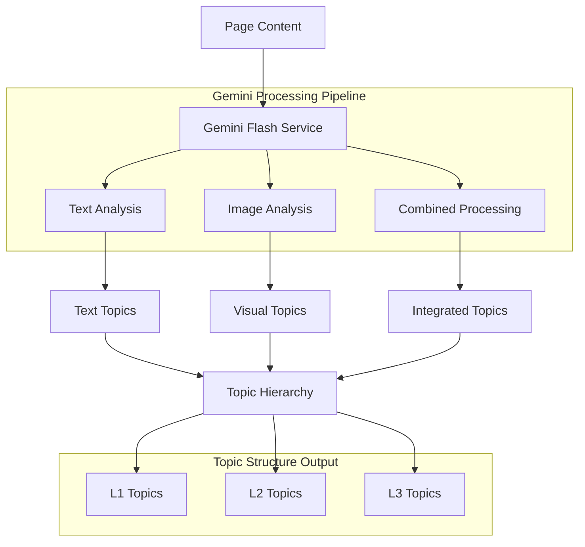

# Gemini Flash Implementation Guide

## Overview

This document provides comprehensive implementation guidance for Gemini Flash integration in the Vectorless RAG system. Based on **Section 5.1** of the PRD, Gemini Flash 1.5 serves as the AI-powered topic extraction engine that analyzes document pages and generates hierarchical topic structures.

### Purpose and Role

Gemini Flash integration serves as:
- **Topic Extractor**: AI-powered analysis of page content for topic identification
- **Visual Processor**: Understanding of charts, diagrams, and visual elements
- **Content Analyzer**: Semantic analysis of text and image combinations
- **Hierarchy Builder**: Generation of L1, L2, L3 topic hierarchies
- **Quality Validator**: Relevance scoring and topic validation

## Technical Specifications

### Core Requirements

Based on **Section 5.1** and **Section 5.3** of the PRD:
- **Model**: Gemini Flash 1.5 for optimal speed and accuracy
- **Processing**: Parallel topic extraction across multiple pages
- **Input Types**: Combined text and image analysis
- **Output Format**: Structured topic hierarchies with metadata
- **Rate Limiting**: Efficient API usage with retry mechanisms
- **Error Handling**: Robust fallback strategies for API failures

### Processing Architecture



## Implementation Details

### 1. Core Gemini Service Class

**app/services/gemini_service.py**
```python
import asyncio
import logging
from typing import List, Dict, Any, Optional, Tuple
import json
import base64
from datetime import datetime, timedelta

import google.generativeai as genai
from google.generativeai.types import HarmCategory, HarmBlockThreshold
import aiohttp
from tenacity import retry, stop_after_attempt, wait_exponential

from app.config import settings
from app.models.topic import TopicExtraction, TopicLevel, TopicNode

logger = logging.getLogger(__name__)

class GeminiFlashService:
    """
    Gemini Flash integration service implementing AI-powered topic extraction
    as specified in Section 5.1 of the PRD.
    """
    
    def __init__(self):
        # Configure Gemini API
        genai.configure(api_key=settings.gemini_api_key)
        
        # Initialize model with optimal settings
        self.model = genai.GenerativeModel(
            model_name="gemini-1.5-flash",
            generation_config={
                "temperature": 0.1,  # Low temperature for consistent results
                "top_p": 0.8,
                "top_k": 40,
                "max_output_tokens": 4096,
            },
            safety_settings={
                HarmCategory.HARM_CATEGORY_HATE_SPEECH: HarmBlockThreshold.BLOCK_NONE,
                HarmCategory.HARM_CATEGORY_HARASSMENT: HarmBlockThreshold.BLOCK_NONE,
                HarmCategory.HARM_CATEGORY_SEXUALLY_EXPLICIT: HarmBlockThreshold.BLOCK_NONE,
                HarmCategory.HARM_CATEGORY_DANGEROUS_CONTENT: HarmBlockThreshold.BLOCK_NONE,
            }
        )
        
        # Rate limiting configuration
        self.rate_limit_requests_per_minute = 60
        self.rate_limit_tokens_per_minute = 1000000
        self.request_timestamps = []
        
        # Retry configuration
        self.max_retries = 3
        self.retry_delay = 1.0
    
    @retry(
        stop=stop_after_attempt(3),
        wait=wait_exponential(multiplier=1, min=4, max=10)
    )
    async def extract_topics(
        self, 
        page_image: bytes, 
        page_text: str,
        context: Optional[Dict[str, Any]] = None
    ) -> List[Dict[str, Any]]:
        """
        Main topic extraction method combining text and image analysis.
        Implements parallel processing as specified in Section 5.3.
        """
        try:
            # Rate limiting check
            await self._check_rate_limits()
            
            # Prepare input for Gemini
            prompt = self._build_extraction_prompt(page_text, context)
            image_data = self._prepare_image_data(page_image)
            
            # Generate topics using Gemini Flash
            response = await self._generate_topics(prompt, image_data)
            
            # Parse and validate response
            topics = self._parse_topic_response(response)
            
            # Post-process topics for hierarchy
            hierarchical_topics = await self._build_topic_hierarchy(topics)
            
            logger.info(f"Extracted {len(hierarchical_topics)} topics from page")
            return hierarchical_topics
            
        except Exception as e:
            logger.error(f"Error extracting topics: {str(e)}")
            # Return fallback topics based on text analysis
            return await self._fallback_topic_extraction(page_text)
    
    def _build_extraction_prompt(
        self, 
        page_text: str, 
        context: Optional[Dict[str, Any]] = None
    ) -> str:
        """Build comprehensive prompt for topic extraction"""
        
        base_prompt = """
        You are an expert document analyst. Analyze the provided page content (text and image) and extract hierarchical topics.

        TASK: Extract topics in a 3-level hierarchy (L1, L2, L3) where:
        - L1: Main themes/sections (high-level concepts)
        - L2: Sub-topics within main themes
        - L3: Specific details and data points

        REQUIREMENTS:
        1. Analyze both text content and visual elements (charts, diagrams, tables)
        2. Generate 3-7 L1 topics, 2-5 L2 topics per L1, 1-3 L3 topics per L2
        3. Include relevance scores (0.0-1.0) for each topic
        4. Extract key keywords for each topic (3-8 keywords)
        5. Provide brief summaries (1-2 sentences) for each topic
        6. Identify relationships between topics

        OUTPUT FORMAT (JSON):
        {
            "topics": [
                {
                    "id": "unique_topic_id",
                    "title": "Topic Title",
                    "level": "L1|L2|L3",
                    "summary": "Brief topic summary",
                    "keywords": ["keyword1", "keyword2", ...],
                    "relevance_score": 0.85,
                    "parent_id": "parent_topic_id_or_null",
                    "content_type": "text|visual|mixed",
                    "page_references": [page_number],
                    "metadata": {
                        "importance_score": 0.8,
                        "complexity_level": "basic|intermediate|advanced",
                        "content_density": "low|medium|high"
                    }
                }
            ],
            "relationships": [
                {
                    "source_id": "topic_id_1",
                    "target_id": "topic_id_2",
                    "relationship_type": "contains|relates_to|depends_on",
                    "strength": 0.7
                }
            ],
            "page_summary": "Overall page summary",
            "confidence_score": 0.9
        }

        TEXT CONTENT:
        {text_content}
        """
        
        # Add context if provided
        if context:
            context_info = f"""
        DOCUMENT CONTEXT:
        - Document Type: {context.get('document_type', 'Unknown')}
        - Previous Topics: {context.get('previous_topics', [])}
        - Collection: {context.get('collection_name', 'Unknown')}
        """
            base_prompt = context_info + base_prompt
        
        return base_prompt.format(text_content=page_text[:8000])  # Limit text length
    
    def _prepare_image_data(self, image_bytes: bytes) -> Dict[str, Any]:
        """Prepare image data for Gemini processing"""
        try:
            # Convert image to base64 for API
            image_b64 = base64.b64encode(image_bytes).decode('utf-8')
            
            return {
                "mime_type": "image/png",
                "data": image_b64
            }
            
        except Exception as e:
            logger.error(f"Error preparing image data: {str(e)}")
            return None
    
    async def _generate_topics(
        self, 
        prompt: str, 
        image_data: Optional[Dict[str, Any]]
    ) -> str:
        """Generate topics using Gemini Flash model"""
        try:
            # Prepare content for multimodal input
            content_parts = [prompt]
            
            if image_data:
                content_parts.append({
                    "mime_type": image_data["mime_type"],
                    "data": image_data["data"]
                })
            
            # Generate response
            response = await asyncio.to_thread(
                self.model.generate_content,
                content_parts
            )
            
            return response.text
            
        except Exception as e:
            logger.error(f"Error generating topics with Gemini: {str(e)}")
            raise GeminiServiceError(f"Topic generation failed: {str(e)}")
    
    def _parse_topic_response(self, response_text: str) -> List[Dict[str, Any]]:
        """Parse and validate Gemini response"""
        try:
            # Extract JSON from response
            json_start = response_text.find('{')
            json_end = response_text.rfind('}') + 1
            
            if json_start == -1 or json_end == 0:
                raise ValueError("No JSON found in response")
            
            json_text = response_text[json_start:json_end]
            parsed_response = json.loads(json_text)
            
            # Validate response structure
            if "topics" not in parsed_response:
                raise ValueError("Invalid response format: missing 'topics'")
            
            topics = parsed_response["topics"]
            
            # Validate each topic
            validated_topics = []
            for topic in topics:
                if self._validate_topic_structure(topic):
                    validated_topics.append(topic)
                else:
                    logger.warning(f"Invalid topic structure: {topic}")
            
            return validated_topics
            
        except json.JSONDecodeError as e:
            logger.error(f"JSON parsing error: {str(e)}")
            return []
        except Exception as e:
            logger.error(f"Error parsing topic response: {str(e)}")
            return []
    
    def _validate_topic_structure(self, topic: Dict[str, Any]) -> bool:
        """Validate individual topic structure"""
        required_fields = ["id", "title", "level", "summary", "keywords", "relevance_score"]
        
        for field in required_fields:
            if field not in topic:
                return False
        
        # Validate level
        if topic["level"] not in ["L1", "L2", "L3"]:
            return False
        
        # Validate relevance score
        score = topic.get("relevance_score", 0)
        if not isinstance(score, (int, float)) or not 0 <= score <= 1:
            return False
        
        return True
    
    async def _build_topic_hierarchy(
        self, 
        topics: List[Dict[str, Any]]
    ) -> List[Dict[str, Any]]:
        """Build hierarchical topic structure"""
        try:
            # Separate topics by level
            l1_topics = [t for t in topics if t["level"] == "L1"]
            l2_topics = [t for t in topics if t["level"] == "L2"]
            l3_topics = [t for t in topics if t["level"] == "L3"]
            
            # Build hierarchy relationships
            for l2_topic in l2_topics:
                parent_id = l2_topic.get("parent_id")
                if parent_id:
                    parent = next((t for t in l1_topics if t["id"] == parent_id), None)
                    if parent:
                        if "children" not in parent:
                            parent["children"] = []
                        parent["children"].append(l2_topic)
            
            for l3_topic in l3_topics:
                parent_id = l3_topic.get("parent_id")
                if parent_id:
                    parent = next((t for t in l2_topics if t["id"] == parent_id), None)
                    if parent:
                        if "children" not in parent:
                            parent["children"] = []
                        parent["children"].append(l3_topic)
            
            # Return all topics with hierarchy
            return topics
            
        except Exception as e:
            logger.error(f"Error building topic hierarchy: {str(e)}")
            return topics
    
    async def _fallback_topic_extraction(self, page_text: str) -> List[Dict[str, Any]]:
        """Fallback topic extraction using simple text analysis"""
        try:
            # Simple keyword-based topic extraction
            words = page_text.split()
            
            # Create basic topic structure
            fallback_topic = {
                "id": f"fallback_{datetime.now().timestamp()}",
                "title": "Page Content",
                "level": "L1",
                "summary": page_text[:200] + "..." if len(page_text) > 200 else page_text,
                "keywords": list(set(words[:10])),  # First 10 unique words
                "relevance_score": 0.5,
                "parent_id": None,
                "content_type": "text",
                "page_references": [1],
                "metadata": {
                    "importance_score": 0.5,
                    "complexity_level": "basic",
                    "content_density": "medium"
                }
            }
            
            return [fallback_topic]
            
        except Exception as e:
            logger.error(f"Error in fallback topic extraction: {str(e)}")
            return []
    
    async def _check_rate_limits(self) -> None:
        """Check and enforce rate limits"""
        current_time = datetime.now()
        
        # Remove timestamps older than 1 minute
        self.request_timestamps = [
            ts for ts in self.request_timestamps 
            if current_time - ts < timedelta(minutes=1)
        ]
        
        # Check if we're within rate limits
        if len(self.request_timestamps) >= self.rate_limit_requests_per_minute:
            sleep_time = 60 - (current_time - self.request_timestamps[0]).seconds
            logger.warning(f"Rate limit reached, sleeping for {sleep_time} seconds")
            await asyncio.sleep(sleep_time)
        
        # Add current request timestamp
        self.request_timestamps.append(current_time)
    
    async def batch_extract_topics(
        self, 
        pages_data: List[Dict[str, Any]],
        max_concurrent: int = 5
    ) -> List[List[Dict[str, Any]]]:
        """Extract topics from multiple pages in parallel"""
        try:
            semaphore = asyncio.Semaphore(max_concurrent)
            
            async def extract_single_page(page_data: Dict[str, Any]) -> List[Dict[str, Any]]:
                async with semaphore:
                    return await self.extract_topics(
                        page_data["image"],
                        page_data["text"],
                        page_data.get("context")
                    )
            
            # Process all pages in parallel
            tasks = [extract_single_page(page) for page in pages_data]
            results = await asyncio.gather(*tasks, return_exceptions=True)
            
            # Filter out failed extractions
            successful_results = []
            for i, result in enumerate(results):
                if isinstance(result, Exception):
                    logger.error(f"Failed to extract topics from page {i + 1}: {str(result)}")
                    successful_results.append([])  # Empty list for failed page
                else:
                    successful_results.append(result)
            
            return successful_results
            
        except Exception as e:
            logger.error(f"Error in batch topic extraction: {str(e)}")
            raise
    
    async def health_check(self) -> bool:
        """Check if Gemini service is available"""
        try:
            # Simple test request
            test_response = await asyncio.to_thread(
                self.model.generate_content,
                "Test connection. Respond with 'OK'."
            )
            
            return "OK" in test_response.text
            
        except Exception as e:
            logger.error(f"Gemini health check failed: {str(e)}")
            return False

class GeminiServiceError(Exception):
    """Custom exception for Gemini service errors"""
    pass

# Global instance
gemini_service = GeminiFlashService()
```

### 2. Topic Models

**app/models/topic.py**
```python
from pydantic import BaseModel, Field, validator
from typing import List, Dict, Any, Optional
from enum import Enum
from datetime import datetime

class TopicLevel(str, Enum):
    L1 = "L1"
    L2 = "L2"
    L3 = "L3"

class ContentType(str, Enum):
    TEXT = "text"
    VISUAL = "visual"
    MIXED = "mixed"

class ComplexityLevel(str, Enum):
    BASIC = "basic"
    INTERMEDIATE = "intermediate"
    ADVANCED = "advanced"

class ContentDensity(str, Enum):
    LOW = "low"
    MEDIUM = "medium"
    HIGH = "high"

class TopicMetadata(BaseModel):
    importance_score: float = Field(..., ge=0.0, le=1.0)
    complexity_level: ComplexityLevel
    content_density: ContentDensity
    extraction_confidence: float = Field(default=0.8, ge=0.0, le=1.0)
    processing_time: Optional[float] = None

class TopicRelationship(BaseModel):
    source_id: str
    target_id: str
    relationship_type: str = Field(..., regex="^(contains|relates_to|depends_on)$")
    strength: float = Field(..., ge=0.0, le=1.0)

class TopicNode(BaseModel):
    id: str
    title: str
    level: TopicLevel
    summary: str = Field(..., max_length=500)
    keywords: List[str] = Field(..., min_items=1, max_items=15)
    relevance_score: float = Field(..., ge=0.0, le=1.0)
    parent_id: Optional[str] = None
    content_type: ContentType
    page_references: List[int] = Field(..., min_items=1)
    metadata: TopicMetadata
    children: List['TopicNode'] = Field(default_factory=list)
    created_at: datetime = Field(default_factory=datetime.utcnow)
    
    @validator('keywords')
    def validate_keywords(cls, v):
        # Remove duplicates and empty strings
        return list(set([k.strip() for k in v if k.strip()]))
    
    @validator('summary')
    def validate_summary(cls, v):
        if len(v.strip()) < 10:
            raise ValueError('Summary must be at least 10 characters long')
        return v.strip()

class TopicExtraction(BaseModel):
    topics: List[TopicNode]
    relationships: List[TopicRelationship] = Field(default_factory=list)
    page_summary: str
    confidence_score: float = Field(..., ge=0.0, le=1.0)
    extraction_metadata: Dict[str, Any] = Field(default_factory=dict)
    
    class Config:
        json_encoders = {
            datetime: lambda v: v.isoformat()
        }

# Update forward references
TopicNode.model_rebuild()
```

## Integration Points

### 1. Document Processing Integration
```python
# app/core/document_processor.py
from app.services.gemini_service import gemini_service

async def _process_pages_parallel(self, pages, document_id):
    # Extract topics using Gemini Flash
    topics_results = await gemini_service.batch_extract_topics(pages)
    
    # Combine page data with extracted topics
    for i, page_data in enumerate(pages):
        page_data["topics"] = topics_results[i]
    
    return pages
```

### 2. FastAPI Endpoint Integration
```python
# app/api/v1/documents.py
@router.post("/{document_id}/extract-topics")
async def extract_topics_endpoint(
    document_id: str,
    page_numbers: Optional[List[int]] = None
):
    # Get page data
    pages = await get_document_pages(document_id, page_numbers)
    
    # Extract topics
    topics = await gemini_service.batch_extract_topics(pages)
    
    return {"topics": topics, "status": "completed"}
```

## Development Tasks

### Phase 1: Core Implementation (Week 1)
- [ ] Setup Gemini API client and authentication
- [ ] Implement basic topic extraction functionality
- [ ] Create prompt engineering for optimal results
- [ ] Add response parsing and validation
- [ ] Implement error handling and retries

### Phase 2: Advanced Features (Week 2)
- [ ] Implement batch processing for multiple pages
- [ ] Add rate limiting and quota management
- [ ] Create topic hierarchy building logic
- [ ] Implement fallback mechanisms
- [ ] Add quality validation and scoring

### Phase 3: Optimization (Week 3)
- [ ] Performance tuning for large documents
- [ ] Memory usage optimization
- [ ] Caching strategies for repeated requests
- [ ] Parallel processing optimization
- [ ] Cost optimization for API usage

### Phase 4: Integration (Week 4)
- [ ] FastAPI endpoint integration
- [ ] MongoDB storage integration
- [ ] Monitoring and logging implementation
- [ ] Testing and validation
- [ ] Documentation completion

## Testing Strategy

### Unit Tests
```python
import pytest
from app.services.gemini_service import gemini_service

@pytest.mark.asyncio
async def test_topic_extraction():
    # Test with sample content
    sample_text = "This is a sample document about financial performance..."
    sample_image = b"sample_image_bytes"
    
    topics = await gemini_service.extract_topics(sample_image, sample_text)
    
    assert len(topics) > 0
    assert all("title" in topic for topic in topics)
    assert all("level" in topic for topic in topics)

@pytest.mark.asyncio
async def test_batch_processing():
    # Test batch topic extraction
    pass

@pytest.mark.asyncio
async def test_rate_limiting():
    # Test rate limiting functionality
    pass
```

## Performance Considerations

### API Optimization
- Efficient prompt design to minimize token usage
- Batch processing to reduce API calls
- Intelligent caching of similar content
- Rate limiting to avoid quota exhaustion

### Quality Assurance
- Response validation and error handling
- Fallback mechanisms for API failures
- Quality scoring for extracted topics
- Continuous improvement based on feedback

## Security Requirements

### API Security
- Secure API key management
- Request/response logging for audit
- Input validation and sanitization
- Rate limiting and abuse prevention

### Data Protection
- Secure handling of document content
- Privacy compliance for sensitive documents
- Audit trails for API usage
- Data retention policies

## Deployment Configuration

### Environment Variables
```bash
GEMINI_API_KEY=your_api_key_here
GEMINI_MODEL=gemini-1.5-flash
GEMINI_RATE_LIMIT_RPM=60
GEMINI_RATE_LIMIT_TPM=1000000
GEMINI_MAX_RETRIES=3
```

### Dependencies
```txt
google-generativeai==0.3.0
aiohttp==3.8.5
tenacity==8.2.3
```

## Monitoring & Logging

### Metrics to Track
- API response times
- Success/failure rates
- Token usage and costs
- Topic extraction quality scores
- Rate limiting events

### Logging Strategy
- Request/response logging
- Error tracking and alerting
- Performance metrics
- Usage analytics

---

*This Gemini Flash implementation guide provides the foundation for AI-powered topic extraction in the vectorless RAG system. Follow the implementation phases and integrate with other system components as specified in the PRD.*
