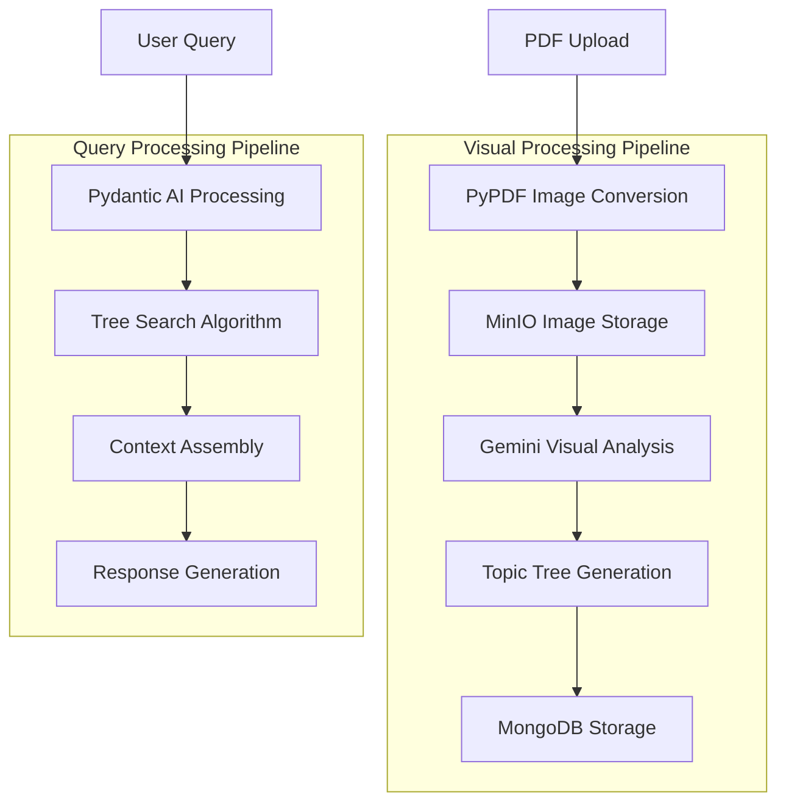
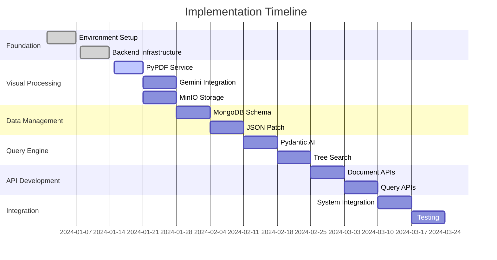

# Vectorless RAG Implementation Plan

## Project Overview

This document provides a comprehensive implementation plan for the Vectorless RAG system, a **visual-first document analysis and querying platform** that processes documents through hierarchical topic trees without traditional vector embeddings.

### Core Architecture Principles

**Visual-First Processing Pipeline:**
- **PyPDF**: Converts PDF pages to high-quality images ONLY
- **Gemini Flash**: Performs ALL content analysis through visual understanding
- **MongoDB**: Stores structured topic trees from visual analysis
- **MinIO**: Manages image storage and retrieval
- **Pydantic AI**: Handles type-safe query processing

## Technology Stack Overview

### Core Technologies

| Component | Technology | Version | Purpose |
|-----------|------------|---------|---------|
| **PDF Processing** | PyPDF2 | 3.0.1 | PDF to image conversion ONLY |
| **Visual Analysis** | Gemini Flash | 1.5 | Complete visual content analysis |
| **Tree Management** | JSON Patch | 1.32 | Hierarchical structure manipulation |
| **Database** | MongoDB | 7.0+ | Document and tree storage |
| **Object Storage** | MinIO | Latest | Image and file storage |
| **API Framework** | FastAPI | 0.104+ | Backend REST API |
| **AI Framework** | Pydantic AI | 0.0.13 | Type-safe query processing |
| **Containerization** | Docker Compose | Latest | Development and deployment |

### Processing Flow

## Implementation Phases

### Phase 1: Foundation Setup (Week 1-2)

#### 1.1 Development Environment
**Priority: Critical**
- [ ] Setup Docker Compose development environment
- [ ] Configure MongoDB, MinIO, and Redis containers
- [ ] Setup Python virtual environment with dependencies
- [ ] Configure environment variables and secrets
- [ ] Setup development tools (linting, formatting, testing)

**Deliverables:**
- Working Docker Compose setup
- Development environment documentation
- Basic project structure

#### 1.2 Core Backend Infrastructure
**Priority: Critical**
- [ ] Initialize FastAPI application structure
- [ ] Setup database connections (MongoDB, MinIO, Redis)
- [ ] Implement configuration management
- [ ] Create basic middleware and error handling
- [ ] Setup dependency injection system

**Deliverables:**
- FastAPI application skeleton
- Database connection management
- Basic API health checks

### Phase 2: Visual Processing Pipeline (Week 3-4)

#### 2.1 PyPDF Image Conversion Service
**Priority: Critical**
- [ ] Implement PDF to image conversion (PyPDF ONLY)
- [ ] Setup high-quality image generation (300 DPI)
- [ ] Create image optimization and compression
- [ ] Implement batch processing for multi-page PDFs
- [ ] Add error handling for corrupted PDFs

**Key Implementation Points:**
- **NO text extraction** - images only
- Focus on image quality for visual analysis
- Efficient memory management for large PDFs

**Deliverables:**
- PyPDF image conversion service
- Image quality optimization
- Batch processing capabilities

#### 2.2 Gemini Visual Analysis Engine
**Priority: Critical**
- [ ] Integrate Gemini Flash API for visual analysis
- [ ] Develop comprehensive visual content analysis prompts
- [ ] Implement hierarchical topic extraction from images
- [ ] Create visual element detection (charts, tables, diagrams)
- [ ] Setup batch processing for multiple page images

**Key Implementation Points:**
- **ALL content analysis** through visual understanding
- No dependency on text extraction
- Comprehensive document structure recognition

**Deliverables:**
- Gemini Flash integration
- Visual analysis prompts and templates
- Topic tree generation from images

#### 2.3 MinIO Storage Integration
**Priority: High**
- [ ] Setup MinIO buckets for image storage
- [ ] Implement image upload and retrieval
- [ ] Create image metadata management
- [ ] Setup automatic cleanup policies
- [ ] Implement access control and security

**Deliverables:**
- MinIO storage service
- Image management system
- Storage security configuration

### Phase 3: Data Management Layer (Week 5-6)

#### 3.1 MongoDB Schema and Operations
**Priority: Critical**
- [ ] Design document and tree collection schemas
- [ ] Implement MongoDB repository patterns
- [ ] Create indexing strategy for performance
- [ ] Setup data validation and constraints
- [ ] Implement backup and recovery procedures

**Deliverables:**
- MongoDB schema design
- Repository implementation
- Database performance optimization

#### 3.2 JSON Patch Tree Management
**Priority: High**
- [ ] Implement JSON Patch operations for tree manipulation
- [ ] Create tree versioning and history tracking
- [ ] Develop tree validation and integrity checks
- [ ] Setup atomic operations for tree updates
- [ ] Implement tree merging and conflict resolution

**Deliverables:**
- JSON Patch integration
- Tree management service
- Version control system

### Phase 4: Query Processing Engine (Week 7-8)

#### 4.1 Pydantic AI Integration
**Priority: Critical**
- [ ] Setup Pydantic AI agents for query processing
- [ ] Implement type-safe query models
- [ ] Create query validation and parsing
- [ ] Develop context assembly algorithms
- [ ] Setup response generation pipeline

**Deliverables:**
- Pydantic AI query engine
- Type-safe query processing
- Context assembly system

#### 4.2 Tree Search Algorithms
**Priority: High**
- [ ] Implement hierarchical tree traversal
- [ ] Create semantic similarity matching
- [ ] Develop keyword-based filtering
- [ ] Setup relevance scoring algorithms
- [ ] Implement query optimization

**Deliverables:**
- Tree search algorithms
- Query optimization engine
- Relevance scoring system

### Phase 5: API Development (Week 9-10)

#### 5.1 Document Management APIs
**Priority: Critical**
- [ ] Create document upload endpoints
- [ ] Implement processing status tracking
- [ ] Setup document metadata management
- [ ] Create document retrieval and listing
- [ ] Implement document deletion and cleanup

**Deliverables:**
- Document management API
- Processing status system
- Document lifecycle management

#### 5.2 Query Processing APIs
**Priority: Critical**
- [ ] Create query submission endpoints
- [ ] Implement real-time query processing
- [ ] Setup query history and analytics
- [ ] Create result formatting and pagination
- [ ] Implement query caching and optimization

**Deliverables:**
- Query processing API
- Query analytics system
- Result optimization

### Phase 6: Integration and Testing (Week 11-12)

#### 6.1 End-to-End Integration
**Priority: Critical**
- [ ] Integrate all system components
- [ ] Test complete processing pipeline
- [ ] Validate visual-first approach
- [ ] Performance testing and optimization
- [ ] Security testing and hardening

**Deliverables:**
- Integrated system
- Performance benchmarks
- Security validation

#### 6.2 Comprehensive Testing
**Priority: High**
- [ ] Unit tests for all components
- [ ] Integration tests for API endpoints
- [ ] Performance tests for processing pipeline
- [ ] Load tests for concurrent processing
- [ ] Security tests for vulnerabilities

**Deliverables:**
- Complete test suite
- Performance reports
- Security assessment

## Development Dependencies

### Phase Dependencies

### Critical Path Items

1. **PyPDF Image Conversion** → **Gemini Visual Analysis** → **MongoDB Storage**
2. **Pydantic AI Setup** → **Tree Search Implementation** → **Query APIs**
3. **MinIO Integration** → **Document APIs** → **End-to-End Testing**

## Resource Requirements

### Development Team

| Role | Responsibility | Time Allocation |
|------|---------------|-----------------|
| **Backend Developer** | FastAPI, MongoDB, APIs | Full-time |
| **AI Integration Specialist** | Gemini Flash, Pydantic AI | Full-time |
| **DevOps Engineer** | Docker, deployment, monitoring | Part-time |
| **QA Engineer** | Testing, validation, performance | Part-time |

### Infrastructure Requirements

| Component | Specification | Purpose |
|-----------|--------------|---------|
| **Development Server** | 16GB RAM, 8 CPU cores | Local development |
| **MongoDB Instance** | 8GB RAM, SSD storage | Document storage |
| **MinIO Storage** | 100GB+ storage | Image storage |
| **Redis Cache** | 4GB RAM | Query caching |

## Quality Assurance

### Testing Strategy

#### Unit Testing
- **PyPDF Service**: Image conversion accuracy and quality
- **Gemini Integration**: Visual analysis response validation
- **MongoDB Operations**: Data integrity and performance
- **Pydantic AI**: Query processing accuracy
- **API Endpoints**: Request/response validation

#### Integration Testing
- **Visual Processing Pipeline**: PDF → Images → Analysis → Storage
- **Query Processing Flow**: Query → Search → Context → Response
- **API Integration**: End-to-end API workflows
- **Error Handling**: Failure scenarios and recovery

#### Performance Testing
- **Document Processing**: Large PDF handling and processing time
- **Concurrent Queries**: Multiple simultaneous query processing
- **Storage Performance**: Image upload/retrieval speed
- **Memory Usage**: Resource consumption optimization

### Code Quality Standards

- **Type Safety**: Full Pydantic model validation
- **Error Handling**: Comprehensive exception management
- **Logging**: Structured logging for debugging and monitoring
- **Documentation**: API documentation and code comments
- **Security**: Input validation and access control

## Risk Management

### Technical Risks

| Risk | Impact | Mitigation |
|------|--------|------------|
| **Gemini API Rate Limits** | High | Implement request queuing and retry logic |
| **Large PDF Processing** | Medium | Implement chunking and parallel processing |
| **Image Storage Costs** | Medium | Implement compression and cleanup policies |
| **Query Performance** | High | Implement caching and query optimization |

### Operational Risks

| Risk | Impact | Mitigation |
|------|--------|------------|
| **Service Dependencies** | High | Implement health checks and fallback mechanisms |
| **Data Loss** | Critical | Implement backup and recovery procedures |
| **Security Vulnerabilities** | High | Regular security audits and updates |
| **Scalability Issues** | Medium | Performance monitoring and optimization |

## Success Metrics

### Performance Targets

- **Document Processing**: < 30 seconds per 10-page PDF
- **Query Response Time**: < 2 seconds for typical queries
- **System Uptime**: 99.9% availability
- **Concurrent Users**: Support 100+ simultaneous users

### Quality Targets

- **Visual Analysis Accuracy**: > 95% content recognition
- **Query Relevance**: > 90% user satisfaction
- **Error Rate**: < 1% processing failures
- **Test Coverage**: > 90% code coverage

## Deployment Strategy

### Development Deployment
- Docker Compose for local development
- Automated testing on code changes
- Development environment mirroring production

### Production Deployment
- Kubernetes orchestration
- Blue-green deployment strategy
- Automated monitoring and alerting
- Backup and disaster recovery

## Monitoring and Maintenance

### Monitoring Requirements
- **Application Performance**: Response times, throughput
- **Resource Usage**: CPU, memory, storage consumption
- **Error Tracking**: Exception monitoring and alerting
- **Business Metrics**: Document processing volume, query patterns

### Maintenance Schedule
- **Daily**: Health checks and log review
- **Weekly**: Performance analysis and optimization
- **Monthly**: Security updates and dependency upgrades
- **Quarterly**: Comprehensive system review and planning

---

*This implementation plan provides a structured approach to building the Vectorless RAG system with a visual-first architecture. Follow the phased approach and maintain focus on the core principle: PyPDF for image conversion only, Gemini Flash for all visual analysis.*