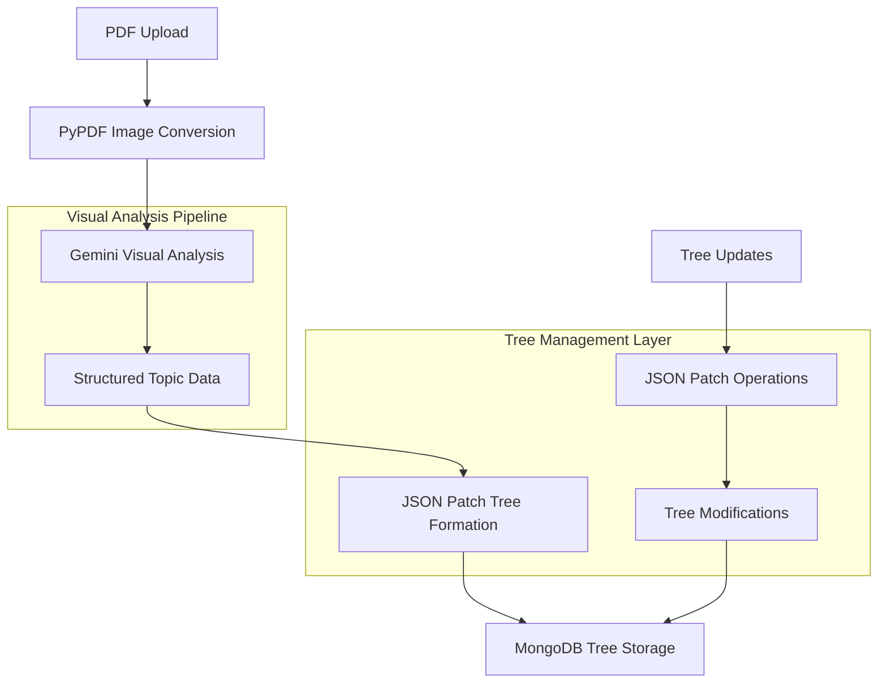

# JSON Patch Implementation Guide

## Overview

This document provides comprehensive implementation guidance for JSON Patch integration in the Vectorless RAG system. JSON Patch serves as the **tree manipulation engine** that processes structured data from Gemini's visual analysis to create, modify, and maintain hierarchical topic trees.

## Role and Purpose

### Primary Function

JSON Patch handles all **tree structure operations** by:

* **Receiving structured topic data** from Gemini Flash visual analysis

* **Creating hierarchical tree structures** from visual analysis results

* **Managing tree modifications** and updates over time

* **Maintaining tree integrity** and consistency

* **Enabling atomic tree operations** for reliable updates

### Integration Context



## Technical Specifications

### Dependencies

```python
# Core JSON Patch library
jsonpatch==1.32

# Supporting libraries
jsonschema==4.17.3  # Tree validation
deepdiff==6.2.1     # Tree comparison
pymongo==4.3.3      # MongoDB integration
pydantic==2.5.0     # Data validation
```

### Core Components

#### 1. Tree Structure Models

```python
from pydantic import BaseModel, Field
from typing import List, Dict, Any, Optional
from datetime import datetime

class TopicNode(BaseModel):
    """Individual topic node from visual analysis"""
    id: str = Field(..., description="Unique node identifier")
    title: str = Field(..., description="Topic title from visual analysis")
    content: str = Field(..., description="Topic content summary")
    level: int = Field(..., description="Hierarchical level (0=root)")
    parent_id: Optional[str] = Field(None, description="Parent node ID")
    children_ids: List[str] = Field(default_factory=list, description="Child node IDs")
    visual_elements: Dict[str, Any] = Field(default_factory=dict, description="Visual elements detected")
    confidence_score: float = Field(..., description="Gemini analysis confidence")
    page_number: int = Field(..., description="Source page number")
    bounding_box: Optional[Dict[str, float]] = Field(None, description="Visual location")

class DocumentTree(BaseModel):
    """Complete document tree structure"""
    document_id: str = Field(..., description="Document identifier")
    title: str = Field(..., description="Document title")
    total_pages: int = Field(..., description="Total pages processed")
    root_nodes: List[str] = Field(..., description="Root level topic IDs")
    nodes: Dict[str, TopicNode] = Field(..., description="All topic nodes")
    metadata: Dict[str, Any] = Field(default_factory=dict, description="Document metadata")
    created_at: datetime = Field(default_factory=datetime.now)
    updated_at: datetime = Field(default_factory=datetime.now)
    version: int = Field(default=1, description="Tree version number")

class TreePatch(BaseModel):
    """JSON Patch operation for tree modification"""
    operation: str = Field(..., description="Patch operation type")
    path: str = Field(..., description="JSON path to modify")
    value: Any = Field(None, description="New value for operation")
    from_path: Optional[str] = Field(None, description="Source path for move/copy")
```

#### 2. Visual Analysis Data Processor

```python
import json
from typing import Dict, List
import uuid

class VisualAnalysisProcessor:
    """Processes Gemini visual analysis results into tree structures"""
    
    def __init__(self):
        self.confidence_threshold = 0.7
        
    def process_gemini_analysis(self, analysis_result: Dict[str, Any]) -> DocumentTree:
        """
        Convert Gemini visual analysis into structured tree
        
        Args:
            analysis_result: Raw Gemini Flash analysis output
            
        Returns:
            DocumentTree: Structured hierarchical tree
        """
        # Extract document metadata
        doc_metadata = analysis_result.get("document_metadata", {})
        
        # Process visual topics from Gemini analysis
        visual_topics = analysis_result.get("topics", [])
        nodes = {}
        root_nodes = []
        
        # Create topic nodes from visual analysis
        for topic_data in visual_topics:
            if topic_data.get("confidence", 0) >= self.confidence_threshold:
                node = self._create_topic_node(topic_data)
                nodes[node.id] = node
                
                # Identify root nodes (level 0 or no parent)
                if node.level == 0 or not node.parent_id:
                    root_nodes.append(node.id)
        
        # Build hierarchical relationships
        self._build_tree_relationships(nodes)
        
        # Create document tree
        tree = DocumentTree(
            document_id=analysis_result.get("document_id"),
            title=doc_metadata.get("title", "Untitled Document"),
            total_pages=doc_metadata.get("total_pages", 0),
            root_nodes=root_nodes,
            nodes=nodes,
            metadata=doc_metadata
        )
        
        return tree
    
    def _create_topic_node(self, topic_data: Dict[str, Any]) -> TopicNode:
        """Create topic node from Gemini analysis data"""
        return TopicNode(
            id=str(uuid.uuid4()),
            title=topic_data.get("title", ""),
            content=topic_data.get("content", ""),
            level=topic_data.get("level", 0),
            parent_id=topic_data.get("parent_id"),
            visual_elements=topic_data.get("visual_elements", {}),
            confidence_score=topic_data.get("confidence", 0.0),
            page_number=topic_data.get("page_number", 1),
            bounding_box=topic_data.get("bounding_box")
        )
    
    def _build_tree_relationships(self, nodes: Dict[str, TopicNode]):
        """Build parent-child relationships in the tree"""
        for node in nodes.values():
            if node.parent_id and node.parent_id in nodes:
                parent = nodes[node.parent_id]
                if node.id not in parent.children_ids:
                    parent.children_ids.append(node.id)
```

#### 3. JSON Patch Tree Manager

```python
import jsonpatch
from jsonschema import validate, ValidationError
from typing import List, Union

class TreePatchManager:
    """Manages JSON Patch operations on document trees"""
    
    def __init__(self):
        self.tree_schema = self._load_tree_schema()
    
    def create_tree_from_analysis(self, analysis_result: Dict[str, Any]) -> DocumentTree:
        """
        Create initial tree from Gemini visual analysis
        
        Args:
            analysis_result: Gemini Flash analysis output
            
        Returns:
            DocumentTree: Initial tree structure
        """
        processor = VisualAnalysisProcessor()
        tree = processor.process_gemini_analysis(analysis_result)
        
        # Validate tree structure
        self._validate_tree(tree)
        
        return tree
    
    def apply_patches(self, tree: DocumentTree, patches: List[TreePatch]) -> DocumentTree:
        """
        Apply JSON Patch operations to tree
        
        Args:
            tree: Current tree state
            patches: List of patch operations
            
        Returns:
            DocumentTree: Updated tree
        """
        # Convert tree to JSON for patching
        tree_json = tree.model_dump()
        
        # Convert patches to JSON Patch format
        json_patches = []
        for patch in patches:
            patch_dict = {
                "op": patch.operation,
                "path": patch.path,
                "value": patch.value
            }
            if patch.from_path:
                patch_dict["from"] = patch.from_path
            json_patches.append(patch_dict)
        
        # Apply patches
        try:
            patch_obj = jsonpatch.JsonPatch(json_patches)
            updated_json = patch_obj.apply(tree_json)
            
            # Convert back to DocumentTree
            updated_tree = DocumentTree(**updated_json)
            updated_tree.version += 1
            updated_tree.updated_at = datetime.now()
            
            # Validate updated tree
            self._validate_tree(updated_tree)
            
            return updated_tree
            
        except jsonpatch.JsonPatchException as e:
            raise ValueError(f"Invalid patch operation: {e}")
    
    def add_topic_node(self, tree: DocumentTree, node: TopicNode, parent_id: Optional[str] = None) -> List[TreePatch]:
        """
        Generate patches to add a new topic node
        
        Args:
            tree: Current tree
            node: New node to add
            parent_id: Parent node ID (if any)
            
        Returns:
            List[TreePatch]: Patches to add the node
        """
        patches = []
        
        # Add node to nodes dictionary
        patches.append(TreePatch(
            operation="add",
            path=f"/nodes/{node.id}",
            value=node.model_dump()
        ))
        
        # Update parent-child relationships
        if parent_id and parent_id in tree.nodes:
            # Add to parent's children
            parent_children_path = f"/nodes/{parent_id}/children_ids"
            current_children = tree.nodes[parent_id].children_ids.copy()
            current_children.append(node.id)
            
            patches.append(TreePatch(
                operation="replace",
                path=parent_children_path,
                value=current_children
            ))
            
            # Set parent ID
            patches.append(TreePatch(
                operation="replace",
                path=f"/nodes/{node.id}/parent_id",
                value=parent_id
            ))
        else:
            # Add to root nodes if no parent
            patches.append(TreePatch(
                operation="add",
                path="/root_nodes/-",
                value=node.id
            ))
        
        return patches
    
    def remove_topic_node(self, tree: DocumentTree, node_id: str) -> List[TreePatch]:
        """
        Generate patches to remove a topic node
        
        Args:
            tree: Current tree
            node_id: Node ID to remove
            
        Returns:
            List[TreePatch]: Patches to remove the node
        """
        if node_id not in tree.nodes:
            raise ValueError(f"Node {node_id} not found in tree")
        
        patches = []
        node = tree.nodes[node_id]
        
        # Remove from parent's children
        if node.parent_id and node.parent_id in tree.nodes:
            parent = tree.nodes[node.parent_id]
            updated_children = [cid for cid in parent.children_ids if cid != node_id]
            
            patches.append(TreePatch(
                operation="replace",
                path=f"/nodes/{node.parent_id}/children_ids",
                value=updated_children
            ))
        else:
            # Remove from root nodes
            try:
                root_index = tree.root_nodes.index(node_id)
                patches.append(TreePatch(
                    operation="remove",
                    path=f"/root_nodes/{root_index}"
                ))
            except ValueError:
                pass  # Node not in root nodes
        
        # Recursively remove children
        for child_id in node.children_ids:
            child_patches = self.remove_topic_node(tree, child_id)
            patches.extend(child_patches)
        
        # Remove the node itself
        patches.append(TreePatch(
            operation="remove",
            path=f"/nodes/{node_id}"
        ))
        
        return patches
    
    def move_topic_node(self, tree: DocumentTree, node_id: str, new_parent_id: Optional[str]) -> List[TreePatch]:
        """
        Generate patches to move a topic node
        
        Args:
            tree: Current tree
            node_id: Node ID to move
            new_parent_id: New parent ID (None for root)
            
        Returns:
            List[TreePatch]: Patches to move the node
        """
        if node_id not in tree.nodes:
            raise ValueError(f"Node {node_id} not found in tree")
        
        patches = []
        node = tree.nodes[node_id]
        
        # Remove from current parent
        if node.parent_id and node.parent_id in tree.nodes:
            current_parent = tree.nodes[node.parent_id]
            updated_children = [cid for cid in current_parent.children_ids if cid != node_id]
            
            patches.append(TreePatch(
                operation="replace",
                path=f"/nodes/{node.parent_id}/children_ids",
                value=updated_children
            ))
        else:
            # Remove from root nodes
            try:
                root_index = tree.root_nodes.index(node_id)
                patches.append(TreePatch(
                    operation="remove",
                    path=f"/root_nodes/{root_index}"
                ))
            except ValueError:
                pass
        
        # Add to new parent
        if new_parent_id and new_parent_id in tree.nodes:
            new_parent = tree.nodes[new_parent_id]
            updated_children = new_parent.children_ids.copy()
            updated_children.append(node_id)
            
            patches.append(TreePatch(
                operation="replace",
                path=f"/nodes/{new_parent_id}/children_ids",
                value=updated_children
            ))
            
            patches.append(TreePatch(
                operation="replace",
                path=f"/nodes/{node_id}/parent_id",
                value=new_parent_id
            ))
        else:
            # Add to root nodes
            patches.append(TreePatch(
                operation="add",
                path="/root_nodes/-",
                value=node_id
            ))
            
            patches.append(TreePatch(
                operation="replace",
                path=f"/nodes/{node_id}/parent_id",
                value=None
            ))
        
        return patches
    
    def _validate_tree(self, tree: DocumentTree):
        """Validate tree structure and integrity"""
        try:
            # Basic schema validation
            validate(tree.model_dump(), self.tree_schema)
            
            # Custom integrity checks
            self._check_tree_integrity(tree)
            
        except ValidationError as e:
            raise ValueError(f"Tree validation failed: {e}")
    
    def _check_tree_integrity(self, tree: DocumentTree):
        """Check tree structural integrity"""
        # Check all root nodes exist
        for root_id in tree.root_nodes:
            if root_id not in tree.nodes:
                raise ValueError(f"Root node {root_id} not found in nodes")
        
        # Check parent-child relationships
        for node_id, node in tree.nodes.items():
            # Check parent exists
            if node.parent_id and node.parent_id not in tree.nodes:
                raise ValueError(f"Parent {node.parent_id} of node {node_id} not found")
            
            # Check children exist
            for child_id in node.children_ids:
                if child_id not in tree.nodes:
                    raise ValueError(f"Child {child_id} of node {node_id} not found")
                
                # Check bidirectional relationship
                child = tree.nodes[child_id]
                if child.parent_id != node_id:
                    raise ValueError(f"Inconsistent parent-child relationship: {node_id} <-> {child_id}")
    
    def _load_tree_schema(self) -> Dict[str, Any]:
        """Load JSON schema for tree validation"""
        return {
            "type": "object",
            "properties": {
                "document_id": {"type": "string"},
                "title": {"type": "string"},
                "total_pages": {"type": "integer", "minimum": 0},
                "root_nodes": {
                    "type": "array",
                    "items": {"type": "string"}
                },
                "nodes": {
                    "type": "object",
                    "patternProperties": {
                        ".*": {
                            "type": "object",
                            "properties": {
                                "id": {"type": "string"},
                                "title": {"type": "string"},
                                "content": {"type": "string"},
                                "level": {"type": "integer", "minimum": 0},
                                "parent_id": {"type": ["string", "null"]},
                                "children_ids": {
                                    "type": "array",
                                    "items": {"type": "string"}
                                },
                                "confidence_score": {"type": "number", "minimum": 0, "maximum": 1},
                                "page_number": {"type": "integer", "minimum": 1}
                            },
                            "required": ["id", "title", "content", "level", "confidence_score", "page_number"]
                        }
                    }
                }
            },
            "required": ["document_id", "title", "total_pages", "root_nodes", "nodes"]
        }
```

#### 4. MongoDB Integration

```python
from pymongo import MongoClient
from typing import Optional

class TreeRepository:
    """MongoDB repository for document trees"""
    
    def __init__(self, connection_string: str, database_name: str):
        self.client = MongoClient(connection_string)
        self.db = self.client[database_name]
        self.trees_collection = self.db.document_trees
        self.patches_collection = self.db.tree_patches
        
        # Create indexes
        self._create_indexes()
    
    def save_tree(self, tree: DocumentTree) -> str:
        """Save document tree to MongoDB"""
        tree_data = tree.model_dump()
        
        # Upsert tree
        result = self.trees_collection.replace_one(
            {"document_id": tree.document_id},
            tree_data,
            upsert=True
        )
        
        return str(result.upserted_id) if result.upserted_id else tree.document_id
    
    def get_tree(self, document_id: str) -> Optional[DocumentTree]:
        """Retrieve document tree by ID"""
        tree_data = self.trees_collection.find_one({"document_id": document_id})
        
        if tree_data:
            # Remove MongoDB _id field
            tree_data.pop("_id", None)
            return DocumentTree(**tree_data)
        
        return None
    
    def save_patches(self, document_id: str, patches: List[TreePatch], version: int):
        """Save patch history for auditing"""
        patch_record = {
            "document_id": document_id,
            "version": version,
            "patches": [patch.model_dump() for patch in patches],
            "applied_at": datetime.now()
        }
        
        self.patches_collection.insert_one(patch_record)
    
    def get_patch_history(self, document_id: str) -> List[Dict[str, Any]]:
        """Get patch history for a document"""
        return list(self.patches_collection.find(
            {"document_id": document_id},
            {"_id": 0}
        ).sort("version", 1))
    
    def _create_indexes(self):
        """Create database indexes for performance"""
        # Tree indexes
        self.trees_collection.create_index("document_id", unique=True)
        self.trees_collection.create_index("created_at")
        self.trees_collection.create_index("updated_at")
        
        # Patch indexes
        self.patches_collection.create_index([("document_id", 1), ("version", 1)])
        self.patches_collection.create_index("applied_at")
```

## Integration Points

### 1. Gemini Flash Integration

```python
class GeminiTreeIntegration:
    """Integration layer between Gemini analysis and tree formation"""
    
    def __init__(self, tree_manager: TreePatchManager):
        self.tree_manager = tree_manager
    
    async def process_visual_analysis(self, gemini_result: Dict[str, Any]) -> DocumentTree:
        """
        Process Gemini visual analysis into tree structure
        
        Args:
            gemini_result: Complete Gemini Flash analysis output
            
        Returns:
            DocumentTree: Structured hierarchical tree
        """
        # Create initial tree from visual analysis
        tree = self.tree_manager.create_tree_from_analysis(gemini_result)
        
        # Apply any post-processing optimizations
        optimized_tree = self._optimize_tree_structure(tree)
        
        return optimized_tree
    
    def _optimize_tree_structure(self, tree: DocumentTree) -> DocumentTree:
        """Optimize tree structure based on visual analysis confidence"""
        # Remove low-confidence nodes
        patches = []
        
        for node_id, node in tree.nodes.items():
            if node.confidence_score < 0.6:  # Low confidence threshold
                remove_patches = self.tree_manager.remove_topic_node(tree, node_id)
                patches.extend(remove_patches)
        
        # Apply optimization patches
        if patches:
            tree = self.tree_manager.apply_patches(tree, patches)
        
        return tree
```

### 2. FastAPI Integration

```python
from fastapi import APIRouter, HTTPException, Depends
from typing import List

router = APIRouter(prefix="/api/v1/trees", tags=["Tree Management"])

@router.post("/create", response_model=DocumentTree)
async def create_tree_from_analysis(
    analysis_result: Dict[str, Any],
    tree_manager: TreePatchManager = Depends(get_tree_manager),
    tree_repo: TreeRepository = Depends(get_tree_repository)
):
    """Create tree from Gemini visual analysis"""
    try:
        # Create tree from analysis
        tree = tree_manager.create_tree_from_analysis(analysis_result)
        
        # Save to database
        tree_repo.save_tree(tree)
        
        return tree
        
    except Exception as e:
        raise HTTPException(status_code=400, detail=str(e))

@router.patch("/{document_id}", response_model=DocumentTree)
async def update_tree(
    document_id: str,
    patches: List[TreePatch],
    tree_manager: TreePatchManager = Depends(get_tree_manager),
    tree_repo: TreeRepository = Depends(get_tree_repository)
):
    """Apply patches to update tree"""
    try:
        # Get current tree
        tree = tree_repo.get_tree(document_id)
        if not tree:
            raise HTTPException(status_code=404, detail="Tree not found")
        
        # Apply patches
        updated_tree = tree_manager.apply_patches(tree, patches)
        
        # Save updated tree and patch history
        tree_repo.save_tree(updated_tree)
        tree_repo.save_patches(document_id, patches, updated_tree.version)
        
        return updated_tree
        
    except Exception as e:
        raise HTTPException(status_code=400, detail=str(e))
```

## Development Tasks

### Phase 1: Core Implementation (Week 1)

* [ ] Setup JSON Patch library and dependencies

* [ ] Implement Pydantic models for tree structures

* [ ] Create VisualAnalysisProcessor class

* [ ] Implement basic TreePatchManager functionality

* [ ] Setup unit tests for core components

### Phase 2: Tree Operations (Week 2)

* [ ] Implement add/remove/move node operations

* [ ] Create tree validation and integrity checks

* [ ] Implement patch generation methods

* [ ] Add comprehensive error handling

* [ ] Create integration tests

### Phase 3: Database Integration (Week 3)

* [ ] Implement MongoDB TreeRepository

* [ ] Setup database indexes and optimization

* [ ] Implement patch history tracking

* [ ] Add backup and recovery mechanisms

* [ ] Performance testing and optimization

### Phase 4: API Integration (Week 4)

* [ ] Create FastAPI endpoints for tree operations

* [ ] Implement Gemini integration layer

* [ ] Add authentication and authorization

* [ ] Create comprehensive API documentation

* [ ] End-to-end testing

## Testing Strategy

### Unit Tests

```python
import pytest
from unittest.mock import Mock

class TestTreePatchManager:
    def test_create_tree_from_analysis(self):
        """Test tree creation from Gemini analysis"""
        manager = TreePatchManager()
        
        # Mock Gemini analysis result
        analysis_result = {
            "document_id": "test-doc-1",
            "document_metadata": {
                "title": "Test Document",
                "total_pages": 5
            },
            "topics": [
                {
                    "title": "Introduction",
                    "content": "Document introduction",
                    "level": 0,
                    "confidence": 0.95,
                    "page_number": 1
                },
                {
                    "title": "Main Topic",
                    "content": "Main content",
                    "level": 1,
                    "parent_id": None,
                    "confidence": 0.88,
                    "page_number": 2
                }
            ]
        }
        
        tree = manager.create_tree_from_analysis(analysis_result)
        
        assert tree.document_id == "test-doc-1"
        assert tree.title == "Test Document"
        assert len(tree.nodes) == 2
        assert len(tree.root_nodes) > 0
    
    def test_apply_patches(self):
        """Test patch application"""
        # Implementation details...
        pass
```

### Integration Tests

```python
class TestGeminiTreeIntegration:
    async def test_visual_analysis_processing(self):
        """Test complete visual analysis to tree conversion"""
        # Implementation details...
        pass
```

## Performance Considerations

### Optimization Strategies

* **Lazy Loading**: Load tree nodes on demand for large documents

* **Caching**: Cache frequently accessed trees in Redis

* **Batch Operations**: Process multiple patches in single transaction

* **Index Optimization**: Efficient MongoDB indexes for tree queries

* **Memory Management**: Efficient handling of large tree structures

### Performance Targets

* **Tree Creation**: < 5 seconds for 100-page document

* **Patch Application**: < 100ms for single operation

* **Tree Retrieval**: < 200ms from database

* **Memory Usage**: < 50MB per tree in memory

## Security Requirements

### Data Protection

* **Input Validation**: Validate all patch operations

* **Access Control**: Role-based tree modification permissions

* **Audit Trail**: Complete patch history tracking

* **Data Integrity**: Atomic operations and rollback capabilities

### Security Implementation

```python
class SecureTreeManager(TreePatchManager):
    """Security-enhanced tree manager"""
    
    def __init__(self, user_permissions: Dict[str, List[str]]):
        super().__init__()
        self.user_permissions = user_permissions
    
    def apply_patches(self, tree: DocumentTree, patches: List[TreePatch], user_id: str) -> DocumentTree:
        """Apply patches with permission checking"""
        # Check user permissions
        if not self._check_permissions(user_id, "modify_tree"):
            raise PermissionError("User not authorized to modify trees")
        
        # Validate patch operations
        for patch in patches:
            if not self._validate_patch_operation(patch, user_id):
                raise ValueError(f"Invalid patch operation: {patch.operation}")
        
        return super().apply_patches(tree, patches)
```

## Deployment Configuration

### Docker Configuration

```dockerfile
# JSON Patch service configuration
FROM python:3.11-slim

WORKDIR /app

COPY requirements.txt .
RUN pip install -r requirements.txt

COPY . .

EXPOSE 8000

CMD ["uvicorn", "app.main:app", "--host", "0.0.0.0", "--port", "8000"]
```

### Environment Variables

```bash
# JSON Patch configuration
JSON_PATCH_VALIDATION_ENABLED=true
JSON_PATCH_MAX_OPERATIONS=1000
JSON_PATCH_CACHE_TTL=3600

# MongoDB configuration
MONGODB_CONNECTION_STRING=mongodb://mongodb:27017
MONGODB_DATABASE_NAME=vectorless_rag

# Performance settings
TREE_CACHE_SIZE=1000
PATCH_BATCH_SIZE=100
```

## Monitoring and Logging

### Metrics Collection

```python
import time
from functools import wraps

def monitor_tree_operations(func):
    """Decorator to monitor tree operations"""
    @wraps(func)
    def wrapper(*args, **kwargs):
        start_time = time.time()
        
        try:
            result = func(*args, **kwargs)
            
            # Log successful operation
            duration = time.time() - start_time
            logger.info(f"Tree operation {func.__name__} completed in {duration:.2f}s")
            
            return result
            
        except Exception as e:
            # Log failed operation
            duration = time.time() - start_time
            logger.error(f"Tree operation {func.__name__} failed after {duration:.2f}s: {e}")
            raise
    
    return wrapper
```

### Key Metrics

* **Operation Latency**: Time for patch operations

* **Tree Size**: Number of nodes per tree

* **Error Rates**: Failed operations percentage

* **Memory Usage**: Tree storage efficiency

* **Database Performance**: Query execution times

***

*This JSON Patch implementation provides robust tree management capabilities for the Vectorless RAG system, processing structured data from Gemini's visual analysis into maintainable hierarchical structures.*
