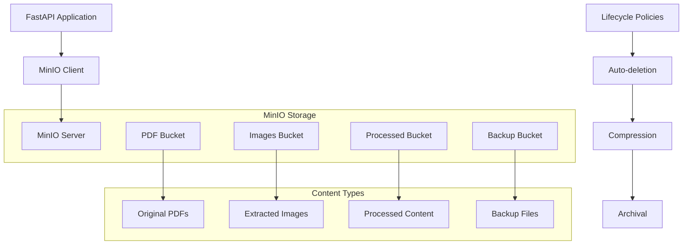

# MinIO Implementation Guide

## Overview

This document provides comprehensive implementation guidance for MinIO object storage integration in the Vectorless RAG system. Based on **Section 5.1** and **Section 7** of the PRD, MinIO serves as the scalable object storage solution for PDF files, extracted images, and processed content with high performance and S3-compatible API.

### Purpose and Role

MinIO integration serves as:
- **File Storage**: Store original PDF documents securely
- **Image Repository**: Store extracted page images from PDF processing
- **Content Archive**: Archive processed content and intermediate files
- **Backup Storage**: Maintain backup copies of critical data
- **CDN Integration**: Serve static content efficiently

## Technical Specifications

### Core Requirements

Based on **Section 5.1** and **Section 7** deployment architecture:
- **Version**: MinIO RELEASE.2024-01-01T00-00-00Z or later
- **Client**: minio-py 7.2+ for Python integration
- **Storage**: Distributed storage with erasure coding
- **Security**: TLS encryption and access key authentication
- **Buckets**: Organized bucket structure for different content types
- **Lifecycle**: Automated lifecycle management for storage optimization

### Storage Architecture



## Implementation Details

### 1. MinIO Service Configuration

**app/services/minio_service.py**
```python
import logging
import asyncio
from typing import Dict, List, Any, Optional, BinaryIO, Tuple
from datetime import datetime, timedelta
import io
import json
from pathlib import Path

from minio import Minio
from minio.error import S3Error, InvalidResponseError
from minio.commonconfig import CopySource
from minio.lifecycleconfig import LifecycleConfig, Rule, Expiration
from urllib3.exceptions import MaxRetryError

from app.core.config import settings
from app.models.storage import StorageObject, BucketInfo

logger = logging.getLogger(__name__)

class MinIOService:
    """
    MinIO service for the Vectorless RAG system
    as specified in Section 5.1 and Section 7 of the PRD.
    """
    
    def __init__(self):
        self.client: Optional[Minio] = None
        
        # Bucket configuration
        self.buckets = {
            "pdfs": "vectorless-rag-pdfs",
            "images": "vectorless-rag-images", 
            "processed": "vectorless-rag-processed",
            "backups": "vectorless-rag-backups",
            "temp": "vectorless-rag-temp"
        }
        
        # File type configurations
        self.content_types = {
            ".pdf": "application/pdf",
            ".png": "image/png",
            ".jpg": "image/jpeg",
            ".jpeg": "image/jpeg",
            ".json": "application/json",
            ".txt": "text/plain"
        }
        
        # Storage policies
        self.lifecycle_policies = {
            "temp": 1,  # 1 day for temp files
            "processed": 30,  # 30 days for processed content
            "backups": 90  # 90 days for backups
        }
    
    async def initialize(self) -> None:
        """Initialize MinIO client and setup buckets."""
        try:
            # Create MinIO client
            self.client = Minio(
                endpoint=settings.MINIO_ENDPOINT,
                access_key=settings.MINIO_ACCESS_KEY,
                secret_key=settings.MINIO_SECRET_KEY,
                secure=settings.MINIO_SECURE
            )
            
            # Test connection
            await self._test_connection()
            
            # Setup buckets
            await self._setup_buckets()
            
            # Configure lifecycle policies
            await self._setup_lifecycle_policies()
            
            logger.info("MinIO service initialized successfully")
            
        except Exception as e:
            logger.error(f"Failed to initialize MinIO service: {str(e)}")
            raise
    
    async def _test_connection(self) -> None:
        """Test MinIO connection."""
        try:
            # Run in thread pool since minio client is synchronous
            loop = asyncio.get_event_loop()
            await loop.run_in_executor(None, list, self.client.list_buckets())
            logger.info("MinIO connection test successful")
        except Exception as e:
            logger.error(f"MinIO connection test failed: {str(e)}")
            raise
    
    async def _setup_buckets(self) -> None:
        """Create and configure MinIO buckets."""
        try:
            loop = asyncio.get_event_loop()
            
            for bucket_type, bucket_name in self.buckets.items():
                # Check if bucket exists
                bucket_exists = await loop.run_in_executor(
                    None, self.client.bucket_exists, bucket_name
                )
                
                if not bucket_exists:
                    # Create bucket
                    await loop.run_in_executor(
                        None, self.client.make_bucket, bucket_name
                    )
                    logger.info(f"Created bucket: {bucket_name}")
                
                # Set bucket policy for public read if needed
                if bucket_type == "images":
                    await self._set_public_read_policy(bucket_name)
            
            logger.info("All buckets setup completed")
            
        except Exception as e:
            logger.error(f"Error setting up buckets: {str(e)}")
            raise
    
    async def _set_public_read_policy(self, bucket_name: str) -> None:
        """Set public read policy for a bucket."""
        try:
            policy = {
                "Version": "2012-10-17",
                "Statement": [
                    {
                        "Effect": "Allow",
                        "Principal": {"AWS": "*"},
                        "Action": ["s3:GetObject"],
                        "Resource": [f"arn:aws:s3:::{bucket_name}/*"]
                    }
                ]
            }
            
            loop = asyncio.get_event_loop()
            await loop.run_in_executor(
                None, 
                self.client.set_bucket_policy, 
                bucket_name, 
                json.dumps(policy)
            )
            
            logger.info(f"Set public read policy for bucket: {bucket_name}")
            
        except Exception as e:
            logger.error(f"Error setting bucket policy: {str(e)}")
            raise
    
    async def _setup_lifecycle_policies(self) -> None:
        """Setup lifecycle policies for automatic cleanup."""
        try:
            loop = asyncio.get_event_loop()
            
            for bucket_type, days in self.lifecycle_policies.items():
                if bucket_type in self.buckets:
                    bucket_name = self.buckets[bucket_type]
                    
                    # Create lifecycle configuration
                    config = LifecycleConfig([
                        Rule(
                            rule_id=f"cleanup_{bucket_type}",
                            status="Enabled",
                            expiration=Expiration(days=days)
                        )
                    ])
                    
                    await loop.run_in_executor(
                        None,
                        self.client.set_bucket_lifecycle,
                        bucket_name,
                        config
                    )
                    
                    logger.info(f"Set lifecycle policy for {bucket_name}: {days} days")
            
        except Exception as e:
            logger.error(f"Error setting lifecycle policies: {str(e)}")
            # Don't raise - lifecycle policies are optional
    
    # File Upload Methods
    
    async def upload_pdf(
        self, 
        document_id: str, 
        file_data: BinaryIO, 
        filename: str,
        user_id: str
    ) -> str:
        """Upload PDF file to storage."""
        try:
            object_name = f"{user_id}/{document_id}/{filename}"
            bucket_name = self.buckets["pdfs"]
            
            # Get file size
            file_data.seek(0, 2)  # Seek to end
            file_size = file_data.tell()
            file_data.seek(0)  # Reset to beginning
            
            # Prepare metadata
            metadata = {
                "user-id": user_id,
                "document-id": document_id,
                "upload-time": datetime.utcnow().isoformat(),
                "original-filename": filename
            }
            
            # Upload file
            loop = asyncio.get_event_loop()
            await loop.run_in_executor(
                None,
                self.client.put_object,
                bucket_name,
                object_name,
                file_data,
                file_size,
                self.content_types.get(".pdf", "application/pdf"),
                metadata
            )
            
            logger.info(f"Uploaded PDF: {object_name}")
            return object_name
            
        except Exception as e:
            logger.error(f"Error uploading PDF: {str(e)}")
            raise
    
    async def upload_image(
        self, 
        document_id: str, 
        page_number: int,
        image_data: bytes, 
        image_format: str = "png",
        user_id: str = None
    ) -> str:
        """Upload extracted page image to storage."""
        try:
            object_name = f"{document_id}/pages/page_{page_number:04d}.{image_format}"
            bucket_name = self.buckets["images"]
            
            # Prepare metadata
            metadata = {
                "document-id": document_id,
                "page-number": str(page_number),
                "image-format": image_format,
                "upload-time": datetime.utcnow().isoformat()
            }
            
            if user_id:
                metadata["user-id"] = user_id
            
            # Create file-like object from bytes
            image_stream = io.BytesIO(image_data)
            
            # Upload image
            loop = asyncio.get_event_loop()
            await loop.run_in_executor(
                None,
                self.client.put_object,
                bucket_name,
                object_name,
                image_stream,
                len(image_data),
                self.content_types.get(f".{image_format}", "image/png"),
                metadata
            )
            
            logger.info(f"Uploaded image: {object_name}")
            return object_name
            
        except Exception as e:
            logger.error(f"Error uploading image: {str(e)}")
            raise
    
    async def upload_processed_content(
        self, 
        document_id: str, 
        content_data: Dict[str, Any],
        content_type: str = "tree"
    ) -> str:
        """Upload processed content (tree structure, metadata, etc.)."""
        try:
            timestamp = datetime.utcnow().strftime("%Y%m%d_%H%M%S")
            object_name = f"{document_id}/{content_type}_{timestamp}.json"
            bucket_name = self.buckets["processed"]
            
            # Convert to JSON
            json_data = json.dumps(content_data, indent=2, default=str)
            json_bytes = json_data.encode('utf-8')
            
            # Prepare metadata
            metadata = {
                "document-id": document_id,
                "content-type": content_type,
                "upload-time": datetime.utcnow().isoformat(),
                "size": str(len(json_bytes))
            }
            
            # Create file-like object
            json_stream = io.BytesIO(json_bytes)
            
            # Upload content
            loop = asyncio.get_event_loop()
            await loop.run_in_executor(
                None,
                self.client.put_object,
                bucket_name,
                object_name,
                json_stream,
                len(json_bytes),
                "application/json",
                metadata
            )
            
            logger.info(f"Uploaded processed content: {object_name}")
            return object_name
            
        except Exception as e:
            logger.error(f"Error uploading processed content: {str(e)}")
            raise
    
    # File Download Methods
    
    async def download_pdf(self, object_name: str) -> bytes:
        """Download PDF file from storage."""
        try:
            bucket_name = self.buckets["pdfs"]
            
            loop = asyncio.get_event_loop()
            response = await loop.run_in_executor(
                None,
                self.client.get_object,
                bucket_name,
                object_name
            )
            
            # Read all data
            data = response.read()
            response.close()
            response.release_conn()
            
            logger.info(f"Downloaded PDF: {object_name}")
            return data
            
        except Exception as e:
            logger.error(f"Error downloading PDF: {str(e)}")
            raise
    
    async def download_image(self, object_name: str) -> bytes:
        """Download image from storage."""
        try:
            bucket_name = self.buckets["images"]
            
            loop = asyncio.get_event_loop()
            response = await loop.run_in_executor(
                None,
                self.client.get_object,
                bucket_name,
                object_name
            )
            
            # Read all data
            data = response.read()
            response.close()
            response.release_conn()
            
            logger.info(f"Downloaded image: {object_name}")
            return data
            
        except Exception as e:
            logger.error(f"Error downloading image: {str(e)}")
            raise
    
    async def get_download_url(
        self, 
        bucket_type: str, 
        object_name: str, 
        expires: timedelta = timedelta(hours=1)
    ) -> str:
        """Generate presigned URL for file download."""
        try:
            bucket_name = self.buckets[bucket_type]
            
            loop = asyncio.get_event_loop()
            url = await loop.run_in_executor(
                None,
                self.client.presigned_get_object,
                bucket_name,
                object_name,
                expires
            )
            
            logger.info(f"Generated download URL for: {object_name}")
            return url
            
        except Exception as e:
            logger.error(f"Error generating download URL: {str(e)}")
            raise
    
    async def get_upload_url(
        self, 
        bucket_type: str, 
        object_name: str, 
        expires: timedelta = timedelta(hours=1)
    ) -> str:
        """Generate presigned URL for file upload."""
        try:
            bucket_name = self.buckets[bucket_type]
            
            loop = asyncio.get_event_loop()
            url = await loop.run_in_executor(
                None,
                self.client.presigned_put_object,
                bucket_name,
                object_name,
                expires
            )
            
            logger.info(f"Generated upload URL for: {object_name}")
            return url
            
        except Exception as e:
            logger.error(f"Error generating upload URL: {str(e)}")
            raise
    
    # File Management Methods
    
    async def list_objects(
        self, 
        bucket_type: str, 
        prefix: str = "", 
        recursive: bool = True
    ) -> List[Dict[str, Any]]:
        """List objects in a bucket with optional prefix filter."""
        try:
            bucket_name = self.buckets[bucket_type]
            
            loop = asyncio.get_event_loop()
            objects = await loop.run_in_executor(
                None,
                lambda: list(self.client.list_objects(bucket_name, prefix, recursive))
            )
            
            object_list = []
            for obj in objects:
                object_info = {
                    "name": obj.object_name,
                    "size": obj.size,
                    "last_modified": obj.last_modified,
                    "etag": obj.etag,
                    "content_type": obj.content_type
                }
                object_list.append(object_info)
            
            logger.info(f"Listed {len(object_list)} objects from {bucket_name}")
            return object_list
            
        except Exception as e:
            logger.error(f"Error listing objects: {str(e)}")
            raise
    
    async def delete_object(self, bucket_type: str, object_name: str) -> bool:
        """Delete an object from storage."""
        try:
            bucket_name = self.buckets[bucket_type]
            
            loop = asyncio.get_event_loop()
            await loop.run_in_executor(
                None,
                self.client.remove_object,
                bucket_name,
                object_name
            )
            
            logger.info(f"Deleted object: {object_name}")
            return True
            
        except Exception as e:
            logger.error(f"Error deleting object: {str(e)}")
            return False
    
    async def delete_objects(self, bucket_type: str, object_names: List[str]) -> int:
        """Delete multiple objects from storage."""
        try:
            bucket_name = self.buckets[bucket_type]
            
            loop = asyncio.get_event_loop()
            errors = await loop.run_in_executor(
                None,
                lambda: list(self.client.remove_objects(bucket_name, object_names))
            )
            
            # Count successful deletions
            successful_deletions = len(object_names) - len(errors)
            
            if errors:
                for error in errors:
                    logger.error(f"Error deleting {error.object_name}: {error.error}")
            
            logger.info(f"Deleted {successful_deletions}/{len(object_names)} objects")
            return successful_deletions
            
        except Exception as e:
            logger.error(f"Error deleting objects: {str(e)}")
            return 0
    
    async def copy_object(
        self, 
        source_bucket_type: str, 
        source_object: str,
        dest_bucket_type: str, 
        dest_object: str
    ) -> bool:
        """Copy object between buckets."""
        try:
            source_bucket = self.buckets[source_bucket_type]
            dest_bucket = self.buckets[dest_bucket_type]
            
            copy_source = CopySource(source_bucket, source_object)
            
            loop = asyncio.get_event_loop()
            await loop.run_in_executor(
                None,
                self.client.copy_object,
                dest_bucket,
                dest_object,
                copy_source
            )
            
            logger.info(f"Copied {source_object} to {dest_object}")
            return True
            
        except Exception as e:
            logger.error(f"Error copying object: {str(e)}")
            return False
    
    async def get_object_metadata(
        self, 
        bucket_type: str, 
        object_name: str
    ) -> Optional[Dict[str, Any]]:
        """Get object metadata."""
        try:
            bucket_name = self.buckets[bucket_type]
            
            loop = asyncio.get_event_loop()
            stat = await loop.run_in_executor(
                None,
                self.client.stat_object,
                bucket_name,
                object_name
            )
            
            metadata = {
                "size": stat.size,
                "last_modified": stat.last_modified,
                "etag": stat.etag,
                "content_type": stat.content_type,
                "metadata": stat.metadata
            }
            
            return metadata
            
        except Exception as e:
            logger.error(f"Error getting object metadata: {str(e)}")
            return None
    
    # Document-specific Methods
    
    async def store_document_files(
        self, 
        document_id: str, 
        pdf_data: bytes,
        images: List[Tuple[int, bytes]], 
        user_id: str,
        filename: str
    ) -> Dict[str, Any]:
        """Store all files related to a document."""
        try:
            results = {
                "pdf_path": None,
                "image_paths": [],
                "errors": []
            }
            
            # Upload PDF
            try:
                pdf_stream = io.BytesIO(pdf_data)
                pdf_path = await self.upload_pdf(document_id, pdf_stream, filename, user_id)
                results["pdf_path"] = pdf_path
            except Exception as e:
                results["errors"].append(f"PDF upload failed: {str(e)}")
            
            # Upload images
            for page_number, image_data in images:
                try:
                    image_path = await self.upload_image(
                        document_id, page_number, image_data, "png", user_id
                    )
                    results["image_paths"].append({
                        "page": page_number,
                        "path": image_path
                    })
                except Exception as e:
                    results["errors"].append(f"Image upload failed for page {page_number}: {str(e)}")
            
            logger.info(f"Stored files for document {document_id}")
            return results
            
        except Exception as e:
            logger.error(f"Error storing document files: {str(e)}")
            raise
    
    async def cleanup_document_files(self, document_id: str) -> Dict[str, int]:
        """Clean up all files related to a document."""
        try:
            results = {
                "pdfs_deleted": 0,
                "images_deleted": 0,
                "processed_deleted": 0
            }
            
            # Clean up PDFs
            pdf_objects = await self.list_objects("pdfs", f"/{document_id}/")
            if pdf_objects:
                pdf_names = [obj["name"] for obj in pdf_objects]
                results["pdfs_deleted"] = await self.delete_objects("pdfs", pdf_names)
            
            # Clean up images
            image_objects = await self.list_objects("images", f"{document_id}/")
            if image_objects:
                image_names = [obj["name"] for obj in image_objects]
                results["images_deleted"] = await self.delete_objects("images", image_names)
            
            # Clean up processed content
            processed_objects = await self.list_objects("processed", f"{document_id}/")
            if processed_objects:
                processed_names = [obj["name"] for obj in processed_objects]
                results["processed_deleted"] = await self.delete_objects("processed", processed_names)
            
            logger.info(f"Cleaned up files for document {document_id}")
            return results
            
        except Exception as e:
            logger.error(f"Error cleaning up document files: {str(e)}")
            raise
    
    # Backup and Recovery
    
    async def backup_document(self, document_id: str) -> str:
        """Create backup of all document files."""
        try:
            timestamp = datetime.utcnow().strftime("%Y%m%d_%H%M%S")
            backup_prefix = f"backups/{document_id}_{timestamp}/"
            
            # Backup PDFs
            pdf_objects = await self.list_objects("pdfs", f"/{document_id}/")
            for obj in pdf_objects:
                backup_name = f"{backup_prefix}pdfs/{obj['name']}"
                await self.copy_object("pdfs", obj["name"], "backups", backup_name)
            
            # Backup processed content
            processed_objects = await self.list_objects("processed", f"{document_id}/")
            for obj in processed_objects:
                backup_name = f"{backup_prefix}processed/{obj['name']}"
                await self.copy_object("processed", obj["name"], "backups", backup_name)
            
            logger.info(f"Created backup for document {document_id}")
            return backup_prefix
            
        except Exception as e:
            logger.error(f"Error creating backup: {str(e)}")
            raise
    
    # Health and Monitoring
    
    async def health_check(self) -> Dict[str, Any]:
        """Perform MinIO health check."""
        try:
            # Test connection
            loop = asyncio.get_event_loop()
            buckets = await loop.run_in_executor(None, list, self.client.list_buckets())
            
            # Get bucket statistics
            bucket_stats = {}
            for bucket_type, bucket_name in self.buckets.items():
                try:
                    objects = await self.list_objects(bucket_type)
                    total_size = sum(obj["size"] for obj in objects)
                    bucket_stats[bucket_type] = {
                        "name": bucket_name,
                        "object_count": len(objects),
                        "total_size": total_size
                    }
                except Exception as e:
                    bucket_stats[bucket_type] = {"error": str(e)}
            
            return {
                "status": "healthy",
                "buckets": bucket_stats,
                "total_buckets": len(buckets),
                "timestamp": datetime.utcnow()
            }
            
        except Exception as e:
            logger.error(f"MinIO health check failed: {str(e)}")
            return {
                "status": "unhealthy",
                "error": str(e),
                "timestamp": datetime.utcnow()
            }

# Global instance
minio_service = MinIOService()
```

### 2. Storage Models

**app/models/storage.py**
```python
from typing import Optional, Dict, Any
from datetime import datetime
from pydantic import BaseModel, Field

class StorageObject(BaseModel):
    name: str = Field(..., description="Object name/path")
    size: int = Field(..., description="Object size in bytes")
    last_modified: datetime = Field(..., description="Last modification time")
    etag: str = Field(..., description="Object ETag")
    content_type: str = Field(..., description="MIME content type")
    metadata: Optional[Dict[str, str]] = Field(default_factory=dict)

class BucketInfo(BaseModel):
    name: str = Field(..., description="Bucket name")
    creation_date: datetime = Field(..., description="Bucket creation date")
    object_count: int = Field(default=0, description="Number of objects")
    total_size: int = Field(default=0, description="Total size in bytes")
```

## Integration Points

### 1. FastAPI Dependency
```python
# app/core/dependencies.py
from app.services.minio_service import minio_service

async def get_minio():
    return minio_service
```

### 2. Document Processing Integration
```python
# app/services/document_processor.py
async def process_document(self, document_id: str, pdf_data: bytes):
    # Store original PDF
    await minio_service.upload_pdf(document_id, pdf_data, filename, user_id)
    
    # Process and store images
    images = await self.extract_images(pdf_data)
    for page_num, image_data in images:
        await minio_service.upload_image(document_id, page_num, image_data)
```

## Development Tasks

### Phase 1: Core Setup (Week 1)
- [ ] Setup MinIO client and connection
- [ ] Implement bucket creation and configuration
- [ ] Add basic upload/download functionality
- [ ] Create error handling and retry logic
- [ ] Implement health checks

### Phase 2: Advanced Features (Week 2)
- [ ] Add presigned URL generation
- [ ] Implement lifecycle policies
- [ ] Create batch operations
- [ ] Add metadata management
- [ ] Implement backup functionality

### Phase 3: Optimization (Week 3)
- [ ] Performance optimization
- [ ] Add caching strategies
- [ ] Implement monitoring and metrics
- [ ] Add security enhancements
- [ ] Production deployment setup

## Testing Strategy

### Unit Tests
```python
import pytest
from app.services.minio_service import minio_service

@pytest.mark.asyncio
async def test_pdf_upload():
    pdf_data = b"fake pdf content"
    pdf_stream = io.BytesIO(pdf_data)
    
    object_name = await minio_service.upload_pdf(
        "test_doc", pdf_stream, "test.pdf", "test_user"
    )
    
    assert object_name is not None
    assert "test_doc" in object_name

@pytest.mark.asyncio
async def test_image_upload():
    image_data = b"fake image content"
    
    object_name = await minio_service.upload_image(
        "test_doc", 1, image_data, "png"
    )
    
    assert object_name is not None
    assert "page_0001.png" in object_name
```

## Performance Considerations

### Upload Optimization
- Multipart uploads for large files
- Parallel uploads for multiple files
- Compression for text content
- Streaming for memory efficiency

### Download Optimization
- CDN integration for static content
- Presigned URLs for direct access
- Caching strategies
- Range requests for large files

## Security Requirements

### Access Control
- Bucket policies for access control
- Presigned URLs with expiration
- User-based file isolation
- API key rotation

### Data Protection
- TLS encryption in transit
- Server-side encryption at rest
- Secure credential management
- Audit logging

## Deployment Configuration

### Docker Compose Integration
```yaml
# From Section 7 of PRD
minio:
  image: minio/minio:RELEASE.2024-01-01T00-00-00Z
  container_name: vectorless-rag-minio
  command: server /data --console-address ":9001"
  environment:
    MINIO_ROOT_USER: ${MINIO_ROOT_USER}
    MINIO_ROOT_PASSWORD: ${MINIO_ROOT_PASSWORD}
  volumes:
    - minio_data:/data
  ports:
    - "9000:9000"
    - "9001:9001"
  networks:
    - vectorless-rag-network
```

### Environment Variables
```bash
MINIO_ENDPOINT=minio:9000
MINIO_ACCESS_KEY=minioadmin
MINIO_SECRET_KEY=minioadmin123
MINIO_SECURE=false
MINIO_REGION=us-east-1
```

## Monitoring & Logging

### Metrics to Track
- Upload/download rates
- Storage usage by bucket
- Error rates
- Response times
- Bandwidth usage

### Logging Strategy
- Operation logging
- Error tracking and alerting
- Performance monitoring
- Security audit logs

### Health Monitoring
```python
@router.get("/health/minio")
async def minio_health():
    health_status = await minio_service.health_check()
    return health_status
```

---

*This MinIO implementation guide provides the foundation for scalable object storage in the vectorless RAG system. Follow the implementation phases and integrate with other system components as specified in the PRD.*