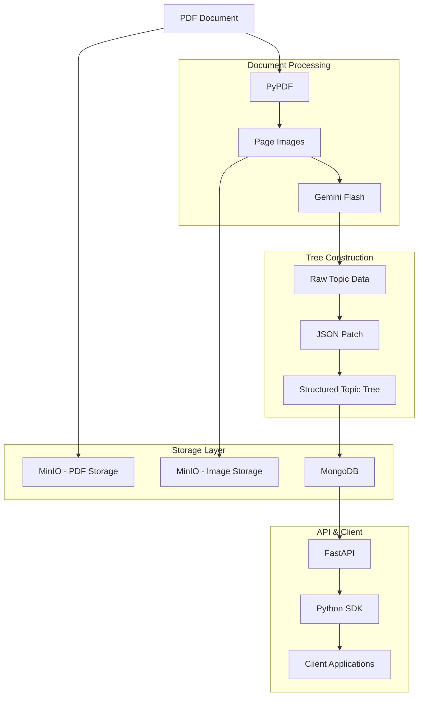
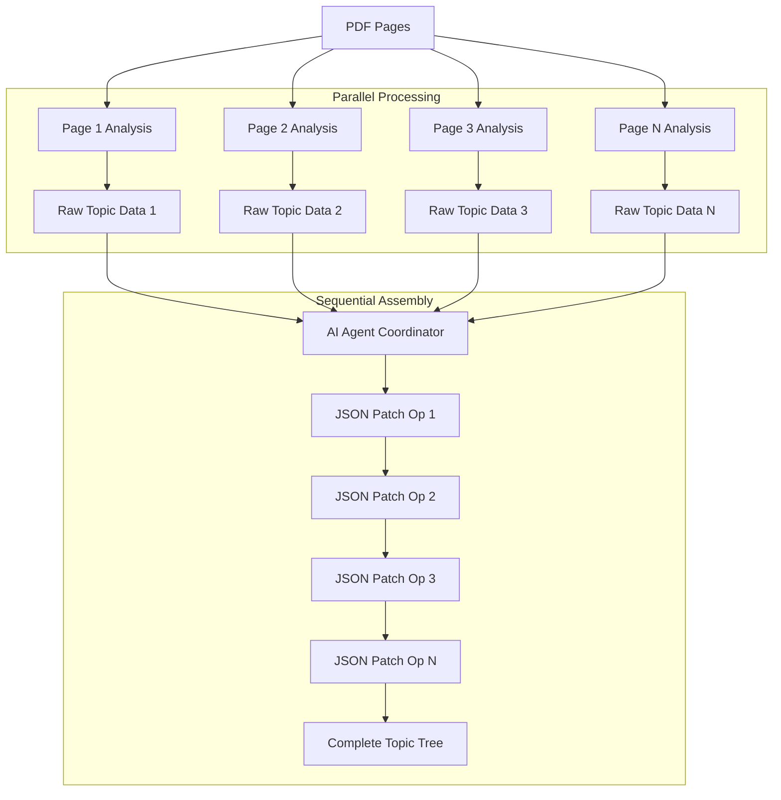
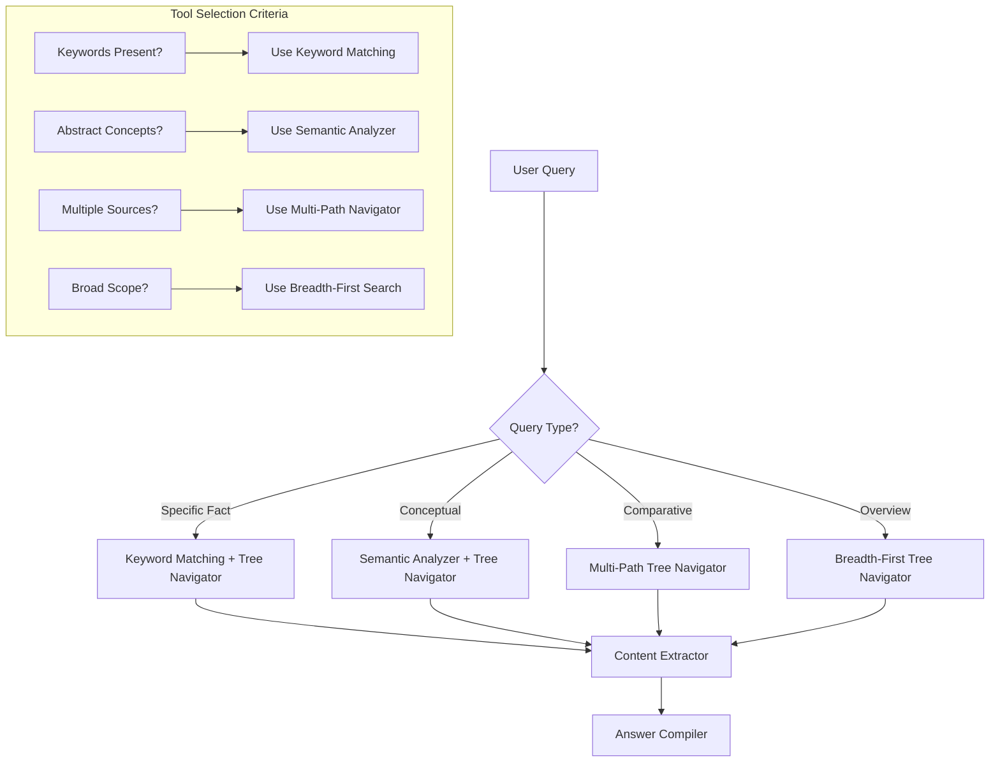
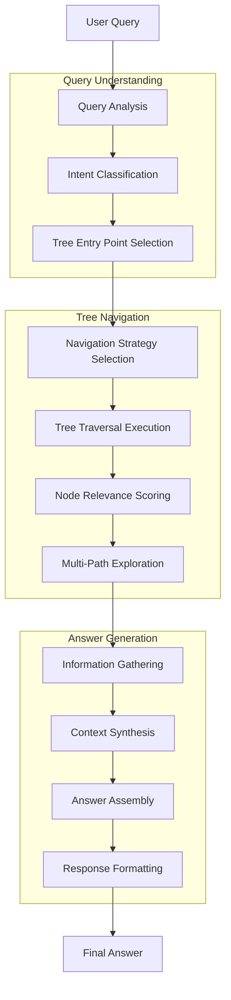
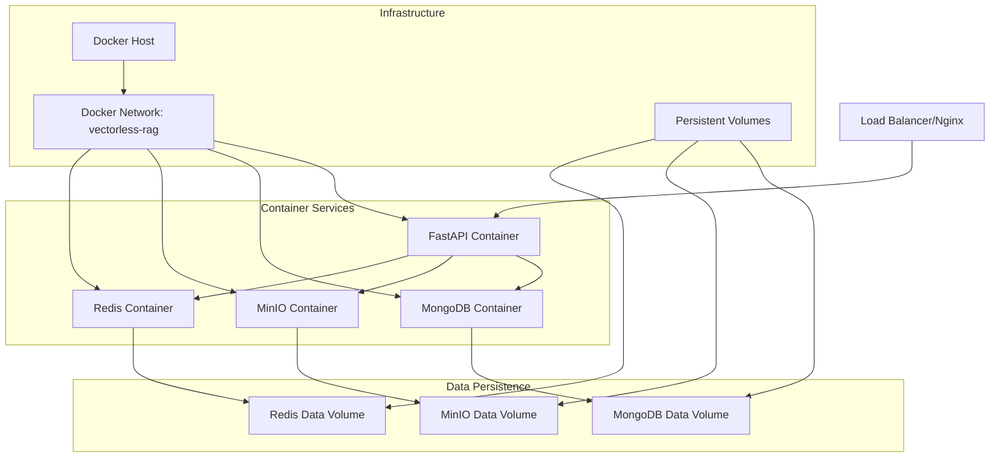
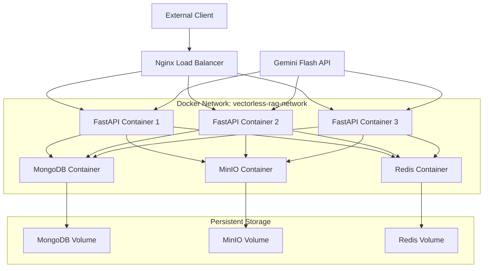

# Vectorless RAG - Product Requirements Document

## 1. Project Overview

### 1.1 Vision

Vectorless RAG is an innovative approach to Retrieval-Augmented Generation that eliminates the need for traditional vector embeddings and text extraction. Instead of processing documents through vector databases, this system creates a hierarchical topic tree structure that enables efficient document navigation and retrieval.

### 1.2 Core Concept

The system operates on a fundamentally different paradigm:

**Traditional RAG Limitations:**
- Requires complete text extraction from documents (time-consuming)
- Relies on vector embeddings and similarity search
- Can lose document structure and context

**Vectorless RAG Innovation:**
- **Topic Tree Structure**: Documents are organized into hierarchical topic trees with high-level and low-level topic nodes
- **Page-Associated Nodes**: Each topic node maintains references to specific page numbers for precise document navigation
- **Image-Based Processing**: PDFs are converted to images rather than extracted text, preserving visual layout and context
- **LLM-Powered Analysis**: Uses advanced LLMs like Gemini Flash to analyze document images and construct the topic hierarchy

### 1.3 Key Benefits

1. **Faster Processing**: Eliminates lengthy text extraction processes
2. **Preserved Context**: Maintains document structure and visual elements
3. **Efficient Retrieval**: Query-driven navigation through topic trees
4. **Scalable Architecture**: Hierarchical structure enables efficient search at scale
5. **Visual Awareness**: Retains charts, diagrams, and formatting that text extraction loses

### 1.4 System Overview

The vectorless RAG system processes documents through the following workflow:

1. **Document Ingestion**: PDFs are split into individual page images
2. **Topic Tree Generation**: LLM analyzes images to create hierarchical topic structure
3. **Node Association**: Each topic node is linked to relevant page numbers
4. **Query Processing**: User queries navigate through the topic tree to find relevant content
5. **Answer Retrieval**: System returns specific pages and contextual information

## 2. Topic Tree Architecture

### 2.1 Hierarchical Structure

The vectorless RAG system creates a **complete tree structure** with three distinct node types, forming a proper hierarchical knowledge organization:

```
Collections (Root Level)
    ├── Documents (Second Level)
    │   ├── Topic Trees (Third Level)
    │   │   ├── L1 Topics (High-level themes)
    │   │   │   ├── L2 Topics (Detailed sections)
    │   │   │   │   └── L3 Topics (Specific concepts)
    │   │   │   │       └── Page References
    │   │   │   └── ...
    │   │   └── ...
    │   └── ...
    └── ...
```

### 2.2 Node Types and Structure

The system uses three distinct node types that create a proper tree hierarchy:

#### Collection Nodes (Tree Root)
- **Purpose**: Top-level organizational containers
- **Examples**: "Financial Reports 2024", "Technical Documentation", "Research Papers"
- **Contains**: Multiple document nodes as children
- **Tree Role**: Root nodes of the knowledge tree

#### Document Nodes (Tree Branches)
- **Purpose**: Individual document containers within collections
- **Examples**: "Q3_2024_Financial_Report.pdf", "User_Manual_v2.1.pdf"
- **Contains**: Complete topic tree for that specific document
- **Tree Role**: Bridge between collections and content topics

#### Topic Nodes (Tree Leaves & Sub-branches)
- **Purpose**: Hierarchical content organization within documents
- **Structure**: Multi-level hierarchy (L1 → L2 → L3)
- **Contains**: Actual content references and page numbers
- **Tree Role**: Content-specific nodes forming the detailed tree structure

### 2.3 Node Schema

Each node in the topic tree contains the following properties:

```json
{
  "node_id": "unique_identifier",
  "type": "collection|document|topic",
  "title": "Human-readable topic title",
  "level": 1-3,
  "parent_id": "parent_node_identifier",
  "children": ["child_node_ids"],
  "page_references": [1, 2, 3],
  "content_summary": "Brief description of content",
  "keywords": ["key", "terms", "concepts"],
  "visual_elements": ["charts", "tables", "diagrams"]
}
```

### 2.4 Example: Complete Tree Structure

```
📁 Financial Reports 2024 (Collection Node)
    ├── 📄 Q1_2024_Report.pdf (Document Node)
    │   ├── 📋 Executive Summary (L1 Topic)
    │   │   ├── 📝 Key Highlights (L2 Topic)
    │   │   │   └── 💰 Revenue Growth (L3 Topic) → Pages 2-3
    │   │   └── 📝 Strategic Initiatives (L2 Topic) → Pages 4-5
    │   ├── 📋 Financial Performance (L1 Topic)
    │   │   ├── 📝 Revenue Analysis (L2 Topic)
    │   │   │   ├── 💼 Product Revenue (L3 Topic) → Pages 8-10
    │   │   │   └── 🌍 Geographic Revenue (L3 Topic) → Pages 11-12
    │   │   └── 📝 Cost Analysis (L2 Topic) → Pages 13-15
    │   └── 📋 Future Outlook (L1 Topic) → Pages 16-18
    └── 📄 Q2_2024_Report.pdf (Document Node)
        ├── 📋 Executive Summary (L1 Topic)
        └── 📋 Financial Performance (L1 Topic)
            └── ... (similar structure)
```

## 3. Topic Organization and Construction

### 3.1 Topic Hierarchy Principles

#### High-Level Topics (L1)
- **Scope**: Broad thematic areas covering multiple pages
- **Examples**: "Introduction", "Methodology", "Results", "Conclusion"
- **Page Range**: Typically span 5-20 pages
- **Identification**: Based on document structure, headings, and content flow

#### Mid-Level Topics (L2)
- **Scope**: Specific subjects within high-level themes
- **Examples**: "Data Collection Methods", "Statistical Analysis", "Key Findings"
- **Page Range**: Typically span 2-8 pages
- **Identification**: Derived from subsection analysis and content clustering

#### Low-Level Topics (L3)
- **Scope**: Granular concepts, definitions, or specific information
- **Examples**: "Sample Size Calculation", "P-value Interpretation", "Figure 3.2 Analysis"
- **Page Range**: Usually 1-3 pages
- **Identification**: Extracted from detailed content analysis and visual elements

### 3.2 Tree Construction Process

#### Phase 1: Document Analysis
1. **Image Processing**: Each PDF page converted to high-resolution image
2. **Layout Detection**: Identify headers, sections, paragraphs, and visual elements
3. **Content Categorization**: Classify content types (text, tables, figures, equations)

#### Phase 2: Hierarchical Topic Extraction
1. **Primary Topic Identification**: LLM analyzes document structure for main themes
2. **Secondary Topic Discovery**: Drill down into subsections and detailed content
3. **Relationship Mapping**: Establish parent-child relationships between topics
4. **Page Association**: Link each topic to specific page numbers

#### Phase 3: Tree Optimization
1. **Redundancy Elimination**: Merge similar or overlapping topics
2. **Balance Adjustment**: Ensure optimal tree depth and breadth
3. **Validation**: Verify topic accuracy and completeness

### 3.3 Navigation and Matching Algorithms

#### Tree Traversal Strategy
1. **Query Analysis**: Parse user query for key concepts and intent
2. **Topic Matching**: Score relevance against all node titles and keywords
3. **Path Selection**: Choose optimal navigation path through the tree
4. **Context Expansion**: Include related nodes from the hierarchy
5. **Page Retrieval**: Return specific pages with highest relevance scores

#### Matching Algorithms
- **Semantic Similarity**: Compare query concepts with topic keywords
- **Hierarchical Scoring**: Weight matches based on tree level and specificity
- **Context Awareness**: Consider surrounding topics and document flow
- **Visual Content Integration**: Include pages with relevant charts/diagrams

### 3.4 Example Topic Trees

#### Academic Research Paper
```
Document: "Machine Learning in Healthcare"
├── L1: Introduction (Pages 1-3)
│   ├── L2: Problem Statement (Page 1)
│   ├── L2: Literature Review (Pages 2-3)
│   └── L2: Research Objectives (Page 3)
├── L1: Methodology (Pages 4-8)
│   ├── L2: Data Collection (Pages 4-5)
│   │   ├── L3: Patient Demographics (Page 4)
│   │   └── L3: Medical Records Processing (Page 5)
│   ├── L2: Model Architecture (Pages 6-7)
│   └── L2: Evaluation Metrics (Page 8)
└── L1: Results (Pages 9-15)
    ├── L2: Performance Analysis (Pages 9-11)
    ├── L2: Comparative Study (Pages 12-13)
    └── L2: Clinical Validation (Pages 14-15)
```

#### Technical Manual
```
Document: "Software Installation Guide"
├── L1: System Requirements (Pages 1-2)
│   ├── L2: Hardware Specifications (Page 1)
│   └── L2: Software Dependencies (Page 2)
├── L1: Installation Process (Pages 3-8)
│   ├── L2: Windows Installation (Pages 3-4)
│   ├── L2: macOS Installation (Pages 5-6)
│   └── L2: Linux Installation (Pages 7-8)
└── L1: Configuration (Pages 9-12)
    ├── L2: Initial Setup (Pages 9-10)
    └── L2: Advanced Settings (Pages 11-12)
```

### 3.5 LLM Integration Strategy

#### Gemini Flash Utilization
- **Multi-Modal Analysis**: Process both text and visual elements in page images
- **Context Understanding**: Maintain document flow and logical structure
- **Iterative Refinement**: Continuously improve topic extraction accuracy
- **Batch Processing**: Efficiently handle multiple pages simultaneously

#### Prompt Engineering Strategy
1. **Structure Recognition**: "Identify the main topics and subtopics in this document page"
2. **Hierarchy Building**: "Organize these topics into a logical hierarchy"
3. **Page Association**: "Link each topic to specific page numbers where it appears"
4. **Relationship Mapping**: "Identify connections between different topics"

### 3.6 Performance Optimization

#### Tree Balancing
- **Depth Control**: Maintain optimal tree depth (typically 3-4 levels)
- **Breadth Management**: Limit children per node (typically 3-7)
- **Load Distribution**: Ensure even distribution of content across branches

#### Caching Strategy
- **Frequent Paths**: Cache commonly accessed navigation routes
- **Topic Summaries**: Store pre-computed topic descriptions
- **Page Previews**: Maintain quick-access page thumbnails

## 4. Complete JSON Example

### 4.1 Business Report Use Case

```json
{
  "document": {
    "document_id": "q3_2024_financial_report",
    "title": "Q3 2024 Financial Performance Report",
    "total_pages": 28,
    "creation_date": "2024-10-15",
    "topic_tree": [
      {
        "node_id": "root",
        "title": "Q3 2024 Financial Performance Report",
        "level": 0,
        "parent_id": null,
        "children": ["exec_summary", "financial_results", "market_analysis", "operations", "risk_assessment", "outlook"],
        "page_references": [1, 2, 3, 4, 5, 6, 7, 8, 9, 10, 11, 12, 13, 14, 15, 16, 17, 18, 19, 20, 21, 22, 23, 24, 25, 26, 27, 28],
        "content_summary": "Comprehensive quarterly financial performance report covering revenue, expenses, market position, and strategic outlook",
        "keywords": ["financial", "performance", "quarterly", "revenue", "profit", "growth"],
        "visual_elements": ["cover_page", "table_of_contents"]
      },
      {
        "node_id": "exec_summary",
        "title": "Executive Summary",
        "level": 1,
        "parent_id": "root",
        "children": ["key_highlights", "financial_overview", "strategic_initiatives"],
        "page_references": [3, 4, 5],
        "content_summary": "High-level overview of Q3 performance, key achievements, and strategic direction",
        "keywords": ["executive", "summary", "highlights", "performance", "achievements"],
        "visual_elements": ["performance_dashboard", "key_metrics_chart"]
      },
      {
        "node_id": "key_highlights",
        "title": "Key Performance Highlights",
        "level": 2,
        "parent_id": "exec_summary",
        "children": ["revenue_growth", "cost_optimization", "market_expansion"],
        "page_references": [3],
        "content_summary": "Major accomplishments and performance metrics for Q3 2024",
        "keywords": ["highlights", "achievements", "milestones", "performance", "metrics"],
        "visual_elements": ["bullet_points", "performance_icons"]
      },
      {
        "node_id": "revenue_growth",
        "title": "Revenue Growth Achievement",
        "level": 3,
        "parent_id": "key_highlights",
        "children": [],
        "page_references": [3],
        "content_summary": "15% year-over-year revenue growth driven by new product launches and market expansion",
        "keywords": ["revenue", "growth", "15%", "year-over-year", "product_launches"],
        "visual_elements": ["growth_chart", "percentage_indicators"]
      },
      {
        "node_id": "financial_results",
        "title": "Financial Results",
        "level": 1,
        "parent_id": "root",
        "children": ["revenue_analysis", "expense_breakdown", "profitability", "cash_flow"],
        "page_references": [6, 7, 8, 9, 10, 11, 12],
        "content_summary": "Detailed financial performance including revenue, expenses, profit margins, and cash flow analysis",
        "keywords": ["financial", "results", "revenue", "expenses", "profit", "cash_flow"],
        "visual_elements": ["financial_charts", "tables", "graphs"]
      },
      {
        "node_id": "revenue_analysis",
        "title": "Revenue Analysis",
        "level": 2,
        "parent_id": "financial_results",
        "children": ["product_revenue", "geographic_revenue", "customer_segments"],
        "page_references": [6, 7],
        "content_summary": "Comprehensive breakdown of revenue sources by product, geography, and customer segments",
        "keywords": ["revenue", "analysis", "breakdown", "products", "geography", "customers"],
        "visual_elements": ["revenue_charts", "pie_charts", "bar_graphs"]
      },
      {
        "node_id": "product_revenue",
        "title": "Product Line Revenue",
        "level": 3,
        "parent_id": "revenue_analysis",
        "children": [],
        "page_references": [6],
        "content_summary": "Revenue performance by individual product lines showing growth trends and market share",
        "keywords": ["product", "revenue", "product_lines", "growth", "market_share"],
        "visual_elements": ["product_chart", "trend_lines", "comparison_table"]
      },
      {
        "node_id": "expense_breakdown",
        "title": "Operating Expenses",
        "level": 2,
        "parent_id": "financial_results",
        "children": ["personnel_costs", "marketing_expenses", "rd_investment"],
        "page_references": [8, 9],
        "content_summary": "Detailed analysis of operating expenses including personnel, marketing, and R&D investments",
        "keywords": ["expenses", "operating", "personnel", "marketing", "research", "development"],
        "visual_elements": ["expense_charts", "cost_breakdown", "trend_analysis"]
      },
      {
        "node_id": "market_analysis",
        "title": "Market Analysis",
        "level": 1,
        "parent_id": "root",
        "children": ["competitive_position", "market_trends", "customer_analysis"],
        "page_references": [13, 14, 15, 16],
        "content_summary": "Analysis of market conditions, competitive landscape, and customer behavior trends",
        "keywords": ["market", "analysis", "competitive", "trends", "customers", "landscape"],
        "visual_elements": ["market_charts", "competitive_matrix", "trend_graphs"]
      },
      {
        "node_id": "competitive_position",
        "title": "Competitive Positioning",
        "level": 2,
        "parent_id": "market_analysis",
        "children": ["market_share", "competitive_advantages"],
        "page_references": [13, 14],
        "content_summary": "Assessment of company's position relative to competitors and key differentiators",
        "keywords": ["competitive", "positioning", "market_share", "advantages", "differentiation"],
        "visual_elements": ["positioning_matrix", "market_share_chart", "comparison_table"]
      },
      {
        "node_id": "operations",
        "title": "Operational Performance",
        "level": 1,
        "parent_id": "root",
        "children": ["production_metrics", "supply_chain", "quality_indicators"],
        "page_references": [17, 18, 19, 20],
        "content_summary": "Operational efficiency metrics, supply chain performance, and quality management results",
        "keywords": ["operations", "performance", "production", "supply_chain", "quality", "efficiency"],
        "visual_elements": ["operational_dashboards", "kpi_charts", "process_diagrams"]
      },
      {
        "node_id": "production_metrics",
        "title": "Production Efficiency",
        "level": 2,
        "parent_id": "operations",
        "children": ["capacity_utilization", "productivity_gains"],
        "page_references": [17, 18],
        "content_summary": "Manufacturing efficiency metrics including capacity utilization and productivity improvements",
        "keywords": ["production", "efficiency", "capacity", "utilization", "productivity", "manufacturing"],
        "visual_elements": ["efficiency_charts", "capacity_graphs", "productivity_metrics"]
      },
      {
        "node_id": "risk_assessment",
        "title": "Risk Assessment",
        "level": 1,
        "parent_id": "root",
        "children": ["financial_risks", "operational_risks", "market_risks"],
        "page_references": [21, 22, 23],
        "content_summary": "Comprehensive risk analysis covering financial, operational, and market-related risks",
        "keywords": ["risk", "assessment", "financial", "operational", "market", "mitigation"],
        "visual_elements": ["risk_matrix", "heat_maps", "mitigation_charts"]
      },
      {
        "node_id": "financial_risks",
        "title": "Financial Risk Factors",
        "level": 2,
        "parent_id": "risk_assessment",
        "children": ["liquidity_risk", "credit_risk"],
        "page_references": [21],
        "content_summary": "Analysis of financial risks including liquidity, credit, and currency exposure",
        "keywords": ["financial", "risk", "liquidity", "credit", "currency", "exposure"],
        "visual_elements": ["risk_charts", "exposure_analysis", "scenario_modeling"]
      },
      {
        "node_id": "outlook",
        "title": "Future Outlook",
        "level": 1,
        "parent_id": "root",
        "children": ["q4_projections", "strategic_goals", "investment_plans"],
        "page_references": [24, 25, 26, 27, 28],
        "content_summary": "Forward-looking statements including Q4 projections, strategic initiatives, and investment priorities",
        "keywords": ["outlook", "future", "projections", "strategic", "goals", "investment"],
        "visual_elements": ["forecast_charts", "timeline_diagrams", "strategic_roadmap"]
      },
      {
        "node_id": "q4_projections",
        "title": "Q4 2024 Projections",
        "level": 2,
        "parent_id": "outlook",
        "children": ["revenue_forecast", "expense_projections"],
        "page_references": [24, 25],
        "content_summary": "Financial projections and business forecasts for the fourth quarter of 2024",
        "keywords": ["Q4", "projections", "forecast", "revenue", "expenses", "2024"],
        "visual_elements": ["forecast_charts", "projection_tables", "scenario_analysis"]
      }
    ]
  }
}
```

### Key Features Demonstrated

This business report example showcases:

1. **Realistic Business Structure**: Follows standard quarterly report format with executive summary, financial results, market analysis, operations, risk assessment, and outlook
2. **Hierarchical Organization**: Clear L1, L2, and L3 topic levels with logical parent-child relationships
3. **Comprehensive Page Coverage**: 28-page document with appropriate page distributions across sections
4. **Business-Relevant Keywords**: Industry-standard terminology for financial reporting and business analysis
5. **Visual Elements**: Typical business report visuals including charts, tables, dashboards, and matrices
6. **Detailed Content Summaries**: Specific descriptions of what each section contains
7. **Cross-Section Navigation**: Related topics that would benefit from hierarchical navigation during queries

### Query Examples

With this structure, users could efficiently query:
- "What were the key financial highlights?" → Navigate to `key_highlights` and `financial_overview`
- "Show me revenue breakdown by product" → Direct to `product_revenue` with associated charts
- "What are the main risks we're facing?" → Access `risk_assessment` and its sub-categories
- "Q4 projections" → Navigate to `q4_projections` and related forecast data

## 5. Technical Stack

### 5.1 Technology Overview

The vectorless RAG system leverages a carefully selected technology stack that enables efficient document processing, intelligent tree construction, and scalable deployment:

| Technology | Purpose | Role in System |
|------------|---------|----------------|
| **PyPDF** | PDF Processing | Extract text and metadata from PDF documents |
| **MinIO** | Object Storage | Store PDF files and page images with high availability |
| **Gemini Flash** | AI Processing | Parse page images and extract hierarchical topic structures |
| **JSON Patch** | Data Operations | Perform incremental updates to topic trees |
| **MongoDB** | Database | Store document metadata and topic tree structures |
| **FastAPI** | API Framework | Provide RESTful API endpoints for system interaction |
| **Python SDK** | Client Library | Enable easy integration with external applications |
| **Pydantic AI** | Query Processing | Provide type-safe, structured query processing with validation |
| **Docker Compose** | Containerization | Orchestrate multi-service deployment with consistent environments |

### 5.2 Document Processing Pipeline

The technologies work together in a streamlined pipeline:



### 5.3 Processing Architecture

The vectorless RAG system employs a sophisticated two-phase processing architecture that optimizes both throughput and data integrity:

#### Phase 1: Parallel Topic Extraction
- **Raw topic data extraction** from individual pages can be processed **in parallel**
- Multiple page images are analyzed **simultaneously** by Gemini Flash instances
- Each page generates independent topic data without dependencies on other pages
- Maximizes processing throughput by utilizing concurrent AI analysis

#### Phase 2: Sequential Tree Assembly
- **JSON patch operations** for tree formation are executed **sequentially** by an AI agent
- Tree assembly requires careful coordination to maintain hierarchical integrity
- Sequential processing prevents conflicts during tree construction and updates
- AI agent ensures logical consistency across the entire document structure



#### Architecture Benefits

1. **Optimized Throughput**: Parallel page analysis maximizes processing speed for large documents
2. **Data Consistency**: Sequential JSON patching ensures tree integrity and prevents structural conflicts
3. **Resource Efficiency**: Concurrent Gemini Flash calls utilize available API capacity effectively
4. **Scalable Coordination**: AI agent manages complex tree assembly logic without manual intervention
5. **Error Isolation**: Parallel processing isolates page-level errors from affecting the entire document
6. **Quality Assurance**: Sequential assembly allows for validation and correction at each tree construction step

### 5.4 Technology Rationale

#### PyPDF - Document Splitting
- **Why Chosen**: Reliable PDF parsing with image extraction capabilities
- **Specific Role**: Converts each PDF page into high-quality images suitable for AI analysis
- **Benefits**: Preserves visual layout, handles complex formatting, supports various PDF types
- **Integration**: First stage of processing pipeline, feeds directly into Gemini Flash

#### MinIO - Object Storage
- **Why Chosen**: S3-compatible object storage with high performance and scalability
- **Specific Role**: Stores original PDF files and generated page images with efficient file management
- **Benefits**: Scalable storage, S3 API compatibility, data redundancy, cost-effective for large files
- **Integration**: Receives PDFs from upload, stores PyPDF-generated images, serves files to processing pipeline

#### Gemini Flash - AI Image Analysis
- **Why Chosen**: Advanced multimodal AI with excellent image-to-text and structure recognition
- **Specific Role**: Analyzes page images to identify topics, hierarchies, and content relationships
- **Benefits**: Understands visual context, recognizes document structure, extracts semantic meaning
- **Integration**: Processes PyPDF output, generates structured data for JSON Patch

#### JSON Patch - Sequential Tree Assembly
- **Why Chosen**: Standard for JSON document manipulation with atomic operations and conflict prevention
- **Specific Role**: Executed sequentially by an AI agent to construct and modify topic trees with careful coordination
- **Sequential Processing**: AI agent ensures each tree modification is applied in proper order to maintain hierarchical integrity
- **Benefits**: Prevents structural conflicts, ensures data consistency, supports incremental updates, maintains tree logic
- **Integration**: Receives parallel-processed Gemini Flash output, coordinates sequential tree assembly, creates MongoDB-ready documents

#### MongoDB - Metadata Storage
- **Why Chosen**: Document-oriented database perfect for hierarchical tree structures
- **Specific Role**: Stores topic trees, collections metadata, and document references (file paths in MinIO)
- **Benefits**: Native JSON support, scalable architecture, efficient querying of nested structures
- **Integration**: Receives JSON Patch output, stores MinIO file references, serves FastAPI requests

#### FastAPI - API Deployment
- **Why Chosen**: High-performance Python web framework with automatic API documentation
- **Specific Role**: Provides REST endpoints for tree querying, document management, and system operations
- **Benefits**: Fast execution, automatic validation, built-in documentation, async support
- **Integration**: Interfaces with MongoDB, serves Python SDK and external clients

#### Python SDK - Client Integration
- **Why Chosen**: Native Python integration for seamless developer experience
- **Specific Role**: Simplifies system integration with Python applications and workflows
- **Benefits**: Type hints, easy installation, comprehensive documentation, example code
- **Integration**: Communicates with FastAPI, provides high-level abstractions

#### Pydantic AI - Query Processing Framework
- **Why Chosen**: Type-safe AI agent framework with built-in validation and structured processing
- **Specific Role**: Orchestrates query processing tools with deterministic, validated workflows
- **Benefits**: Type safety, input/output validation, structured tool coordination, error handling
- **Integration**: Manages tree search tools, validates query inputs, ensures response consistency

#### Docker Compose - Containerization Strategy
- **Why Chosen**: Industry-standard multi-container orchestration with simplified deployment workflows
- **Specific Role**: Orchestrates FastAPI, MongoDB, MinIO, and optional Redis services in isolated containers
- **Benefits**: Environment consistency, service isolation, easy scaling, simplified deployment, development-production parity
- **Integration**: Manages all system services, handles inter-service networking, provides volume management for persistent data

### 5.5 Architecture Benefits

This technology stack provides:

1. **Scalability**: MinIO handles large file storage while MongoDB manages metadata efficiently
2. **Accuracy**: Gemini Flash ensures high-quality topic extraction from visual content
3. **Flexibility**: JSON Patch enables dynamic tree modifications without data corruption
4. **Performance**: FastAPI delivers sub-second query responses with optimized storage separation
5. **Developer Experience**: Python SDK reduces integration complexity and development time
6. **Maintainability**: Clear separation of concerns across processing, file storage, metadata, and API layers
7. **Cost Efficiency**: MinIO provides cost-effective object storage for large PDF and image files
8. **Data Integrity**: Separate storage systems ensure file availability independent of metadata operations

### 5.6 System Requirements

#### Development Environment
- **Docker**: 20.10+ with Docker Compose v2.0+
- **Python**: 3.8+ for local development and testing
- **Memory**: 8GB+ RAM (4GB for containers, 4GB for host system)
- **Storage**: 20GB+ available disk space for containers and volumes
- **Network**: Internet access for Gemini Flash API calls and container image pulls

#### Production Environment
- **Docker**: 20.10+ with Docker Compose v2.0+ or Kubernetes
- **Memory**: 16GB+ RAM for optimal performance
- **Storage**: 
  - 100GB+ for MinIO object storage volumes
  - 50GB+ for MongoDB data volumes
  - 20GB+ for application containers
- **Network**: Stable internet connection, load balancer for high availability
- **Security**: SSL certificates, firewall configuration, secrets management

#### Container Resource Specifications
- **FastAPI Service**: 1GB RAM, 1 CPU core
- **MongoDB Service**: 2GB RAM, 1 CPU core, persistent volume
- **MinIO Service**: 2GB RAM, 1 CPU core, persistent volume
- **Redis Service** (optional): 512MB RAM, 0.5 CPU core

#### Dependencies & Configuration
- **Container Images**: Managed through Docker Compose with version pinning
- **Environment Variables**: Centralized configuration for all services
- **Volume Management**: Persistent storage for databases and object storage
- **Network Configuration**: Internal container networking with external access points

## 6. Querying Strategy

### 6.1 Tree Search Overview

The vectorless RAG system employs intelligent tree search algorithms to navigate the hierarchical topic structure and locate relevant information. Unlike traditional vector-based retrieval, this approach leverages the natural document organization to provide contextually aware and structurally informed responses.

**Core Principles:**
- **Hierarchical Navigation**: Queries traverse the tree from collections down to specific topics
- **Context Preservation**: Search maintains document structure and relationships
- **Multi-Path Exploration**: Agent can explore multiple relevant branches simultaneously
- **Semantic Understanding**: AI agent interprets query intent beyond keyword matching

### 6.2 Query Processing Tools & Components

Before diving into the processing flow, let's define the concrete tools and components required for query processing:

#### 6.2.1 Core Search Tools Required

**Tree Traversal Engine**
- **Purpose**: Navigate the hierarchical topic structure stored in MongoDB
- **Implementation**: MongoDB aggregation pipelines with recursive queries
- **Functions**: Parent-child traversal, depth control, path tracking

**Keyword Matching Tool**
- **Purpose**: Find nodes containing specific terms or phrases
- **Implementation**: MongoDB text search with custom scoring
- **Functions**: Exact match, fuzzy matching, stemming, synonym expansion

**Semantic Similarity Calculator**
- **Purpose**: Match query intent with topic concepts using AI understanding
- **Implementation**: Gemini Flash API for semantic analysis
- **Functions**: Intent classification, concept matching, relevance scoring

**Node Filtering System**
- **Purpose**: Filter and rank nodes based on multiple criteria
- **Implementation**: Custom Python algorithms with MongoDB queries
- **Functions**: Multi-criteria filtering, relevance ranking, duplicate removal

**Content Extraction Tool**
- **Purpose**: Retrieve actual content from pages and visual elements
- **Implementation**: MinIO API for file access + OCR for images
- **Functions**: Page content retrieval, image analysis, table extraction

#### 6.2.2 Pydantic AI Framework

The system uses **Pydantic AI agents** for type-safe, deterministic query processing with structured validation:

**Pydantic Models for Type Safety:**
```python
from pydantic import BaseModel
from pydantic_ai import Agent
from typing import List, Optional

# Core Data Models
class QueryRequest(BaseModel):
    query_text: str
    filters: Optional[dict] = None
    max_results: int = 10
    include_visuals: bool = True

class TreeNode(BaseModel):
    node_id: str
    title: str
    level: int
    parent_id: Optional[str]
    page_references: List[int]
    content_summary: str
    keywords: List[str]
    relevance_score: float

class SearchResult(BaseModel):
    nodes: List[TreeNode]
    total_found: int
    search_path: List[str]
    processing_time: float

class QueryResponse(BaseModel):
    answer: str
    sources: List[TreeNode]
    confidence_score: float
    visual_elements: List[str]
    page_references: List[int]
```

**Pydantic AI Agent Configuration:**
```python
# Tree Navigator Agent
tree_navigator = Agent(
    'gemini-1.5-flash',
    deps_type=TreeNavigationDeps,
    result_type=SearchResult,
    system_prompt="""
    You are a tree navigation specialist. Navigate the hierarchical topic structure 
    to find nodes relevant to the user query. Return structured results with 
    relevance scores and navigation paths.
    """
)

# Content Extractor Agent  
content_extractor = Agent(
    'gemini-1.5-flash',
    deps_type=ContentExtractionDeps,
    result_type=str,
    system_prompt="""
    Extract and synthesize content from specified tree nodes and page references.
    Maintain context and relationships between different pieces of information.
    """
)

# Query Orchestrator Agent
query_orchestrator = Agent(
    'gemini-1.5-flash',
    deps_type=QueryDeps,
    result_type=QueryResponse,
    system_prompt="""
    Orchestrate the complete query processing workflow. Use tree navigation to find 
    relevant nodes, extract content, and compile a comprehensive answer with proper 
    citations and confidence scoring.
    """
)
```

**Structured Query Processing Workflow:**
```python
async def process_query(query_request: QueryRequest) -> QueryResponse:
    # Step 1: Navigate tree structure with validation
    search_result = await tree_navigator.run(
        f"Find nodes relevant to: {query_request.query_text}",
        deps=TreeNavigationDeps(
            mongodb_client=mongo_client,
            filters=query_request.filters
        )
    )
    
    # Step 2: Extract content with type safety
    content = await content_extractor.run(
        f"Extract content from nodes: {[node.node_id for node in search_result.data.nodes]}",
        deps=ContentExtractionDeps(
            minio_client=minio_client,
            nodes=search_result.data.nodes
        )
    )
    
    # Step 3: Compile final answer with validation
    response = await query_orchestrator.run(
        f"Compile answer for: {query_request.query_text}",
        deps=QueryDeps(
            extracted_content=content.data,
            source_nodes=search_result.data.nodes,
            include_visuals=query_request.include_visuals
        )
    )
    
    return response.data
```

#### 6.2.3 Concrete Implementation Framework

**MongoDB Query Tools:**
- **Tree Navigation Queries**: Recursive aggregation pipelines for parent-child traversal
- **Text Search Queries**: Full-text search with custom scoring algorithms
- **Filtering Queries**: Multi-field filtering with relevance ranking
- **Metadata Queries**: Extract node properties, keywords, and relationships

**Text Processing Tools:**
- **NLP Pipeline**: Tokenization, stemming, entity recognition
- **Keyword Extraction**: TF-IDF and custom algorithms for key term identification
- **Intent Classification**: Rule-based and ML-based query categorization
- **Content Summarization**: Extractive and abstractive summarization

**LLM Integration Tools:**
- **Gemini Flash API**: Semantic understanding and content analysis
- **Prompt Templates**: Structured prompts for consistent AI responses
- **Response Parsing**: Extract structured data from AI responses
- **Context Management**: Maintain conversation context across tool calls

**Response Formatting Tools:**
- **Template Engine**: Structure answers with consistent formatting
- **Citation Manager**: Track and format source references
- **Visual Integration**: Embed charts, tables, and diagrams in responses
- **Output Validation**: Ensure response quality and completeness

#### 6.2.4 Tool Selection Logic

**Decision Tree for Tool Selection:**



**Fallback Mechanisms:**
1. **Primary Tool Failure**: Switch to alternative tool (e.g., semantic analyzer if keyword matching fails)
2. **No Results Found**: Expand search scope or use broader navigation strategy
3. **Ambiguous Query**: Request clarification or provide multiple interpretations
4. **Content Access Error**: Use cached summaries or alternative sources

#### 6.2.5 Example Pydantic AI Execution

**Query**: "What was the revenue growth rate in Q3 2024?"

**Pydantic AI Workflow Execution:**
```python
# Step 1: Create validated query request
query_request = QueryRequest(
    query_text="What was the revenue growth rate in Q3 2024?",
    filters={"document_type": "financial_report", "year": 2024},
    max_results=5,
    include_visuals=True
)

# Step 2: Tree Navigation with type safety
search_result = await tree_navigator.run(
    "Find nodes containing revenue growth information for Q3 2024",
    deps=TreeNavigationDeps(
        mongodb_client=mongo_client,
        filters=query_request.filters
    )
)
# Validated Output: SearchResult(
#   nodes=[TreeNode(
#     node_id="revenue_growth_q3_2024",
#     title="Revenue Growth Achievement", 
#     level=3,
#     page_references=[8, 9, 10],
#     relevance_score=0.95,
#     keywords=["revenue", "growth", "15%", "year-over-year"]
#   )],
#   total_found=1,
#   search_path=["financial_results", "revenue_analysis", "revenue_growth_q3_2024"],
#   processing_time=0.23
# )

# Step 3: Content Extraction with validation
content = await content_extractor.run(
    "Extract revenue growth data from identified nodes",
    deps=ContentExtractionDeps(
        minio_client=minio_client,
        nodes=search_result.data.nodes
    )
)
# Validated Output: "Revenue growth rate: 15% year-over-year in Q3 2024, 
#                   driven by new product launches and market expansion"

# Step 4: Final Answer Compilation
response = await query_orchestrator.run(
    "Compile comprehensive answer for revenue growth query",
    deps=QueryDeps(
        extracted_content=content.data,
        source_nodes=search_result.data.nodes,
        include_visuals=True
    )
)
# Validated Output: QueryResponse(
#   answer="The revenue growth rate in Q3 2024 was 15% year-over-year, driven by new product launches and market expansion.",
#   sources=[TreeNode(...)],
#   confidence_score=0.95,
#   visual_elements=["growth_chart", "percentage_indicators"],
#   page_references=[3, 8, 9]
# )
```

**Pydantic AI Data Flow:**
```
QueryRequest → Tree Navigation (validated) → Content Extraction (typed) → Answer Compilation (structured) → QueryResponse
```

**Key Benefits of Pydantic AI Framework:**
1. **Type Safety**: All inputs and outputs are validated against Pydantic models
2. **Error Prevention**: Invalid data is caught early with clear error messages
3. **Structured Processing**: Consistent data flow with predictable formats
4. **Async Support**: Native async/await support for improved performance
5. **Integration**: Seamless integration with FastAPI and MongoDB
6. **Debugging**: Clear data structures make debugging and monitoring easier
7. **Scalability**: Type-safe agents can be easily distributed and scaled

This Pydantic AI framework provides robust, type-safe tools and implementation details needed to build the vectorless RAG query system with deterministic, reliable, and maintainable processing.

### 6.3 Query Processing Flow

The AI agent processes user queries through a systematic approach using the tools defined above:



#### Step-by-Step Process:

1. **Query Analysis**: Parse user input for key concepts, entities, and question type
2. **Intent Classification**: Determine if query seeks specific facts, summaries, comparisons, or explanations
3. **Tree Entry Point Selection**: Choose optimal starting point (collection, document, or topic level)
4. **Navigation Strategy Selection**: Select appropriate traversal algorithm based on query type
5. **Tree Traversal Execution**: Navigate through relevant nodes using chosen strategy
6. **Node Relevance Scoring**: Score each node's relevance to the query
7. **Multi-Path Exploration**: Explore multiple promising branches when beneficial
8. **Information Gathering**: Collect relevant content from identified nodes
9. **Context Synthesis**: Combine information while preserving relationships
10. **Answer Assembly**: Structure response with proper context and citations
11. **Response Formatting**: Present answer with page references and visual elements

### 6.3 Tree Navigation Algorithms

The AI agent employs different navigation strategies based on query characteristics:

#### 6.3.1 Top-Down Traversal
**When Used**: Broad queries requiring comprehensive coverage
**Process**: Start from collection level, progressively narrow to specific topics
**Example**: "What are the main findings in the financial reports?"

```
Collections → Documents → L1 Topics → L2 Topics → L3 Topics
```

#### 6.3.2 Keyword-Based Filtering
**When Used**: Specific term or concept searches
**Process**: Filter nodes at all levels based on keyword matches
**Example**: "Find information about revenue growth"

```
Search all nodes for "revenue" + "growth" → Score matches → Return relevant paths
```

#### 6.3.3 Semantic Similarity Matching
**When Used**: Conceptual queries that may not match exact keywords
**Process**: Use AI understanding to match query intent with topic concepts
**Example**: "How is the company performing financially?"

```
Query Intent: Financial Performance
↓
Match with: "Financial Results", "Revenue Analysis", "Profit Margins"
```

#### 6.3.4 Multi-Path Exploration
**When Used**: Complex queries requiring information from multiple sources
**Process**: Simultaneously explore multiple relevant branches
**Example**: "Compare Q1 and Q2 performance metrics"

```
Path 1: Q1_Report → Financial Performance → Metrics
Path 2: Q2_Report → Financial Performance → Metrics
↓
Synthesize comparison
```

#### 6.3.5 Depth-First vs Breadth-First Selection

**Depth-First Strategy:**
- Used for specific, detailed queries
- Explores one branch completely before moving to others
- Optimal for finding comprehensive information on a single topic

**Breadth-First Strategy:**
- Used for comparative or overview queries
- Explores all branches at the same level before going deeper
- Optimal for gathering diverse perspectives or comprehensive summaries

### 6.4 Answer Assembly Process

The AI agent synthesizes information from multiple nodes through a structured approach:

#### 6.4.1 Information Gathering
1. **Node Content Extraction**: Retrieve summaries, keywords, and page references from relevant nodes
2. **Page Content Analysis**: Access specific pages through MinIO for detailed information
3. **Visual Element Integration**: Include charts, tables, and diagrams when relevant
4. **Relationship Mapping**: Understand connections between different pieces of information

#### 6.4.2 Context Synthesis
1. **Hierarchical Context**: Maintain understanding of where information sits in the document structure
2. **Temporal Context**: Preserve chronological relationships (e.g., quarterly progression)
3. **Causal Context**: Understand cause-and-effect relationships between topics
4. **Comparative Context**: Identify similarities and differences across sources

#### 6.4.3 Answer Formatting
1. **Structured Response**: Organize answer with clear sections and logical flow
2. **Source Attribution**: Provide specific page references for all claims
3. **Visual Integration**: Include relevant charts or tables in the response
4. **Confidence Indicators**: Indicate certainty level based on source quality and consistency

### 6.5 Query Examples

#### Example 1: Specific Fact Query
**Query**: "What was the revenue growth rate in Q3 2024?"

**Navigation Path**:
```
Financial Reports 2024 (Collection)
→ Q3_2024_Financial_Report.pdf (Document)
→ Financial Performance (L1 Topic)
→ Revenue Analysis (L2 Topic)
→ Growth Metrics (L3 Topic)
→ Pages 8-10
```

**Agent Process**:
1. Identify "revenue growth" and "Q3 2024" as key terms
2. Navigate to Financial Reports collection
3. Select Q3 2024 document
4. Traverse to Revenue Analysis section
5. Extract specific growth rate from pages 8-10
6. Return: "Revenue growth rate was 12.5% in Q3 2024 (Page 9, Figure 3.2)"

#### Example 2: Comparative Analysis Query
**Query**: "How did operational costs change between Q1 and Q3?"

**Navigation Path**:
```
Path 1: Q1_2024_Report → Financial Performance → Cost Analysis → Pages 13-15
Path 2: Q3_2024_Report → Financial Performance → Cost Analysis → Pages 11-13
```

**Agent Process**:
1. Identify comparative intent and time periods
2. Navigate to both Q1 and Q3 reports simultaneously
3. Extract cost data from both documents
4. Synthesize comparison with specific metrics
5. Return structured comparison with page references

#### Example 3: Conceptual Overview Query
**Query**: "What are the main strategic initiatives mentioned in the reports?"

**Navigation Path**:
```
Financial Reports 2024 (Collection)
→ All Documents (Breadth-first)
→ Strategic sections across all reports
→ Aggregate findings
```

**Agent Process**:
1. Recognize broad overview request
2. Use breadth-first search across all documents
3. Identify strategic initiative sections
4. Compile comprehensive list with sources
5. Return organized summary with page references

### 6.6 Optimization Strategies

#### 6.6.1 Search Efficiency
1. **Caching Strategy**: Cache frequently accessed node paths and results
2. **Index Optimization**: Maintain keyword and concept indexes for faster filtering
3. **Pruning Algorithms**: Eliminate irrelevant branches early in traversal
4. **Parallel Processing**: Execute multiple search paths simultaneously when beneficial

#### 6.6.2 Accuracy Improvements
1. **Relevance Scoring**: Implement sophisticated scoring algorithms for node relevance
2. **Context Weighting**: Give higher weight to information that appears in multiple related nodes
3. **Validation Checks**: Cross-reference information across multiple sources
4. **Feedback Learning**: Improve search algorithms based on user feedback and query patterns

#### 6.6.3 Response Quality
1. **Source Diversity**: Ensure answers draw from multiple relevant sources when available
2. **Completeness Checks**: Verify that all aspects of complex queries are addressed
3. **Clarity Optimization**: Structure responses for maximum readability and understanding
4. **Visual Integration**: Automatically include relevant charts and diagrams in responses

#### 6.6.4 Scalability Considerations
1. **Distributed Search**: Enable search across multiple document collections simultaneously
2. **Load Balancing**: Distribute query processing across multiple AI agents
3. **Memory Management**: Optimize tree traversal to minimize memory usage for large documents
4. **Response Streaming**: Stream partial results for complex queries to improve user experience

---

## 7. Deployment Architecture

### 7.1 Containerization Strategy

The vectorless RAG system employs Docker Compose for comprehensive containerization, providing consistent deployment environments across development, staging, and production. This approach ensures service isolation, simplified scaling, and reliable deployment workflows.

#### Core Containerization Benefits

1. **Environment Consistency**: Identical runtime environments across all deployment stages
2. **Service Isolation**: Each component runs in isolated containers with defined resource limits
3. **Simplified Deployment**: Single-command deployment with `docker-compose up`
4. **Easy Scaling**: Horizontal scaling through Docker Compose scaling directives
5. **Development Parity**: Developers work with production-identical environments
6. **Dependency Management**: All dependencies packaged within containers
7. **Version Control**: Container images provide immutable deployment artifacts

### 7.2 Service Architecture

The system consists of four primary containerized services orchestrated through Docker Compose:



### 7.3 Docker Compose Services Definition

#### 7.3.1 FastAPI Application Service

```yaml
services:
  vectorless-rag-api:
    build:
      context: .
      dockerfile: Dockerfile
    container_name: vectorless-rag-api
    ports:
      - "8000:8000"
    environment:
      - MONGODB_URL=mongodb://mongodb:27017
      - MINIO_ENDPOINT=minio:9000
      - MINIO_ACCESS_KEY=${MINIO_ACCESS_KEY}
      - MINIO_SECRET_KEY=${MINIO_SECRET_KEY}
      - REDIS_URL=redis://redis:6379
      - GEMINI_API_KEY=${GEMINI_API_KEY}
    depends_on:
      - mongodb
      - minio
      - redis
    networks:
      - vectorless-rag-network
    restart: unless-stopped
    healthcheck:
      test: ["CMD", "curl", "-f", "http://localhost:8000/health"]
      interval: 30s
      timeout: 10s
      retries: 3
```

#### 7.3.2 MongoDB Service

```yaml
  mongodb:
    image: mongo:7.0
    container_name: vectorless-rag-mongodb
    ports:
      - "27017:27017"
    environment:
      - MONGO_INITDB_ROOT_USERNAME=${MONGO_ROOT_USERNAME}
      - MONGO_INITDB_ROOT_PASSWORD=${MONGO_ROOT_PASSWORD}
      - MONGO_INITDB_DATABASE=vectorless_rag
    volumes:
      - mongodb_data:/data/db
      - ./init-scripts:/docker-entrypoint-initdb.d
    networks:
      - vectorless-rag-network
    restart: unless-stopped
    healthcheck:
      test: ["CMD", "mongosh", "--eval", "db.adminCommand('ping')"]
      interval: 30s
      timeout: 10s
      retries: 3
```

#### 7.3.3 MinIO Object Storage Service

```yaml
  minio:
    image: minio/minio:latest
    container_name: vectorless-rag-minio
    ports:
      - "9000:9000"
      - "9001:9001"
    environment:
      - MINIO_ROOT_USER=${MINIO_ACCESS_KEY}
      - MINIO_ROOT_PASSWORD=${MINIO_SECRET_KEY}
    command: server /data --console-address ":9001"
    volumes:
      - minio_data:/data
    networks:
      - vectorless-rag-network
    restart: unless-stopped
    healthcheck:
      test: ["CMD", "curl", "-f", "http://localhost:9000/minio/health/live"]
      interval: 30s
      timeout: 10s
      retries: 3
```

#### 7.3.4 Redis Caching Service (Optional)

```yaml
  redis:
    image: redis:7.2-alpine
    container_name: vectorless-rag-redis
    ports:
      - "6379:6379"
    command: redis-server --appendonly yes
    volumes:
      - redis_data:/data
    networks:
      - vectorless-rag-network
    restart: unless-stopped
    healthcheck:
      test: ["CMD", "redis-cli", "ping"]
      interval: 30s
      timeout: 10s
      retries: 3
```

#### 7.3.5 Network and Volume Configuration

```yaml
networks:
  vectorless-rag-network:
    driver: bridge
    ipam:
      config:
        - subnet: 172.20.0.0/16

volumes:
  mongodb_data:
    driver: local
  minio_data:
    driver: local
  redis_data:
    driver: local
```

### 7.4 Development vs Production Configurations

#### 7.4.1 Development Configuration

**File**: `docker-compose.dev.yml`

```yaml
version: '3.8'

services:
  vectorless-rag-api:
    build:
      context: .
      dockerfile: Dockerfile.dev
    volumes:
      - .:/app
      - /app/node_modules
    environment:
      - DEBUG=true
      - LOG_LEVEL=debug
    ports:
      - "8000:8000"
      - "5678:5678"  # Debug port

  mongodb:
    ports:
      - "27017:27017"  # Exposed for development tools

  minio:
    ports:
      - "9000:9000"
      - "9001:9001"   # Console access
```

**Development Features**:
- Hot reload for code changes
- Debug port exposure
- Verbose logging
- Direct database access
- Development-specific environment variables

#### 7.4.2 Production Configuration

**File**: `docker-compose.prod.yml`

```yaml
version: '3.8'

services:
  vectorless-rag-api:
    image: vectorless-rag:${VERSION}
    environment:
      - DEBUG=false
      - LOG_LEVEL=info
    deploy:
      replicas: 3
      resources:
        limits:
          memory: 1G
          cpus: '1.0'
        reservations:
          memory: 512M
          cpus: '0.5'

  nginx:
    image: nginx:alpine
    ports:
      - "80:80"
      - "443:443"
    volumes:
      - ./nginx.conf:/etc/nginx/nginx.conf
      - ./ssl:/etc/nginx/ssl
    depends_on:
      - vectorless-rag-api

  mongodb:
    deploy:
      resources:
        limits:
          memory: 2G
          cpus: '1.0'
    # No exposed ports for security

  minio:
    deploy:
      resources:
        limits:
          memory: 2G
          cpus: '1.0'
    # No exposed ports for security
```

**Production Features**:
- Load balancer (Nginx)
- SSL termination
- Resource limits and reservations
- Multiple API replicas
- No direct database exposure
- Production logging levels

### 7.5 Environment Variables and Secrets Management

#### 7.5.1 Environment Variables Structure

**File**: `.env`

```bash
# Application Configuration
APP_NAME=vectorless-rag
VERSION=1.0.0
ENVIRONMENT=production

# Database Configuration
MONGO_ROOT_USERNAME=admin
MONGO_ROOT_PASSWORD=secure_password_here
MONGODB_DATABASE=vectorless_rag

# Object Storage Configuration
MINIO_ACCESS_KEY=minioadmin
MINIO_SECRET_KEY=secure_minio_password_here

# AI Service Configuration
GEMINI_API_KEY=your_gemini_api_key_here

# Redis Configuration
REDIS_PASSWORD=secure_redis_password_here

# Security Configuration
JWT_SECRET_KEY=your_jwt_secret_here
ENCRYPTION_KEY=your_encryption_key_here
```

#### 7.5.2 Secrets Management Strategy

**Development**:
- Use `.env` files with placeholder values
- Store actual secrets in local environment or development secret manager
- Never commit real secrets to version control

**Production**:
- Use Docker Secrets or external secret management (HashiCorp Vault, AWS Secrets Manager)
- Environment-specific secret injection
- Automated secret rotation capabilities

### 7.6 Container Data Flow and Networking



#### Network Configuration Details

1. **Internal Communication**: All services communicate through the `vectorless-rag-network` bridge network
2. **Service Discovery**: Services reference each other by container names (e.g., `mongodb:27017`)
3. **Port Mapping**: Only necessary ports exposed to host system
4. **Security**: Internal network isolation with controlled external access points

#### Volume Management

1. **Persistent Data**: MongoDB, MinIO, and Redis data persisted through named volumes
2. **Backup Strategy**: Volume-based backup and restore procedures
3. **Data Migration**: Volume export/import for environment migrations
4. **Performance**: SSD-backed volumes for optimal database performance

### 7.7 Scaling and High Availability

#### 7.7.1 Horizontal Scaling

```bash
# Scale FastAPI service to 5 replicas
docker-compose up --scale vectorless-rag-api=5

# Scale with resource limits
docker-compose -f docker-compose.prod.yml up --scale vectorless-rag-api=5
```

#### 7.7.2 High Availability Configuration

**MongoDB Replica Set**:
```yaml
  mongodb-primary:
    image: mongo:7.0
    command: mongod --replSet rs0 --bind_ip_all
    
  mongodb-secondary:
    image: mongo:7.0
    command: mongod --replSet rs0 --bind_ip_all
    depends_on:
      - mongodb-primary
```

**MinIO Cluster**:
```yaml
  minio-1:
    image: minio/minio:latest
    command: server http://minio-{1...4}/data{1...2}
    
  minio-2:
    image: minio/minio:latest
    command: server http://minio-{1...4}/data{1...2}
```

#### 7.7.3 Health Monitoring

All services include comprehensive health checks:
- **Application Health**: Custom health endpoints
- **Database Health**: Connection and query tests
- **Storage Health**: Read/write capability tests
- **Cache Health**: Redis ping tests

### 7.8 Deployment Commands

#### 7.8.1 Development Deployment

```bash
# Start development environment
docker-compose -f docker-compose.yml -f docker-compose.dev.yml up -d

# View logs
docker-compose logs -f vectorless-rag-api

# Stop environment
docker-compose down
```

#### 7.8.2 Production Deployment

```bash
# Build and deploy production environment
docker-compose -f docker-compose.yml -f docker-compose.prod.yml up -d

# Update specific service
docker-compose -f docker-compose.prod.yml up -d --no-deps vectorless-rag-api

# Backup data volumes
docker run --rm -v vectorless-rag_mongodb_data:/data -v $(pwd):/backup alpine tar czf /backup/mongodb-backup.tar.gz -C /data .
```

#### 7.8.3 Maintenance Operations

```bash
# Update all services
docker-compose pull
docker-compose up -d

# Clean up unused resources
docker system prune -f

# Monitor resource usage
docker stats
```

---

## Summary

This Product Requirements Document establishes the foundation for a vectorless RAG system that revolutionizes document retrieval through hierarchical topic trees and intelligent querying strategies. The system provides:

- **Intuitive Navigation**: Tree-based structure that mirrors human understanding of document organization
- **Scalable Architecture**: Three-tier hierarchy (Collections → Documents → Topics) supporting enterprise-scale deployments
- **Advanced AI Integration**: Gemini Flash-powered topic extraction with parallel processing capabilities
- **Intelligent Querying**: Sophisticated tree search algorithms that understand context and intent
- **Robust Technology Stack**: Carefully selected technologies optimized for performance, scalability, and maintainability
- **Containerized Deployment**: Docker Compose orchestration providing consistent environments, easy scaling, and simplified deployment workflows
- **Production-Ready Infrastructure**: Comprehensive deployment architecture with development/production configurations, health monitoring, and high availability options

The vectorless RAG system represents a paradigm shift from traditional vector-based retrieval to structure-aware, context-preserving document navigation that delivers precise, well-sourced answers through intelligent tree traversal, all packaged in a modern, containerized deployment architecture ready for enterprise adoption.


