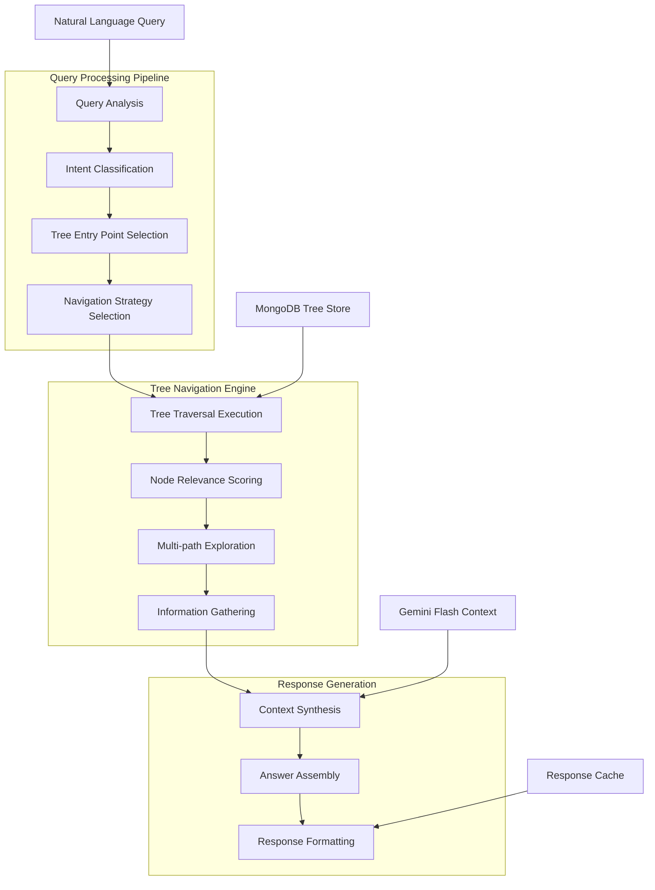

# Pydantic AI Implementation Guide

## Overview

This document provides comprehensive implementation guidance for Pydantic AI integration in the Vectorless RAG system. Based on **Section 6** of the PRD, Pydantic AI serves as the intelligent query processing engine that analyzes natural language queries and navigates the hierarchical topic trees to provide accurate, contextual responses.

### Purpose and Role

Pydantic AI integration serves as:
- **Query Processor**: Analyze and understand natural language queries
- **Tree Navigator**: Intelligently traverse hierarchical topic structures
- **Context Synthesizer**: Combine information from multiple tree nodes
- **Response Generator**: Produce coherent, accurate answers
- **Intent Classifier**: Determine query type and appropriate response strategy

## Technical Specifications

### Core Requirements

Based on **Section 6** querying strategy from PRD:
- **Version**: Pydantic AI 0.0.13+ for latest features
- **LLM Integration**: Support for multiple LLM providers (OpenAI, Anthropic, Google)
- **Tree Navigation**: Advanced algorithms for hierarchical data traversal
- **Context Management**: Efficient handling of large document contexts
- **Response Validation**: Structured output validation using Pydantic models
- **Caching**: Intelligent caching for improved performance

### Processing Architecture



## Implementation Details

### 1. Pydantic AI Service Core

**app/services/pydantic_ai_service.py**
```python
import logging
import asyncio
import time
from typing import Dict, List, Optional, Any, Tuple
from datetime import datetime
from enum import Enum

from pydantic import BaseModel, Field
from pydantic_ai import Agent, RunContext
from pydantic_ai.models import Model, KnownModelName
import openai
from anthropic import AsyncAnthropic
from google.generativeai import GenerativeModel

from app.core.config import settings
from app.models.query import QueryType, QueryContext, QueryResult
from app.models.tree import TopicNode, TreeNavigationResult
from app.services.mongodb_service import MongoDBService
from app.services.tree_navigator import TreeNavigator
from app.services.context_synthesizer import ContextSynthesizer

logger = logging.getLogger(__name__)

class QueryIntent(str, Enum):
    """Query intent classification based on Section 6.1 from PRD."""
    FACTUAL = "factual"           # Direct fact retrieval
    ANALYTICAL = "analytical"     # Analysis and interpretation
    COMPARATIVE = "comparative"   # Comparison between concepts
    PROCEDURAL = "procedural"     # Step-by-step processes
    CONTEXTUAL = "contextual"     # Context-dependent information
    EXPLORATORY = "exploratory"   # Open-ended exploration

class NavigationStrategy(str, Enum):
    """Tree navigation strategies from Section 6.2 of PRD."""
    TOP_DOWN = "top_down"         # Start from root, traverse down
    KEYWORD_BASED = "keyword_based"  # Use keyword matching
    SEMANTIC_SIMILARITY = "semantic_similarity"  # Semantic matching
    MULTI_PATH = "multi_path"     # Explore multiple paths
    DEPTH_FIRST = "depth_first"   # Deep exploration
    BREADTH_FIRST = "breadth_first"  # Wide exploration

class QueryAnalysis(BaseModel):
    """Structured query analysis result."""
    intent: QueryIntent
    keywords: List[str]
    entities: List[str]
    complexity_score: float = Field(ge=0.0, le=1.0)
    navigation_strategy: NavigationStrategy
    confidence: float = Field(ge=0.0, le=1.0)

class TreeNavigationContext(BaseModel):
    """Context for tree navigation operations."""
    document_id: str
    user_id: str
    query_text: str
    analysis: QueryAnalysis
    max_depth: int = 3
    max_nodes: int = 50
    relevance_threshold: float = 0.3

class ResponseAssembly(BaseModel):
    """Structured response assembly."""
    answer: str
    sources: List[Dict[str, Any]]
    confidence_score: float
    processing_time: float
    navigation_path: List[str]
    related_topics: List[str]

class PydanticAIService:
    """
    Main Pydantic AI service for query processing.
    Implements Section 6 querying strategy from PRD.
    """
    
    def __init__(self):
        self.mongodb_service: Optional[MongoDBService] = None
        self.tree_navigator = TreeNavigator()
        self.context_synthesizer = ContextSynthesizer()
        
        # Initialize AI agents for different tasks
        self._setup_agents()
        
        # Performance tracking
        self.query_cache: Dict[str, Any] = {}
        self.performance_metrics: Dict[str, float] = {}
    
    def _setup_agents(self):
        """Setup specialized AI agents for different query processing tasks."""
        
        # Query analysis agent
        self.query_analyzer = Agent(
            model=self._get_model("gpt-4o-mini"),
            system_prompt="""
            You are a query analysis expert. Analyze natural language queries and extract:
            1. Intent classification (factual, analytical, comparative, procedural, contextual, exploratory)
            2. Key entities and keywords
            3. Complexity assessment
            4. Recommended navigation strategy
            
            Be precise and structured in your analysis.
            """,
            result_type=QueryAnalysis
        )
        
        # Context synthesis agent
        self.context_synthesizer_agent = Agent(
            model=self._get_model("gpt-4o"),
            system_prompt="""
            You are a context synthesis expert. Given multiple pieces of information from a document tree,
            synthesize them into a coherent, accurate response. Maintain factual accuracy and cite sources.
            """,
            result_type=ResponseAssembly
        )
        
        # Tree navigation agent
        self.navigation_agent = Agent(
            model=self._get_model("gpt-4o-mini"),
            system_prompt="""
            You are a tree navigation expert. Given a query and tree structure,
            determine the most relevant nodes and optimal traversal path.
            """,
            result_type=TreeNavigationResult
        )
    
    def _get_model(self, model_name: str) -> Model:
        """Get configured model instance."""
        if model_name.startswith("gpt"):
            return Model(model_name, openai_api_key=settings.OPENAI_API_KEY)
        elif model_name.startswith("claude"):
            return Model(model_name, anthropic_api_key=settings.ANTHROPIC_API_KEY)
        elif model_name.startswith("gemini"):
            return Model(model_name, google_api_key=settings.GOOGLE_API_KEY)
        else:
            raise ValueError(f"Unsupported model: {model_name}")
    
    async def initialize(self, mongodb_service: MongoDBService):
        """Initialize the service with dependencies."""
        self.mongodb_service = mongodb_service
        await self.tree_navigator.initialize(mongodb_service)
        logger.info("Pydantic AI service initialized")
    
    async def process_query(
        self,
        query_text: str,
        document_id: str,
        user_id: str,
        context: Optional[QueryContext] = None
    ) -> Dict[str, Any]:
        """
        Main query processing pipeline.
        Implements Section 6 querying strategy from PRD.
        """
        start_time = time.time()
        query_id = f"query_{user_id}_{int(start_time)}"
        
        try:
            logger.info(f"Processing query {query_id}: {query_text[:100]}...")
            
            # Step 1: Query Analysis (Section 6.1)
            analysis = await self._analyze_query(query_text, context)
            logger.debug(f"Query analysis: {analysis}")
            
            # Step 2: Tree Entry Point Selection (Section 6.2)
            entry_points = await self._select_entry_points(
                document_id, analysis, user_id
            )
            logger.debug(f"Selected {len(entry_points)} entry points")
            
            # Step 3: Tree Traversal Execution (Section 6.3)
            navigation_context = TreeNavigationContext(
                document_id=document_id,
                user_id=user_id,
                query_text=query_text,
                analysis=analysis
            )
            
            navigation_results = await self._execute_tree_traversal(
                navigation_context, entry_points
            )
            logger.debug(f"Navigation found {len(navigation_results)} relevant nodes")
            
            # Step 4: Information Gathering (Section 6.4)
            gathered_info = await self._gather_information(
                navigation_results, analysis
            )
            
            # Step 5: Context Synthesis (Section 6.5)
            synthesized_context = await self._synthesize_context(
                gathered_info, query_text, analysis
            )
            
            # Step 6: Answer Assembly (Section 6.6)
            response = await self._assemble_response(
                synthesized_context, query_text, analysis
            )
            
            processing_time = time.time() - start_time
            
            # Prepare final result
            result = {
                "query_id": query_id,
                "answer": response.answer,
                "sources": response.sources,
                "confidence_score": response.confidence_score,
                "processing_time": processing_time,
                "navigation_path": response.navigation_path,
                "related_topics": response.related_topics,
                "query_analysis": analysis.dict(),
                "metadata": {
                    "nodes_explored": len(navigation_results),
                    "entry_points": len(entry_points),
                    "strategy_used": analysis.navigation_strategy.value
                }
            }
            
            # Cache result for performance
            self._cache_result(query_text, document_id, result)
            
            logger.info(f"Query {query_id} processed in {processing_time:.2f}s")
            return result
            
        except Exception as e:
            logger.error(f"Error processing query {query_id}: {str(e)}")
            return {
                "query_id": query_id,
                "error": str(e),
                "processing_time": time.time() - start_time
            }
    
    async def _analyze_query(
        self, 
        query_text: str, 
        context: Optional[QueryContext] = None
    ) -> QueryAnalysis:
        """
        Analyze query to determine intent and strategy.
        Implements Section 6.1 from PRD.
        """
        try:
            # Prepare context for analysis
            analysis_context = {
                "query": query_text,
                "previous_context": context.dict() if context else None,
                "analysis_instructions": """
                Analyze this query and determine:
                1. Primary intent (factual, analytical, comparative, procedural, contextual, exploratory)
                2. Key entities and keywords for tree navigation
                3. Query complexity (0.0 = simple, 1.0 = very complex)
                4. Best navigation strategy for this type of query
                5. Confidence in the analysis
                """
            }
            
            # Run analysis using Pydantic AI
            result = await self.query_analyzer.run(
                user_prompt=f"Analyze this query: {query_text}",
                message_history=[],
                model_settings={"temperature": 0.1}  # Low temperature for consistent analysis
            )
            
            return result.data
            
        except Exception as e:
            logger.error(f"Error in query analysis: {str(e)}")
            # Fallback to basic analysis
            return QueryAnalysis(
                intent=QueryIntent.FACTUAL,
                keywords=query_text.split(),
                entities=[],
                complexity_score=0.5,
                navigation_strategy=NavigationStrategy.KEYWORD_BASED,
                confidence=0.3
            )
    
    async def _select_entry_points(
        self,
        document_id: str,
        analysis: QueryAnalysis,
        user_id: str
    ) -> List[TopicNode]:
        """
        Select optimal entry points for tree traversal.
        Implements Section 6.2 from PRD.
        """
        try:
            # Get document tree
            tree = await self.mongodb_service.get_document_tree(document_id)
            if not tree:
                return []
            
            # Strategy-based entry point selection
            if analysis.navigation_strategy == NavigationStrategy.TOP_DOWN:
                # Start from root nodes (L1 topics)
                entry_points = await self.mongodb_service.find_topics_by_level(
                    document_id, "L1"
                )
            
            elif analysis.navigation_strategy == NavigationStrategy.KEYWORD_BASED:
                # Find nodes matching keywords
                entry_points = await self._find_keyword_matches(
                    document_id, analysis.keywords
                )
            
            elif analysis.navigation_strategy == NavigationStrategy.SEMANTIC_SIMILARITY:
                # Use semantic similarity for entry point selection
                entry_points = await self._find_semantic_matches(
                    document_id, analysis.keywords, analysis.entities
                )
            
            else:
                # Default to keyword-based approach
                entry_points = await self._find_keyword_matches(
                    document_id, analysis.keywords
                )
            
            # Limit entry points to prevent excessive traversal
            return entry_points[:5]
            
        except Exception as e:
            logger.error(f"Error selecting entry points: {str(e)}")
            return []
    
    async def _execute_tree_traversal(
        self,
        context: TreeNavigationContext,
        entry_points: List[TopicNode]
    ) -> List[Dict[str, Any]]:
        """
        Execute tree traversal from entry points.
        Implements Section 6.3 from PRD.
        """
        try:
            navigation_results = []
            
            for entry_point in entry_points:
                # Navigate from this entry point
                result = await self.tree_navigator.navigate_from_node(
                    context.document_id,
                    entry_point["topic_id"],
                    context.analysis.navigation_strategy,
                    context.max_depth,
                    context.relevance_threshold
                )
                
                navigation_results.extend(result)
            
            # Remove duplicates and sort by relevance
            unique_results = self._deduplicate_results(navigation_results)
            sorted_results = sorted(
                unique_results,
                key=lambda x: x.get("relevance_score", 0),
                reverse=True
            )
            
            return sorted_results[:context.max_nodes]
            
        except Exception as e:
            logger.error(f"Error in tree traversal: {str(e)}")
            return []
    
    async def _gather_information(
        self,
        navigation_results: List[Dict[str, Any]],
        analysis: QueryAnalysis
    ) -> Dict[str, Any]:
        """
        Gather and organize information from navigation results.
        Implements Section 6.4 from PRD.
        """
        try:
            gathered_info = {
                "primary_content": [],
                "supporting_content": [],
                "metadata": [],
                "relationships": []
            }
            
            for result in navigation_results:
                # Categorize content based on relevance and type
                relevance = result.get("relevance_score", 0)
                
                if relevance > 0.7:
                    gathered_info["primary_content"].append(result)
                elif relevance > 0.4:
                    gathered_info["supporting_content"].append(result)
                else:
                    gathered_info["metadata"].append(result)
                
                # Extract relationships
                if "relationships" in result:
                    gathered_info["relationships"].extend(result["relationships"])
            
            return gathered_info
            
        except Exception as e:
            logger.error(f"Error gathering information: {str(e)}")
            return {"primary_content": [], "supporting_content": [], "metadata": [], "relationships": []}
    
    async def _synthesize_context(
        self,
        gathered_info: Dict[str, Any],
        query_text: str,
        analysis: QueryAnalysis
    ) -> Dict[str, Any]:
        """
        Synthesize gathered information into coherent context.
        Implements Section 6.5 from PRD.
        """
        try:
            # Prepare context for synthesis
            synthesis_prompt = f"""
            Query: {query_text}
            Intent: {analysis.intent.value}
            
            Primary Content:
            {self._format_content_for_synthesis(gathered_info["primary_content"])}
            
            Supporting Content:
            {self._format_content_for_synthesis(gathered_info["supporting_content"])}
            
            Please synthesize this information to answer the query accurately and comprehensively.
            """
            
            # Use context synthesizer
            synthesized = await self.context_synthesizer.synthesize(
                gathered_info, query_text, analysis
            )
            
            return synthesized
            
        except Exception as e:
            logger.error(f"Error synthesizing context: {str(e)}")
            return {"synthesized_content": "", "confidence": 0.0}
    
    async def _assemble_response(
        self,
        synthesized_context: Dict[str, Any],
        query_text: str,
        analysis: QueryAnalysis
    ) -> ResponseAssembly:
        """
        Assemble final response from synthesized context.
        Implements Section 6.6 from PRD.
        """
        try:
            # Prepare response assembly prompt
            assembly_prompt = f"""
            Query: {query_text}
            Synthesized Context: {synthesized_context.get("synthesized_content", "")}
            
            Assemble a comprehensive response that:
            1. Directly answers the query
            2. Provides supporting evidence
            3. Cites relevant sources
            4. Suggests related topics
            5. Maintains factual accuracy
            """
            
            # Run response assembly
            result = await self.context_synthesizer_agent.run(
                user_prompt=assembly_prompt,
                message_history=[],
                model_settings={"temperature": 0.2}
            )
            
            return result.data
            
        except Exception as e:
            logger.error(f"Error assembling response: {str(e)}")
            return ResponseAssembly(
                answer="I apologize, but I encountered an error while processing your query.",
                sources=[],
                confidence_score=0.0,
                processing_time=0.0,
                navigation_path=[],
                related_topics=[]
            )
    
    async def _find_keyword_matches(
        self,
        document_id: str,
        keywords: List[str]
    ) -> List[TopicNode]:
        """Find tree nodes matching keywords."""
        try:
            # Use MongoDB text search
            matches = await self.mongodb_service.search_trees_by_keywords(
                keywords, limit=10
            )
            
            # Filter by document_id
            document_matches = [
                match for match in matches 
                if match.get("document_id") == document_id
            ]
            
            return document_matches
            
        except Exception as e:
            logger.error(f"Error finding keyword matches: {str(e)}")
            return []
    
    async def _find_semantic_matches(
        self,
        document_id: str,
        keywords: List[str],
        entities: List[str]
    ) -> List[TopicNode]:
        """Find semantically similar tree nodes."""
        try:
            # This would implement semantic similarity search
            # For now, fall back to keyword matching
            return await self._find_keyword_matches(document_id, keywords + entities)
            
        except Exception as e:
            logger.error(f"Error finding semantic matches: {str(e)}")
            return []
    
    def _deduplicate_results(self, results: List[Dict[str, Any]]) -> List[Dict[str, Any]]:
        """Remove duplicate results based on topic_id."""
        seen_ids = set()
        unique_results = []
        
        for result in results:
            topic_id = result.get("topic_id")
            if topic_id and topic_id not in seen_ids:
                seen_ids.add(topic_id)
                unique_results.append(result)
        
        return unique_results
    
    def _format_content_for_synthesis(self, content_list: List[Dict[str, Any]]) -> str:
        """Format content for synthesis prompt."""
        formatted = []
        for item in content_list:
            formatted.append(f"- {item.get('title', 'Untitled')}: {item.get('content', '')}")
        return "\n".join(formatted)
    
    def _cache_result(self, query_text: str, document_id: str, result: Dict[str, Any]):
        """Cache query result for performance."""
        cache_key = f"{document_id}:{hash(query_text)}"
        self.query_cache[cache_key] = {
            "result": result,
            "timestamp": time.time()
        }
        
        # Limit cache size
        if len(self.query_cache) > 1000:
            # Remove oldest entries
            oldest_key = min(
                self.query_cache.keys(),
                key=lambda k: self.query_cache[k]["timestamp"]
            )
            del self.query_cache[oldest_key]
    
    async def get_cached_result(
        self, 
        query_text: str, 
        document_id: str
    ) -> Optional[Dict[str, Any]]:
        """Get cached query result if available."""
        cache_key = f"{document_id}:{hash(query_text)}"
        cached = self.query_cache.get(cache_key)
        
        if cached:
            # Check if cache is still valid (1 hour)
            if time.time() - cached["timestamp"] < 3600:
                return cached["result"]
            else:
                # Remove expired cache
                del self.query_cache[cache_key]
        
        return None
    
    async def health_check(self) -> Dict[str, Any]:
        """Service health check."""
        try:
            # Test basic functionality
            test_analysis = await self._analyze_query("test query", None)
            
            return {
                "status": "healthy",
                "cache_size": len(self.query_cache),
                "test_analysis": test_analysis is not None
            }
            
        except Exception as e:
            return {
                "status": "unhealthy",
                "error": str(e)
            }

# Global service instance
pydantic_ai_service = PydanticAIService()
```

### 2. Tree Navigator Component

**app/services/tree_navigator.py**
```python
import logging
from typing import List, Dict, Any, Optional
from enum import Enum

from app.models.tree import TopicNode, NavigationStrategy
from app.services.mongodb_service import MongoDBService

logger = logging.getLogger(__name__)

class TreeNavigator:
    """
    Advanced tree navigation component.
    Implements navigation algorithms from Section 6.2 of PRD.
    """
    
    def __init__(self):
        self.mongodb_service: Optional[MongoDBService] = None
    
    async def initialize(self, mongodb_service: MongoDBService):
        """Initialize with MongoDB service."""
        self.mongodb_service = mongodb_service
    
    async def navigate_from_node(
        self,
        document_id: str,
        start_node_id: str,
        strategy: NavigationStrategy,
        max_depth: int = 3,
        relevance_threshold: float = 0.3
    ) -> List[Dict[str, Any]]:
        """Navigate tree from a starting node using specified strategy."""
        try:
            if strategy == NavigationStrategy.DEPTH_FIRST:
                return await self._depth_first_navigation(
                    document_id, start_node_id, max_depth, relevance_threshold
                )
            elif strategy == NavigationStrategy.BREADTH_FIRST:
                return await self._breadth_first_navigation(
                    document_id, start_node_id, max_depth, relevance_threshold
                )
            elif strategy == NavigationStrategy.MULTI_PATH:
                return await self._multi_path_navigation(
                    document_id, start_node_id, max_depth, relevance_threshold
                )
            else:
                # Default to depth-first
                return await self._depth_first_navigation(
                    document_id, start_node_id, max_depth, relevance_threshold
                )
                
        except Exception as e:
            logger.error(f"Error in tree navigation: {str(e)}")
            return []
    
    async def _depth_first_navigation(
        self,
        document_id: str,
        start_node_id: str,
        max_depth: int,
        relevance_threshold: float
    ) -> List[Dict[str, Any]]:
        """Depth-first tree navigation."""
        visited = set()
        results = []
        
        async def dfs(node_id: str, current_depth: int):
            if current_depth > max_depth or node_id in visited:
                return
            
            visited.add(node_id)
            
            # Get node information
            node = await self.mongodb_service.get_topic_node(document_id, node_id)
            if node:
                # Calculate relevance score (simplified)
                relevance_score = self._calculate_relevance_score(node)
                
                if relevance_score >= relevance_threshold:
                    results.append({
                        **node,
                        "relevance_score": relevance_score,
                        "depth": current_depth
                    })
                
                # Navigate to children
                children = await self.mongodb_service.get_child_topics(document_id, node_id)
                for child in children:
                    await dfs(child["topic_id"], current_depth + 1)
        
        await dfs(start_node_id, 0)
        return results
    
    async def _breadth_first_navigation(
        self,
        document_id: str,
        start_node_id: str,
        max_depth: int,
        relevance_threshold: float
    ) -> List[Dict[str, Any]]:
        """Breadth-first tree navigation."""
        visited = set()
        results = []
        queue = [(start_node_id, 0)]  # (node_id, depth)
        
        while queue:
            node_id, current_depth = queue.pop(0)
            
            if current_depth > max_depth or node_id in visited:
                continue
            
            visited.add(node_id)
            
            # Get node information
            node = await self.mongodb_service.get_topic_node(document_id, node_id)
            if node:
                # Calculate relevance score
                relevance_score = self._calculate_relevance_score(node)
                
                if relevance_score >= relevance_threshold:
                    results.append({
                        **node,
                        "relevance_score": relevance_score,
                        "depth": current_depth
                    })
                
                # Add children to queue
                children = await self.mongodb_service.get_child_topics(document_id, node_id)
                for child in children:
                    queue.append((child["topic_id"], current_depth + 1))
        
        return results
    
    async def _multi_path_navigation(
        self,
        document_id: str,
        start_node_id: str,
        max_depth: int,
        relevance_threshold: float
    ) -> List[Dict[str, Any]]:
        """Multi-path exploration navigation."""
        # Combine both depth-first and breadth-first results
        depth_results = await self._depth_first_navigation(
            document_id, start_node_id, max_depth, relevance_threshold
        )
        breadth_results = await self._breadth_first_navigation(
            document_id, start_node_id, max_depth, relevance_threshold
        )
        
        # Merge and deduplicate
        all_results = depth_results + breadth_results
        unique_results = {}
        
        for result in all_results:
            node_id = result["topic_id"]
            if node_id not in unique_results or result["relevance_score"] > unique_results[node_id]["relevance_score"]:
                unique_results[node_id] = result
        
        return list(unique_results.values())
    
    def _calculate_relevance_score(self, node: Dict[str, Any]) -> float:
        """Calculate relevance score for a node (simplified implementation)."""
        # This would implement sophisticated relevance scoring
        # For now, return a basic score based on content length and level
        content_length = len(node.get("content", ""))
        level = node.get("level", "L3")
        
        # Higher score for more content and higher levels
        base_score = min(content_length / 1000, 1.0)  # Normalize by content length
        level_bonus = {"L1": 0.3, "L2": 0.2, "L3": 0.1}.get(level, 0.0)
        
        return min(base_score + level_bonus, 1.0)
```

### 3. Context Synthesizer Component

**app/services/context_synthesizer.py**
```python
import logging
from typing import Dict, List, Any, Optional

from app.models.query import QueryAnalysis, QueryIntent

logger = logging.getLogger(__name__)

class ContextSynthesizer:
    """
    Context synthesis component for combining information from multiple sources.
    Implements Section 6.5 from PRD.
    """
    
    async def synthesize(
        self,
        gathered_info: Dict[str, Any],
        query_text: str,
        analysis: QueryAnalysis
    ) -> Dict[str, Any]:
        """Synthesize gathered information based on query intent."""
        try:
            if analysis.intent == QueryIntent.FACTUAL:
                return await self._synthesize_factual(gathered_info, query_text)
            elif analysis.intent == QueryIntent.ANALYTICAL:
                return await self._synthesize_analytical(gathered_info, query_text)
            elif analysis.intent == QueryIntent.COMPARATIVE:
                return await self._synthesize_comparative(gathered_info, query_text)
            elif analysis.intent == QueryIntent.PROCEDURAL:
                return await self._synthesize_procedural(gathered_info, query_text)
            elif analysis.intent == QueryIntent.CONTEXTUAL:
                return await self._synthesize_contextual(gathered_info, query_text)
            else:  # EXPLORATORY
                return await self._synthesize_exploratory(gathered_info, query_text)
                
        except Exception as e:
            logger.error(f"Error in context synthesis: {str(e)}")
            return {"synthesized_content": "", "confidence": 0.0}
    
    async def _synthesize_factual(
        self, 
        gathered_info: Dict[str, Any], 
        query_text: str
    ) -> Dict[str, Any]:
        """Synthesize factual information."""
        primary_content = gathered_info.get("primary_content", [])
        
        # Extract direct facts
        facts = []
        for content in primary_content:
            if content.get("content"):
                facts.append(content["content"])
        
        synthesized = " ".join(facts[:3])  # Limit to top 3 facts
        
        return {
            "synthesized_content": synthesized,
            "confidence": 0.8 if facts else 0.2,
            "synthesis_type": "factual"
        }
    
    async def _synthesize_analytical(
        self, 
        gathered_info: Dict[str, Any], 
        query_text: str
    ) -> Dict[str, Any]:
        """Synthesize analytical information."""
        primary_content = gathered_info.get("primary_content", [])
        supporting_content = gathered_info.get("supporting_content", [])
        
        # Combine primary and supporting content for analysis
        all_content = primary_content + supporting_content
        
        # Extract key insights
        insights = []
        for content in all_content:
            if content.get("content") and len(content["content"]) > 100:
                insights.append(content["content"])
        
        synthesized = " ".join(insights[:5])  # Limit to top 5 insights
        
        return {
            "synthesized_content": synthesized,
            "confidence": 0.7 if insights else 0.3,
            "synthesis_type": "analytical"
        }
    
    async def _synthesize_comparative(
        self, 
        gathered_info: Dict[str, Any], 
        query_text: str
    ) -> Dict[str, Any]:
        """Synthesize comparative information."""
        primary_content = gathered_info.get("primary_content", [])
        
        # Group content by topics for comparison
        topics = {}
        for content in primary_content:
            topic = content.get("title", "Unknown")
            if topic not in topics:
                topics[topic] = []
            topics[topic].append(content.get("content", ""))
        
        # Create comparison synthesis
        comparisons = []
        for topic, contents in topics.items():
            if contents:
                comparisons.append(f"{topic}: {' '.join(contents[:2])}")
        
        synthesized = " | ".join(comparisons[:3])  # Limit to 3 comparisons
        
        return {
            "synthesized_content": synthesized,
            "confidence": 0.6 if comparisons else 0.2,
            "synthesis_type": "comparative"
        }
    
    async def _synthesize_procedural(
        self, 
        gathered_info: Dict[str, Any], 
        query_text: str
    ) -> Dict[str, Any]:
        """Synthesize procedural information."""
        primary_content = gathered_info.get("primary_content", [])
        
        # Look for step-by-step content
        steps = []
        for content in primary_content:
            content_text = content.get("content", "")
            if any(keyword in content_text.lower() for keyword in ["step", "first", "then", "next", "finally"]):
                steps.append(content_text)
        
        synthesized = " ".join(steps[:5])  # Limit to 5 steps
        
        return {
            "synthesized_content": synthesized,
            "confidence": 0.7 if steps else 0.3,
            "synthesis_type": "procedural"
        }
    
    async def _synthesize_contextual(
        self, 
        gathered_info: Dict[str, Any], 
        query_text: str
    ) -> Dict[str, Any]:
        """Synthesize contextual information."""
        all_content = (
            gathered_info.get("primary_content", []) +
            gathered_info.get("supporting_content", []) +
            gathered_info.get("metadata", [])
        )
        
        # Combine all available context
        context_pieces = []
        for content in all_content:
            if content.get("content"):
                context_pieces.append(content["content"])
        
        synthesized = " ".join(context_pieces[:7])  # More content for context
        
        return {
            "synthesized_content": synthesized,
            "confidence": 0.6 if context_pieces else 0.2,
            "synthesis_type": "contextual"
        }
    
    async def _synthesize_exploratory(
        self, 
        gathered_info: Dict[str, Any], 
        query_text: str
    ) -> Dict[str, Any]:
        """Synthesize exploratory information."""
        all_content = (
            gathered_info.get("primary_content", []) +
            gathered_info.get("supporting_content", [])
        )
        
        # Provide diverse information for exploration
        diverse_content = []
        seen_topics = set()
        
        for content in all_content:
            topic = content.get("title", "")
            if topic not in seen_topics:
                seen_topics.add(topic)
                diverse_content.append(content.get("content", ""))
        
        synthesized = " ".join(diverse_content[:6])  # Diverse content
        
        return {
            "synthesized_content": synthesized,
            "confidence": 0.5 if diverse_content else 0.2,
            "synthesis_type": "exploratory"
        }
```

## Integration Points

### 1. FastAPI Integration
```python
# app/api/v1/queries.py
from app.services.pydantic_ai_service import pydantic_ai_service

@router.post("/", response_model=QueryResponse)
async def process_query(
    query_request: QueryRequest,
    current_user: User = Depends(get_current_user)
):
    result = await pydantic_ai_service.process_query(
        query_request.query_text,
        query_request.document_id,
        current_user.id,
        query_request.context
    )
    return QueryResponse(**result)
```

### 2. MongoDB Integration
```python
# Integration with MongoDB service for tree access
await pydantic_ai_service.initialize(mongodb_service)
```

### 3. Caching Integration
```python
# Redis caching for query results
from app.services.redis_service import redis_service

# Check cache before processing
cached_result = await redis_service.get_cached_query(query_hash)
if cached_result:
    return cached_result
```

## Development Tasks

### Phase 1: Core Query Processing (Week 1)
- [ ] Implement PydanticAIService class with basic query analysis
- [ ] Create TreeNavigator with depth-first and breadth-first algorithms
- [ ] Build ContextSynthesizer for different query intents
- [ ] Add basic caching mechanism
- [ ] Implement query result validation

### Phase 2: Advanced Navigation (Week 2)
- [ ] Add semantic similarity matching
- [ ] Implement multi-path exploration
- [ ] Create relevance scoring algorithms
- [ ] Add query optimization strategies
- [ ] Implement performance monitoring

### Phase 3: Production Optimization (Week 3)
- [ ] Add comprehensive error handling
- [ ] Implement advanced caching strategies
- [ ] Add query analytics and logging
- [ ] Performance optimization and tuning
- [ ] Add comprehensive testing

## Testing Strategy

### Unit Tests
```python
import pytest
from app.services.pydantic_ai_service import PydanticAIService, QueryAnalysis

@pytest.mark.asyncio
async def test_query_analysis():
    service = PydanticAIService()
    analysis = await service._analyze_query("What is machine learning?")
    
    assert isinstance(analysis, QueryAnalysis)
    assert analysis.intent is not None
    assert len(analysis.keywords) > 0

@pytest.mark.asyncio
async def test_tree_navigation():
    navigator = TreeNavigator()
    # Mock MongoDB service
    results = await navigator.navigate_from_node(
        "doc_123", "topic_456", NavigationStrategy.DEPTH_FIRST
    )
    assert isinstance(results, list)
```

### Integration Tests
```python
@pytest.mark.asyncio
async def test_end_to_end_query():
    service = PydanticAIService()
    await service.initialize(mock_mongodb_service)
    
    result = await service.process_query(
        "Explain the main concepts",
        "doc_123",
        "user_456"
    )
    
    assert "answer" in result
    assert "confidence_score" in result
    assert result["confidence_score"] > 0
```

## Performance Considerations

### Query Optimization
- Intelligent caching of query results
- Parallel tree traversal for multiple entry points
- Lazy loading of tree nodes
- Query result pagination

### Memory Management
- Efficient tree node storage
- Context size limitations
- Garbage collection for cached results
- Memory-efficient navigation algorithms

## Security Requirements

### Input Validation
- Query text sanitization
- Maximum query length limits
- Rate limiting per user
- Malicious query detection

### Access Control
- Document-level access validation
- User permission checking
- Query logging for audit
- Sensitive information filtering

## Deployment Configuration

### Environment Variables
```bash
OPENAI_API_KEY=your-openai-key
ANTHROPIC_API_KEY=your-anthropic-key
GOOGLE_API_KEY=your-google-key
PYDANTIC_AI_MODEL=gpt-4o-mini
QUERY_CACHE_SIZE=1000
MAX_QUERY_LENGTH=1000
```

### Dependencies
```txt
pydantic-ai==0.0.13
openai>=1.0.0
anthropic>=0.8.0
google-generativeai>=0.3.0
```

## Monitoring & Logging

### Metrics to Track
- Query processing times
- Cache hit rates
- Model API usage
- Error rates by query type
- User query patterns

### Logging Strategy
- Query analysis results
- Tree navigation paths
- Response generation metrics
- Error tracking and debugging
- Performance bottleneck identification

---

*This Pydantic AI implementation guide provides the foundation for intelligent query processing in the vectorless RAG system. Follow the implementation phases and integrate with other system components as specified in the PRD.*